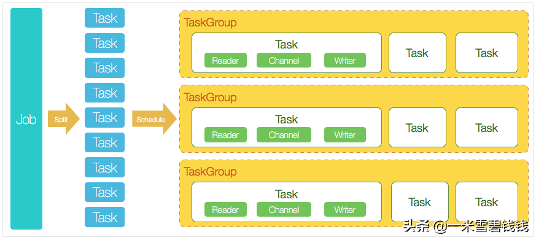
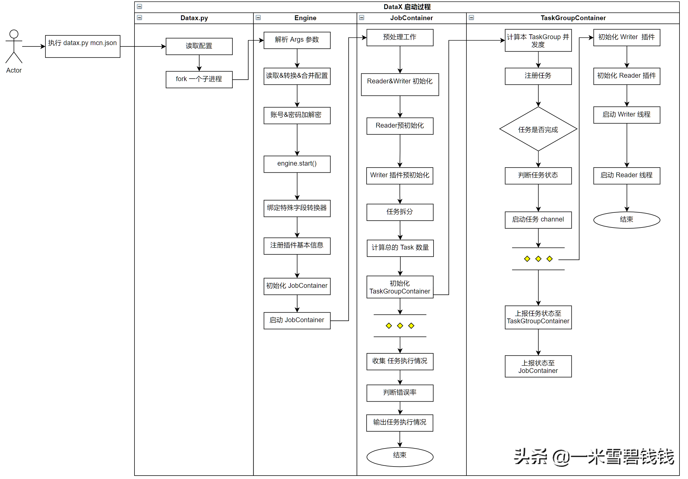

> DataX 是阿里开源的一款异构数据源离线同步工具。将复杂的网状的同步链路变成了星型数据链路。
>接下来，我们将一起来看看 DataX 整体流程都干啥了，后面再逐步地拆开每个模块来细讲。
> 

[DataX源码分析之二本地启动调试.md](DataX源码分析之二本地启动调试.md) 

## **DataX 3.0 核心架构**

DataX 3.0 核心架构

## **DataX 的核心概念**

> DataX 里面涉及到一些概念，在阅读源码前，我们必须要整体了解这些概念，防止后续阅读源码搞混了。
> 
1. Job：DataX完成单个数据同步的作业，我们称之为Job。比如，我们在 mcn.json 里面定义了从 mysql 的 order_info 
表同步到 kafka 中，这个称之为Job 的详细配置，而执行 datax.py mcn.json 称之为启动一个任务。
2. Task：DataXJob启动后，会根据不同的源端切分策略，将Job切分成多个小的Task(子任务)，以便于并发执行。
Task便是DataX作业的最小单元，每一个Task都会负责一部分数据的同步工作。Task 可以自动重试功能。
3. TaskGroup：切分多个Task之后，DataX Job会调用Scheduler模块，根据配置的并发数据量，
将拆分成的Task重新组合，组装成TaskGroup(任务组)。每一个TaskGroup负责以一定的并发运行完毕分配好的所有Task，
默认单个任务组的并发数量为5。每一个Task都由TaskGroup负责启动，Task启动后，会固定
启动Reader—>Channel—>Writer的线程来完成任务同步工作，TaskGroup 里面的Task 会自动重试。
4. JobContainer：Job 执行容器，负责 Job 任务的拆分、调度等等。
5. TaskGroupContainer：TaskGroup 执行容器。负责执行一组Task 的工作单元。

## **启动源码过程**

> 启动源码过程，略有删减，对于源码的各种判断，先删除掉。假设我们是最初的开发者，我们需要把握整体流程，其他的各种判断都是开发过程中各种的优化流程。
> 

DataX 主干逻辑源码分析流程图

## **如何阅读源码**

1. 理解此开源项目的整体执行情况、概念。
2. 假设你来设计，按照你刚才理解的执行情况、概念，在脑海中快速有个 demo（最好有主体流程即可，不要太详细）。
3. 按照你脑海的 demo，去阅读源码。
4. 再次去深入阅读源码中的各种分支、异常处理情况。

## **总结**

- 上面的是 DataX 整体源码执行过程。只保留了主干逻辑。后续会推出主干逻辑+分支逻辑。让大家更深入地理解DataX 源码情况。