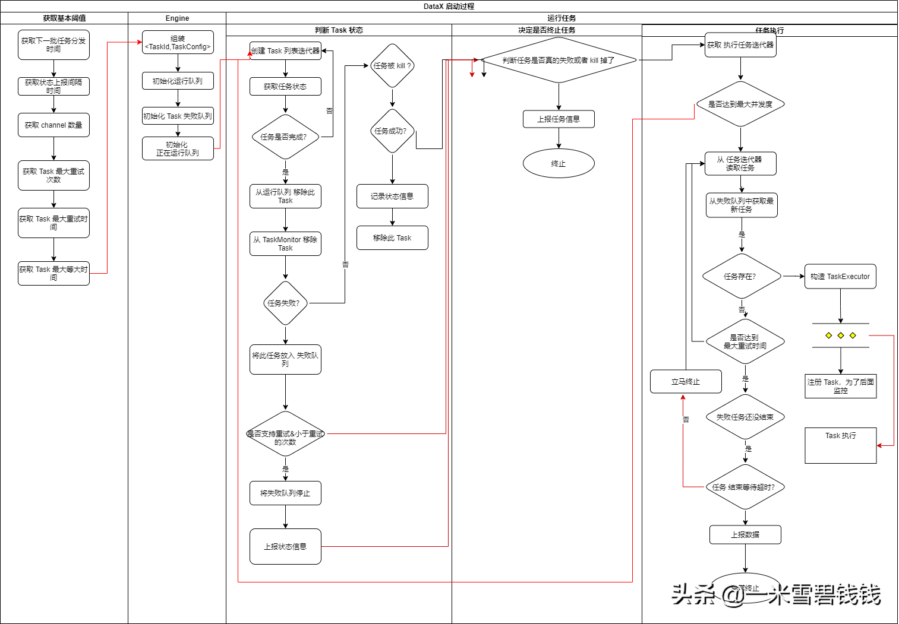

> 从上一章中，我们可以看到 JobContainer 在初始化的过程中，用 <font color='green'>split</font> 过程生成了 Task 任务列表。
>然后，紧接着 执行 <font color='green'>schedule</font> 方法，
>生成 taskGroupConfig ，并 启动了所有的 TaskGroupContainer。那么 TaskGroupContainer 如何保证任务之间的可靠性呢？接下来我们仔细分析以下。
> 

继上一篇文章：[DataX源码分析五之JobContainer详解.md](DataX源码分析五之JobContainer详解.md) 

## **代码启动入口**

> 代码的入口：com.alibaba.datax.core.job.scheduler.processinner.ProcessInnerScheduler#startAllTaskGroup
> 

```java
// 所有的 TaskGroupContainer 启动的话，都需要包装成 TaskGroupContainerRunner，丢到线程池里面启动。
private TaskGroupContainerRunner newTaskGroupContainerRunner(Configuration configuration) {
   TaskGroupContainer taskGroupContainer = new TaskGroupContainer(configuration);
   return new TaskGroupContainerRunner(taskGroupContainer);
}
```

## **TaskGroupContainer 构造函数**

> 在构造函数里面，有一个 Commuicator 方法，我们先不要理会，这个是用于上报 TaskGroup的心跳信息，后续文章会讲到。
> 

```java
    public TaskGroupContainer(Configuration configuration) {
        super(configuration);
        // 用于汇报本TaskGroupContainer 的运行时状态数据      
        initCommunicator(configuration);
        this.jobId = this.configuration.getLong(CoreConstant.DATAX_CORE_CONTAINER_JOB_ID);
        this.taskGroupId = this.configuration.getInt(CoreConstant.DATAX_CORE_CONTAINER_TASKGROUP_ID);
        this.channelClazz = this.configuration.getString(CoreConstant.DATAX_CORE_TRANSPORT_CHANNEL_CLASS);
        this.taskCollectorClass = this.configuration.getString(CoreConstant.DATAX_CORE_STATISTICS_COLLECTOR_PLUGIN_TASKCLASS);
    }
```

## **启动 TakGroupContainer**

```java
this.taskGroupContainer.start();
```

## **整体流程分析**


TaskGroup 对于 Task 的管理如上图所示

## **代码流程**

> 我只摘抄重要的代码出来，这样大家里面就比较快。
> 

```java
@Override
    public void start() {
        try {
            /**  状态check时间间隔，较短，可以把任务及时分发到对应channel中  */
            int sleepIntervalInMillSec = this.configuration.getInt(CoreConstant.DATAX_CORE_CONTAINER_TASKGROUP_SLEEPINTERVAL, 100);

            /**  状态汇报时间间隔，稍长，避免大量汇报  */
            long reportIntervalInMillSec = this.configuration.getLong(CoreConstant.DATAX_CORE_CONTAINER_TASKGROUP_REPORTINTERVAL, 10000);
            /**  2分钟汇报一次性能统计 */
            // 获取channel数目
            int channelNumber = this.configuration.getInt(CoreConstant.DATAX_CORE_CONTAINER_TASKGROUP_CHANNEL);
            // Task 最大重试次数
            int taskMaxRetryTimes = this.configuration.getInt(CoreConstant.DATAX_CORE_CONTAINER_TASK_FAILOVER_MAXRETRYTIMES, 1);
            // Task 最大重试时间
            long taskRetryIntervalInMsec = this.configuration.getLong(CoreConstant.DATAX_CORE_CONTAINER_TASK_FAILOVER_RETRYINTERVALINMSEC, 10000);
            // Task 最大等待时间
            long taskMaxWaitInMsec = this.configuration.getLong(CoreConstant.DATAX_CORE_CONTAINER_TASK_FAILOVER_MAXWAITINMSEC, 60000);
            // 这个是 本TaskGroupContainer 的配置了。
            List<Configuration> taskConfigs = this.configuration.getListConfiguration(CoreConstant.DATAX_JOB_CONTENT);
            if (LOG.isDebugEnabled()) {
                LOG.debug("taskGroup[{}]'s task configs[{}]", this.taskGroupId, JSON.toJSONString(taskConfigs));
            }
            int taskCountInThisTaskGroup = taskConfigs.size();
            LOG.info(String.format("taskGroupId=[%d] start [%d] channels for [%d] tasks.", this.taskGroupId, channelNumber, taskCountInThisTaskGroup));
            // 初始化 Communication， 最终是：

            this.taskCommunicationMap.put(taskId, new Communication());
            this.containerCommunicator.registerCommunication(taskConfigs);
            // taskId与taskConfig配置
            Map<Integer, Configuration> taskConfigMap = buildTaskConfigMap(taskConfigs);
            // 待运行task列表
            List<Configuration> taskQueue = buildRemainTasks(taskConfigs);
            // taskId与上次失败实例
            Map<Integer, TaskExecutor> taskFailedExecutorMap = new HashMap<Integer, TaskExecutor>();
            // 正在运行task
            List<TaskExecutor> runTasks = new ArrayList<TaskExecutor>(channelNumber);
            // 任务开始时间
            Map<Integer, Long> taskStartTimeMap = new HashMap<Integer, Long>();
            long lastReportTimeStamp = 0;
            Communication lastTaskGroupContainerCommunication = new Communication();
            // 死循环，尽可能的把所有任务都挨个跑完
            while (true) {
                //1.判断task状态
                boolean failedOrKilled = false;
                Map<Integer, Communication> communicationMap = containerCommunicator.getCommunicationMap();
                for (Map.Entry<Integer, Communication> entry : communicationMap.entrySet()) {
                    Integer taskId = entry.getKey();
                    Communication taskCommunication = entry.getValue();
                    // 任务是否结束了：SUCCEEDED、FAILED、KILLED
                    if (!taskCommunication.isFinished()) {
                        continue;
                    }                    
                    // 从 【正在运行task】移除指定的 Task
                    TaskExecutor taskExecutor = removeTask(runTasks, taskId);
                    //上面从runTasks里移除了，因此对应在monitor里移除
                    taskMonitor.removeTask(taskId);
                    //失败，看task是否支持failover，重试次数未超过最大限制
                    if (taskCommunication.getState() == State.FAILED) {
                        taskFailedExecutorMap.put(taskId, taskExecutor);
                        // 判断是否需要再来一次
                        if (taskExecutor.supportFailOver() && taskExecutor.getAttemptCount() < taskMaxRetryTimes) {
                            // 关闭老的executor
                            taskExecutor.shutdown();
                            // 将task的状态重置
                            containerCommunicator.resetCommunication(taskId);
                            Configuration taskConfig = taskConfigMap.get(taskId);
                            //重新加入任务列表
                            taskQueue.add(taskConfig);
                        } else {
                            failedOrKilled = true;
                            break;
                        }
                    } else if (taskCommunication.getState() == State.KILLED) {
                        failedOrKilled = true;
                        break;
                    } else if (taskCommunication.getState() == State.SUCCEEDED) {
                        Long taskStartTime = taskStartTimeMap.get(taskId);
                        if (taskStartTime != null) {
                            Long usedTime = System.currentTimeMillis() - taskStartTime;
                            LOG.info("taskGroup[{}] taskId[{}] is successed, used[{}]ms", this.taskGroupId, taskId, usedTime);
                            //usedTime*1000*1000 转换成PerfRecord记录的ns，这里主要是简单登记，进行最长任务的打印。因此增加特定静态方法
                            PerfRecord.addPerfRecord(taskGroupId, taskId, PerfRecord.PHASE.TASK_TOTAL, taskStartTime, usedTime * 1000L * 1000L);
                            taskStartTimeMap.remove(taskId);
                            taskConfigMap.remove(taskId);
                        }
                    }
                }
                // 2.发现该taskGroup下taskExecutor的总状态失败则汇报错误
                if (failedOrKilled) {
                    lastTaskGroupContainerCommunication = reportTaskGroupCommunication(lastTaskGroupContainerCommunication, taskCountInThisTaskGroup);
                    throw DataXException.asDataXException(FrameworkErrorCode.PLUGIN_RUNTIME_ERROR, lastTaskGroupContainerCommunication.getThrowable());
                }
                //3.有任务未执行，且正在运行的任务数小于最大通道限制
                Iterator<Configuration> iterator = taskQueue.iterator();
                // 控制并发执行的量
                while (iterator.hasNext() && runTasks.size() < channelNumber) {
                    Configuration taskConfig = iterator.next();
                    Integer taskId = taskConfig.getInt(CoreConstant.TASK_ID);
                    int attemptCount = 1;
                    TaskExecutor lastExecutor = taskFailedExecutorMap.get(taskId);
                    if (lastExecutor != null) {
                        attemptCount = lastExecutor.getAttemptCount() + 1;
                        long now = System.currentTimeMillis();
                        long failedTime = lastExecutor.getTimeStamp();
                        // 如果时间还未到 Task 重试的间隔的话，将继续呆在 queue 里面
                        if (now - failedTime < taskRetryIntervalInMsec) {
                            continue;
                        }
                        //上次失败的task仍未结束
                        if (!lastExecutor.isShutdown()) {
                            if (now - failedTime > taskMaxWaitInMsec) {
                                markCommunicationFailed(taskId);
                                reportTaskGroupCommunication(lastTaskGroupContainerCommunication, taskCountInThisTaskGroup);
                                throw DataXException.asDataXException(CommonErrorCode.WAIT_TIME_EXCEED, "task failover等待超时");
                            } else {
                                //再次尝试关闭
                                lastExecutor.shutdown();
                                continue;
                            }
                        } else {
                            LOG.info("taskGroup[{}] taskId[{}] attemptCount[{}] has already shutdown", this.taskGroupId, taskId, lastExecutor.getAttemptCount());
                        }
                    }
                    Configuration taskConfigForRun = taskMaxRetryTimes > 1 ? taskConfig.clone() : taskConfig;
                    // 构建任务执行器，有 reader、writer、channel
                    TaskExecutor taskExecutor = new TaskExecutor(taskConfigForRun, attemptCount);
                    taskStartTimeMap.put(taskId, System.currentTimeMillis());
                    // 启动一个 TaskExecutor
                    taskExecutor.doStart();
                    iterator.remove();
                    runTasks.add(taskExecutor);
                    //上面，增加task到runTasks列表，因此在monitor里注册。
                    taskMonitor.registerTask(taskId, this.containerCommunicator.getCommunication(taskId));
                    taskFailedExecutorMap.remove(taskId);
                    LOG.info("taskGroup[{}] taskId[{}] attemptCount[{}] is started", this.taskGroupId, taskId, attemptCount);
                }
                //4.任务列表为空，executor已结束, 搜集状态为success--->成功
                if (taskQueue.isEmpty() && isAllTaskDone(runTasks) && containerCommunicator.collectState() == State.SUCCEEDED) {
                    // 成功的情况下，也需要汇报一次。否则在任务结束非常快的情况下，采集的信息将会不准确
                    lastTaskGroupContainerCommunication = reportTaskGroupCommunication(lastTaskGroupContainerCommunication, taskCountInThisTaskGroup);
                    LOG.info("taskGroup[{}] completed it's tasks.", this.taskGroupId);
                    break;
                }
                // 5.如果当前时间已经超出汇报时间的interval，那么我们需要马上汇报
                long now = System.currentTimeMillis();
                if (now - lastReportTimeStamp > reportIntervalInMillSec) {
                    lastTaskGroupContainerCommunication = reportTaskGroupCommunication(lastTaskGroupContainerCommunication, taskCountInThisTaskGroup);
                    lastReportTimeStamp = now;
                    //taskMonitor对于正在运行的task，每reportIntervalInMillSec进行检查
                    for (TaskExecutor taskExecutor : runTasks) {
                        taskMonitor.report(taskExecutor.getTaskId(), this.containerCommunicator.getCommunication(taskExecutor.getTaskId()));
                    }
                }
                Thread.sleep(sleepIntervalInMillSec);
            }
            //6. 当TaskGroup 的任务都执行了。最后还要汇报一次
            reportTaskGroupCommunication(lastTaskGroupContainerCommunication, taskCountInThisTaskGroup);
        } catch (Throwable e) {
            Communication nowTaskGroupContainerCommunication = this.containerCommunicator.collect();
            if (nowTaskGroupContainerCommunication.getThrowable() == null) {
                nowTaskGroupContainerCommunication.setThrowable(e);
            }
            nowTaskGroupContainerCommunication.setState(State.FAILED);
            this.containerCommunicator.report(nowTaskGroupContainerCommunication);
            throw DataXException.asDataXException(FrameworkErrorCode.RUNTIME_ERROR, e);
        } finally {
            if (!PerfTrace.getInstance().isJob()) {
                //最后打印cpu的平均消耗，GC的统计
                VMInfo vmInfo = VMInfo.getVmInfo();
                if (vmInfo != null) {
                    vmInfo.getDelta(false);
                    LOG.info(vmInfo.totalString());
                }
                LOG.info(PerfTrace.getInstance().summarizeNoException());
            }
        }
    }
```

## **总结**

- TaskGroup 会对 Task 级别<font color='green'>重试</font>，等重试到一定次数后，就直接终止整个 Job 任务。
- TaskGroup 对于 Task 的失败，会有一个重试的间隔。不会是立马重试的。
- TaskGroup 对于 此 Task 不会全部执行的，是可控制的方式。而且，是一批一批的执行，<font color='green'>每个批次都是等待一定的时间</font>。这个设计比较简单粗暴。

## **未完待续**

- 后续会继续讲到 Channel 里面是如何针对 Reader 和 Writer 来限流、处理数据的。