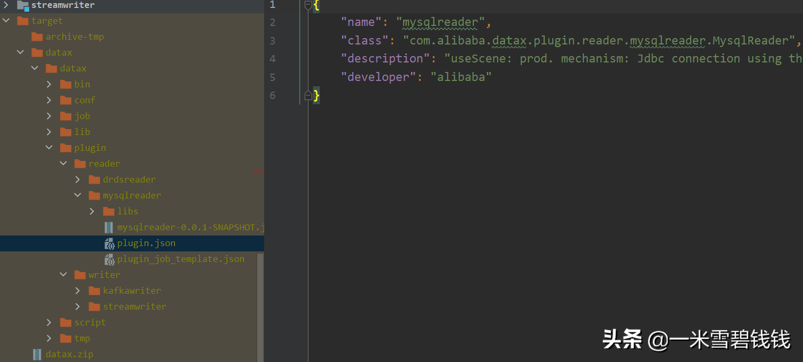

> 在上一篇文章中，我们知道在 JobContainer 初始化的过程中，会有 Reader、Writer 插件加载并初始化过程，那我们接下来仔细来分析 DataX插件开发、加载原理。
> 

继上一篇文章中提到插件加载：[DataX源码分析六之Task分配过程.md](DataX源码分析六之Task分配过程.md) 

## **DataX 插件类型**

> 在 DataX 中，插件只要有 4类。如下代码块所示：
> 

```java
public enum PluginType {
    READER("reader"), TRANSFORMER("transformer"), WRITER("writer"), HANDLER("handler");
    private String pluginType;

    private PluginType(String pluginType) {
        this.pluginType = pluginType;
    }
}
```

- Reader：读插件，比如 MySQL Reader 插件，表示从 MySQL 读取数据。
- Writer：写插件。比如 kafkawriter，将 Reader 插件读取的数据，经过 Writer 插件写入到目标源。
- Transformer：转换插件，其中DataX 内部，也有一些内置的了。比如 com.alibaba.datax.core.transport.transformer.TransformerRegistry 这个类里面，就定义了一系列的 Transformer，这个过程就是数据的清洗、转换过程、 数据裁剪等等。
- Hander：主要用于Job任务执行前、后的预处理工作。

## **开发新的插件**

```java
先贴上官方方的插件开发指南：https://github.com/alibaba/DataX/blob/master/dataxPluginDev.md
// 开发插件的时候。aseembly 的配置别搞错了。不然，打包会有问题。
```

- DataX的打包过程中，是采用Assembly插件。在开发插件的时候，要配置好 package.xml 文件的内容。

## **DataX 的 package.xml 文件内容**

```xml
<assembly xmlns="<http://maven.apache.org/plugins/maven-assembly-plugin/assembly/1.1.0>"
          xmlns:xsi="<http://www.w3.org/2001/XMLSchema-instance>"
          xsi:schemaLocation="<http://maven.apache.org/plugins/maven-assembly-plugin/assembly/1.1.0> <http://maven.apache.org/xsd/assembly-1.1.0.xsd>">
    <id></id>
    <formats>
        <format>dir</format>
    </formats>
    <includeBaseDirectory>false</includeBaseDirectory>
    <fileSets>        <!-- 定义插件的 resources 目录下的内容输出路径-->
        <fileSet>
            <directory>src/main/resources</directory>
            <includes>
                <include>plugin.json</include>
                <include>plugin_job_template.json</include>
            </includes>
            <outputDirectory>plugin/reader/mysqlreader</outputDirectory>
        </fileSet>        <!--  定义插件的最后输出目录-->
        <fileSet>
            <directory>target/</directory>
            <includes>
                <include>mysqlreader-0.0.1-SNAPSHOT.jar</include>
            </includes>
            <outputDirectory>plugin/reader/mysqlreader</outputDirectory>
        </fileSet>
    </fileSets>    <!-- 定义插件依赖的 jar 放在哪个位置   -->
    <dependencySets>
        <dependencySet>
            <useProjectArtifact>false</useProjectArtifact>
            <outputDirectory>plugin/reader/mysqlreader/libs</outputDirectory>
            <scope>runtime</scope>
        </dependencySet>
    </dependencySets>
</assembly>

```

## **直观感受DataX插件形态**

> 执行 mvn -U clean package assembly:assembly -Dmaven.test.skip=true 命令后，打包效果如下图所示：
> 



DataX 插件打包后，如上图所示

- plugin目录：插件存放的目录。分为读插件、写插件。如上图所示。
- libs目录：插件运行时，需要使用到的 jar 包存放位置。
- reader目录：存放 Reader 插件。
- mysqlreader目录：表示 mysql reader 插件。
- writer目录：存放Writer 插件，比如上图中的 kafkawriter。
- kafkawriter 目录：存放 kafkawriter 插件的信息。
- plugin.json目录：表示插件的元数据信息。后面 DataX 加载插件都是根据这个来的。特别是 name 、class 这两项的元数据别写错了。
- plugin_job_template.json：插件的模板。比如，有时候，我们不知道插件怎么用，输入：python bin/datax.py -r mysqlreader -w kafkawriter这个命令，就可以看看 reader 、writer 如何使用了。

---

接下来！我们分析一下DataX插件加载原理

---

### **第一步：读取插件名字**

> 代码入口：com.alibaba.datax.core.util.ConfigParser#parse，读取配置文件中定义的插件名。
> 

```java
        // 获取读插件的名字
        String readerPluginName = configuration.getString(CoreConstant.DATAX_JOB_CONTENT_READER_NAME);
        // 获取写插件的名字
        String writerPluginName = configuration.getString(CoreConstant.DATAX_JOB_CONTENT_WRITER_NAME);
```

### **第二步：获取插件的 Configuration**

> 代码入口：com.alibaba.datax.core.util.ConfigParser#parseOnePluginConfig，这部分是读取插件的 plugin.json 。plugin.json 包含了插件的name、初始化类。这里把 plugin.json 和plugin 的 path 统一打包，形成一个 Configuration。
> 

```java
// 组转好 plugin.json 的配置信息
   String filePath = path + File.separator + "plugin.json";
// 返回 plugin.json 的内容
   Configuration configuration = Configuration.from(new File(filePath));
// 设置插件的 path。
   configuration.set("path", path);
// 每个插件的 Configuration 还会和 Job 的 Configuration 合并。
```

### **第三步：设定好插件配置**

```java
// 这里先把这个 Job 配置缓存起来，后面根据 plugin.json 的信息，反射生成插件实例。这里是完整的信息了，包含了插件的具体的路径了。
//代码入口时：com.alibaba.datax.core.Engine#startLoadUtil.bind(allConf);
```

### **最后一大步：初始化插件**

> 代码入口：com.alibaba.datax.core.job.JobContainer#init。下面的代码片段是我摘抄出来的。这样更加容易理解。
> 

```java
//必须先Reader ，后Writer
this.jobReader = this.initJobReader(jobPluginCollector);
this.jobWriter = this.initJobWriter(jobPluginCollector);
// 根据插件定义的 path 通过 classLaoder 来加载插件
JarLoader jarLoader = new JarLoader(new String[]{pluginPath});
// 根据 plugin.json 定义的 class 信息，通过 classLoader 来反射生成 Class 对象
(Class<? extends AbstractPlugin>) jarLoader.loadClass(pluginConf.getString("class") + "$" + pluginRunType.value())
// 根据上一步得到的 Class 对象，初始化实例AbstractJobPlugin 
jobPlugin = (AbstractJobPlugin) clazz.newInstance();
// 调用插件的 init 方法
jobReader.init();
```

## **总结**

- DataX 插件加载机制并不难的。整体流程先根据 plugin.json 反射读取到 插件的 class ，然后，反射生成具体的实例。这种操作和 SpringBoot 的自己写一个 starter 差不多，SpringBoot 也是扫描每个 jar 的spring.factories，最终反射生成、初始化各种Bean，
- 如果自己搞的一套中间件的话，可以参考比如DataX的 plugin.json 这种方式，这个也是标准的插件架构写法。