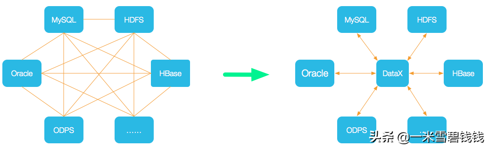
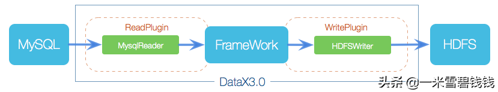
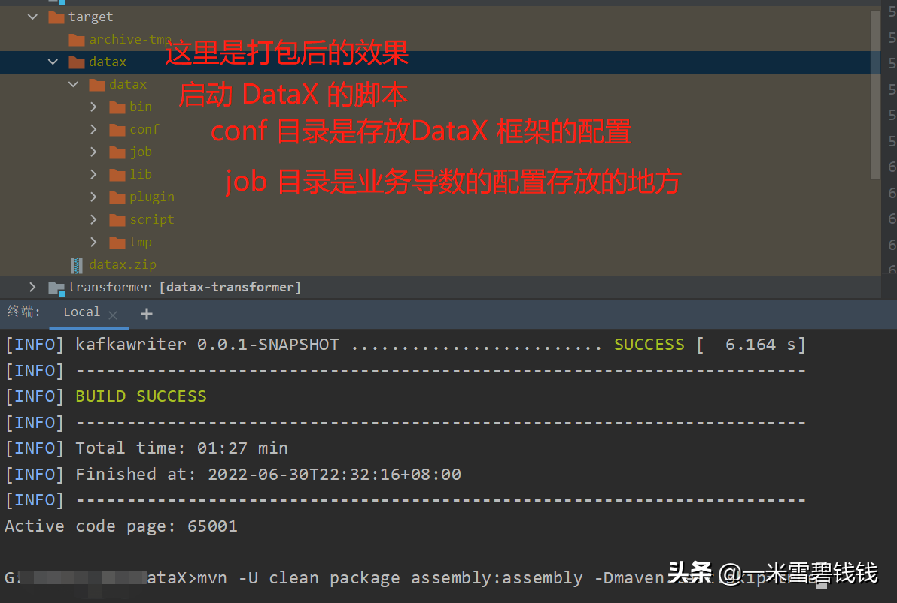
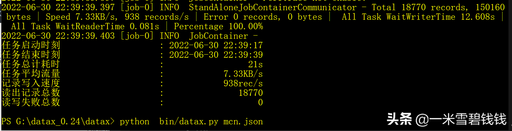

> 主导、开发<font color='green'>数据宽表平台</font>很多年了。其中，离线导数模块部分，
>正好使用了 <font color='green'>DataX</font>。
>基于阿里DataX做了一些内部的改造及优化。后续会逐渐分享给大家。本篇只给大家直观认识、使用阿里的 DataX。
> 

## **背景**

在业界中，离线导数据有 Sqoop，Flink CDC等。Sqoop 在 15年使用过，超级难用。Flink CDC是Flink 的一个生态组件，
提供离线、实时获取的功能。若想要需要额外的功能，需要基于 Sqoop 源码做改造，基本上是由公司内部的维护团队来改造。
有没有一款解耦神器呢。那请 <font color='green'>DataX</font> 出场。

## **DataX 简介**

> DataX 是一款异构数据源离线同步工具，致力于实现包括关系型数据库(MySQL、Oracle等)、HDFS、Hive、ODPS、HBase、FTP等各种异构数据源之间稳定高效的数据同步功能。DataX 数据同步链路图如下：
> 



DataX 的设计理念非常好。DataX将复杂的网状的同步链路变成了<font color='green'>星型数据链路</font>，
DataX作为中间传输载体负责连接各种数据源。当需要接入一个新的数据源的时候，只需要将此数据源对接到DataX，便能跟已有的数据源做到无缝数据同步。

---

> 在公司里面发现，很多业务方在做一些迁移改造的时候，完全可以基于DataX迁移数据，而不必要自己写代码，关键是很多人都不太知道DataX 。
> 

---

# **DataX 框架设计**


DataX 框架设计架构图

DataX本身作为离线数据同步框架，采用<font color='green'>Framework + plugin</font>架构构建。将数据源读取和写入抽象成为Reader/Writer插件，纳入到整个同步框架中。

- Reader：Reader为数据采集模块，负责采集数据源的数据，将数据发送给Framework。
- Writer： Writer为数据写入模块，负责不断向Framework取数据，并将数据写入到目的端。
- Framework：Framework用于连接reader和writer，作为两者的数据传输通道，并处理缓冲，流控，并发，数据转换等核心技术问题。

> 画外音：大家可以吸收这种架构。比如，我开发的数据宽表平台，也会涉及到 业务定制化的处理，这种完全基于插件模式去处理。业务方在 数据宽表平台上传定制化插件，平台方同台加载加载。达到解耦的目的。
> 

# **如何使用**

- 下载代码

```shell script
git clone https://github.com/alibaba/DataX.git
```

- 开发工具打开 DataX 源码。注释掉无用的 Reader、Writer插件(不然，下载依赖超慢，还有一些jar下载不下来)。比如，我只保留了如下的 Reader、Writer。 kafkaWriter 是我基于 数据宽表平台的需求定制化的。。

```xml
<modules>
    <module>common</module>
    <module>core</module>
    <module>transformer</module>  <!-- reader -->
    <module>mysqlreader</module>
    <module>drdsreader</module>  <!-- writer -->
    <module>streamwriter</module>
    <module>kafkawriter</module>  <!-- common support module -->
    <module>plugin-rdbms-util</module>
    <module>plugin-unstructured-storage-util</module>
</modules>

```

- 执行打包命令

```shell script
mvn -U clean package assembly:assembly -Dmaven.test.skip=true
```

- 打包后的效果：



DataX 打包后的结果如上图所示

- 执行DataX 看看


DataX 执行导数的效果图

# **总结**

- DataX 基于 <font color='green'>微内核+插件模式</font>，达到了解耦的目的。Reader、Writer 插件可供业务方自由的定制化，而DataX Core 由平台部门维护。这种思想我们要充分，特汲取别是搞中间件的各位小伙伴。
- DataX 特别是在<font color='green'>插件加载模块</font>，设计很独特。大家可以充分吸收以下。