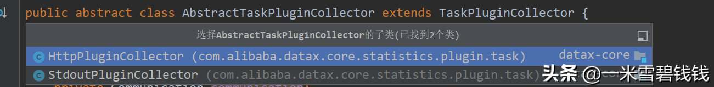

> 在上一篇文章中，我们提到了 <font color='green'>TaskGroupContainer</font> 里面有 Task 的初始化、启动、重试等等逻辑。
>那么，我们本章将着重讲解 DataX 中的 Task 是如何初始化的。
> 

继前N篇文章：

[DataX源码分析七之插件加载原理.md](DataX源码分析七之插件加载原理.md) 

[DataX源码分享八之TaskGroupContainer.md](DataX源码分享八之TaskGroupContainer.md) 

## **代码入口**

> 下面的代码片段在：<font color='green'>com.alibaba.datax.core.taskgroup.TaskGroupContainer#start</font>。这里是初始化 Task、启动Task 的入口。
> 

```java
// 构建任务执行器，有 reader、writer、channel
TaskExecutor taskExecutor = new TaskExecutor(taskConfigForRun, attemptCount);
taskStartTimeMap.put(taskId, System.currentTimeMillis());
// 启动一个 TaskExecutor，就是启动过一个 
TasktaskExecutor.doStart();

```

## **TaskExecutor 初始化**

> 下面，我将摘抄 TaskExecutor 构造函数的代码，DataX 中的 Task 包含了 <font color='green'>Reader、Writer、Channel、Transformer</font>。
> 

```java
// 默认配置路径：core.transport.channel.class，即：com.alibaba.datax.core.transport.channel.memory.MemoryChannel
this.channel = ClassUtil.instantiate(channelClazz, Channel.class, configuration);
// 获取 transformer 参数，里面还有各种的 Transformer 的注册、加载等等。
List<TransformerExecution> transformerInfoExecs = TransformerUtil.buildTransformerInfo(taskConfig);
// 为 Writer 构建一个 Runnable
writerRunner = (WriterRunner) generateRunner(PluginType.WRITER);
// 为 Reader 构建一个 Runnable
readerRunner = (ReaderRunner) generateRunner(PluginType.READER,transformerInfoExecs);
```

## **Channel 初始化**

> 通过上一小节，我们知道 Channel 默认是使用<font color='green'>com.alibaba.datax.core.transport.channel.memory.MemoryChannel</font>。可从 <font color='green'>core.json</font> 中看出来的。初始化的操作是通过 类加载其来的，如下面的代码片段。
> 

```java
// 这个是 通过 Java 反射机制，生成 Channel 的实例。
Constructor constructor = (Constructor) Class.forName(className).getConstructor(ClassUtil.toClassType(args));
return (T) constructor.newInstance(args);


// ------------------ 分割线，下面是 channel 构造函数核心的参数，涉及到 限流等等操作。 -------------------//
//channel的queue里默认record为1万条。原来为512条
int capacity = configuration.getInt(CoreConstant.DATAX_CORE_TRANSPORT_CHANNEL_CAPACITY, 2048);
// byte 的速率是 1MB
long byteSpeed = configuration.getLong(CoreConstant.DATAX_CORE_TRANSPORT_CHANNEL_SPEED_BYTE, 1024 * 1024);
// Record 的速率是 1w条。
long recordSpeed = configuration.getLong(CoreConstant.DATAX_CORE_TRANSPORT_CHANNEL_SPEED_RECORD, 10000);
// 流控规则是 1000 ms
flowControlInterval = configuration.getLong(CoreConstant.DATAX_CORE_TRANSPORT_CHANNEL_FLOWCONTROLINTERVAL, 1000);
//channel的queue默认大小为8M，原来为64Mbyte
Capacity = configuration.getInt(CoreConstant.DATAX_CORE_TRANSPORT_CHANNEL_CAPACITY_BYTE, 8 * 1024 * 1024);
```

## **MemoryChannel 初始化**

> 在 DataX 中，Channel 是一个抽象类，其本质就是一个缓冲队列，提供了限流、push、pull 基础能力。<font color='green'>MemoryChannel</font> 是Channel 在DataX默认、唯一的具体实现类。我们可以通过其构造函数即可看出来。
> 

```java
// 调用 channel 的构造函数super(configuration);// 阻塞队列。所有的数据都要在这里停留，这个是 FIFO 模型
this.queue = new ArrayBlockingQueue<Record>(this.getCapacity());
// 默认是 32
this.bufferSize = configuration.getInt(CoreConstant.DATAX_CORE_TRANSPORT_EXCHANGER_BUFFERSIZE);
lock = new ReentrantLock();
notInsufficient = lock.newCondition();
// 锁。
notEmpty = lock.newCondition();
```

## **WriterRunner 初始化**

> 可能一些小伙伴还有印象，我们之前也分析过在JobContainer 里面，也有插件的初始化！是的，没错，
但是JobContainer 的插件初始化是为了 split 任务等等。这时在这里的Writer 插件初始化是为了即将写入数。
下面的代码片段是摘抄的！
> 

```java
case WRITER:
  newRunner = LoadUtil.loadPluginRunner(pluginType, this.taskConfig.getString(CoreConstant.JOB_WRITER_NAME));
  newRunner.setJobConf(this.taskConfig.getConfiguration(CoreConstant.JOB_WRITER_PARAMETER));
  // com.alibaba.datax.core.statistics.plugin.task.StdoutPlugin
  CollectorpluginCollector = ClassUtil.instantiate(taskCollectorClass, AbstractTaskPluginCollector.class, configuration, this.taskCommunication, PluginType.WRITER);
  ((WriterRunner) newRunner).setRecordReceiver(new BufferedRecordExchanger(this.channel, pluginCollector));
  // 设置taskPlugin的collector，用来处理脏数据和job/task通信
  newRunner.setTaskPluginCollector(pluginCollector);
  break;
```

## **ReaderRunner 初始化**

> 初始化 Reader 插件，同 WriterRunner 一样
> 

```java
case READER:
  newRunner = LoadUtil.loadPluginRunner(pluginType, this.taskConfig.getString(CoreConstant.JOB_READER_NAME));
  newRunner.setJobConf(this.taskConfig.getConfiguration(CoreConstant.JOB_READER_PARAMETER));
  pluginCollector = ClassUtil.instantiate(taskCollectorClass, AbstractTaskPluginCollector.class, configuration, this.taskCommunication, PluginType.READER);
  RecordSender recordSender;
  if (transformerInfoExecs != null && transformerInfoExecs.size() > 0) {
      recordSender = new BufferedRecordTransformerExchanger(taskGroupId, this.taskId, this.channel, this.taskCommunication, pluginCollector, transformerInfoExecs);
  } else {
      recordSender = new BufferedRecordExchanger(this.channel, pluginCollector);
  }
  ((ReaderRunner) newRunner).setRecordSender(recordSender);
  // 设置taskPlugin的collector，用来处理脏数据和job/task通信
  newRunner.setTaskPluginCollector(pluginCollector);
  break;
```

# **Transformer 初始化**

> 在 DataX 中，数据通过 Reader、Channe、Writer 即可完成数据的操作，但是有时候，
>我们还需要在中间的过程中做一些转换的逻辑，比如，比较常见的是：<font color='green'>账号、密码脱敏</font>功能。下一期会详细讲解Transformer。
> 

```java
// 在 TaskExecutor 初始化过程中，有一段这样的代码，里面有 各种内置的 Transformer 加载、初始化。
TransformerUtil.buildTransformerInfo(taskConfig);
```

## **Task 脏数据收集插件**

> 在 DataX 中，有各种各样的状态数据收集，而 Task 中的 Reader、Writer 脏数据如何收集呢？默认是 <font color='green'>StdoutPluginCollector</font> ，
>直接打印到日志文件里面的。可以在 core.json 中修改。
>
>1、脏数据记录，TaskPluginCollector提供多种脏数据记录的适配，包括本地输出、集中式汇报等等
>
>2、自定义信息，所有的task插件运行过程中可以通过TaskPluginCollector收集信息。
> 

```java
// com.alibaba.datax.core.statistics.plugin.task.StdoutPluginCollector
this.taskCollectorClass = this.configuration.getString(CoreConstant.DATAX_CORE_STATISTICS_COLLECTOR_PLUGIN_TASKCLASS);
// 通过反射的方式，初始化
pluginCollector = ClassUtil.instantiate(taskCollectorClass, AbstractTaskPluginCollector.class, configuration, this.taskCommunication, PluginType.WRITER);

```


DataX中的脏数据 收集插件

# **未完待续**

- [ ]  Transfomer 是如何加载、初始化的。DataX内部又有哪些呢？下一期，我们继续分享。
- [ ]  Reader、Writer 插件都抽象为 ReaderRunner、WriterRunner，里面都做了啥了呢？下一期，我们继续分享。

# **总结**

1. 本章的内容比较简单。在DataX 中，存在 Reader、Channel、Transformer、Writer。这4个元素，共同组成一条数据抽取、组装、写入流水线。