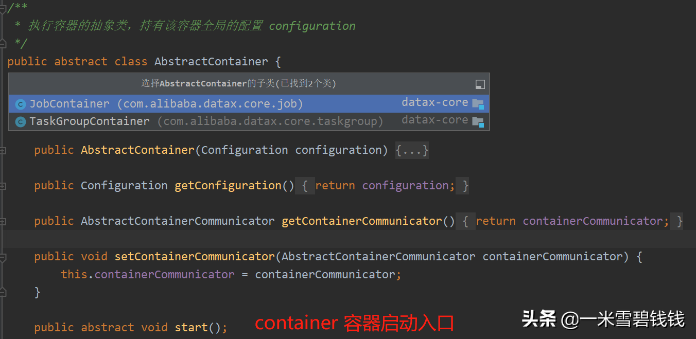
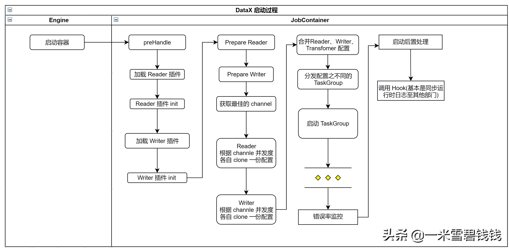
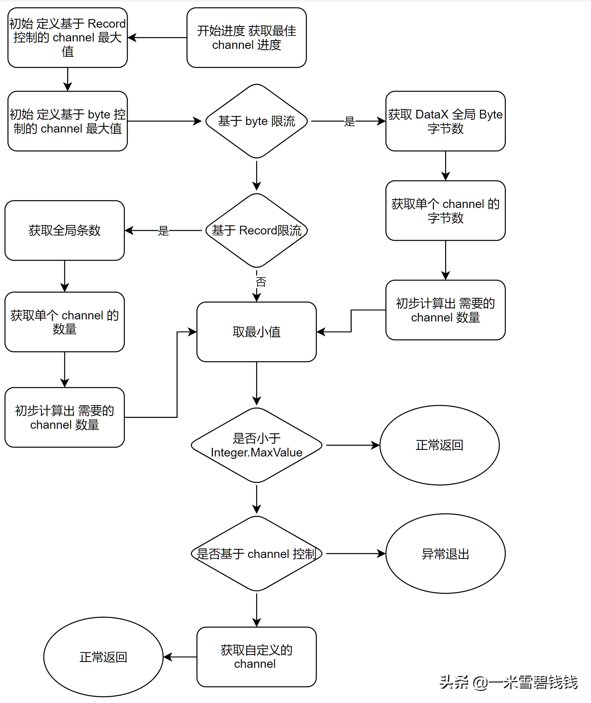
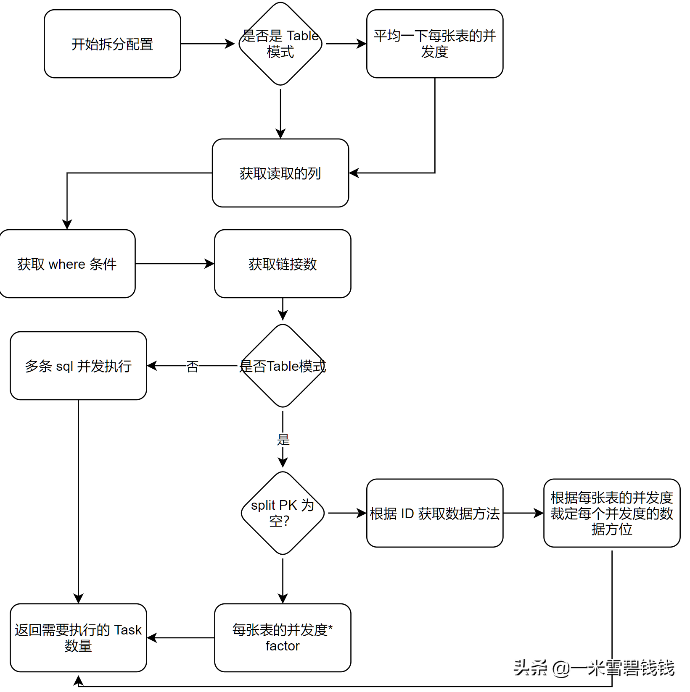

> 在上一章中，我们分析到了 DataX 的 Engine 类启动做了哪些事情。接下来，我们将继续分析 JobContainer 在里面都做了啥。
> 

继上篇文章：[DataX源码分析四之启动入口分析.md](DataX源码分析四之启动入口分析.md) 

## **1、概念**

> JobContainer：Job 执行容器，负责 Job 任务的拆分、调度、任务状态收集、等等。
> 

## **2、继承关系**

上图是 DataX 的 AbstractContainer 的继承关系

> 由于我们是单机版的，所以任务的拆分先创建 JobContainer ，然后再创建N个TaskGroupContainer。
> 

## **3、流程**

> 下面的代码块，就是 JobContainer 的启动流程所作的事情了，接下来我们一个一个说，每个方法是做哪些操作的。
> 
- preHandle：主要是做预处理操作。
- init：此方法是根据 Job 中的 Reader和Writer 配置来初始化 Reader 和Writer插件。这里会涉及到 DataX 
插件加载原理及调用各自插件的 init 方法。比如 MysqlReader 可以在这里先行测试是否能链接数据库等等。
- prepare ：此方法默认是空实现。
- split：按照 Job 的配置，对任务进行拆分，目的就是为了获取最佳的 channel 并发数。
而 DataX 中最佳运行的 channel 并发数，可以通过byte、record、channel数量来一起计算而得出的。
writer的切分结果要参照reader的切分结果， 达到切分后数目相等，才能满足1：1的通道模型，
所以这里可以将reader和writer的配置整合到一起。因为一个 channel 包含了 Reader Writer 、queue。
这里的每个 channel 会 clone 一份原生的 JobConfiguration 配置。
- schedule：根据 split 方法生成的 task 配置，生成一系列 TaskGroup 对象。
这里就开启了 channel 并行处理数据操作了。schedule 方法后面，还有一个错误率校验逻辑，如果超过阈值，直接终止 此 Job 任务。
- invoker：调用自定义逻辑，推送 DataX内部运行数据。这里可以自己做改造的。

## **4、整体流程图**

> 下面的流程图：根据我的理解，梳理了一下。源码里面写的比较绕，我就直白化处理。
> 

JobContainer 的 start 方法所作的事情

## **5、详解之获取最佳 channel 数量。**

> 在 DataX 中，可以自定义并发度，其中有 3 种粒度。分别是 byte、Record、channel。让我们仔细看看 DataX 是如何基于 3种粒度来获取最佳的 channel ，接下来，我们细看一下
> 

## **6、详解之Task任务数**

> 下面这个流程图，是 Reader 的如何计算 Task 数量，而 Writer 的 Task 数量是跟 Reader 数量保持 1：1
> 

## **总结**

- 上面的基本是 JobContainer 的 start 逻辑了，还有一点是 TaskGroup 如何分配，留给下一期讲解。我们先消化这部分先。
- 从上面我们学到了一个很重要的原理：DataX 插件加载机制。如果我们在开发系统的涉及到插件模块，可以参考这种设计。
- DataX 在执行完成后，还提供一个 Hook 功能。这种设计思想，我们也要汲取。