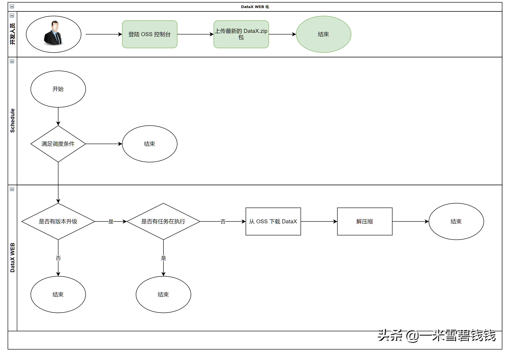

> GitHub 上面开源的 DataX源码，只能是单机部署的，最主要是部署不够灵活，一般情况下，我们需要将其改造为 WEB 化
> 

## **如何改造**

- 第一种：在 DataX 内部改造，让其支持 WEB 服务。（直接在 DataX 内部，用Python 写一个<font color='green'>HtppServer</font>。
在每次发布DataX 服务时，自动拉起 HttpServer。需要发布平台支持）
- 第二种：在 DataX <font color='green'>外部包一层壳</font>，达到 WEB 化。

---

我个人是推荐 第二种！改造起来快！维护方便。

---

**那该如何改造呢？**

## **设计库表结构**

```sql

CREATE TABLE `datax_version`(    `id`          bigint(11) unsigned NOT NULL AUTO_INCREMENT COMMENT 'ID',    `version`     varchar(128)        NOT NULL DEFAULT '-' COMMENT 'datax 版本号',    `description` text COMMENT 'desc',    `valid`       tinyint(1)          NOT NULL DEFAULT '1' COMMENT ' 1有效 0无效',    PRIMARY KEY (`id`)) ENGINE = InnoDB AUTO_INCREMENT = 1  DEFAULT CHARSET = utf8mb4 COMMENT ='datax 版本管理';

```

- 为什么需要设计库表呢？库表信息记录了 DataX 自己内部的发版情况。

# **DataX WEB 化流程图**



DataX WEB 服务化之路

那我们的 WEB 服务已经将 DataX 从 OSS 上面下载了，如何拉起一个 DataX Job 任务呢？

# **拉起DataX 任务**


执行 DataX 任 务

# **拉起DataX 任务代码片段**

```java
// 拉起一个 DataX 服务
Process process = Runtime.getRuntime().exec(new String[]{"python", dataXPyPath(), configPath});
// 获取进程ID
String pid = ProcessUtil.getProcessId(process);
// 获取进程在 运行中产生的日志流。
BufferedReader buffer = new BufferedReader(new InputStreamReader(process.getInputStream()));
// 获取进程 异常退出的信息
BufferedReader bufrError = new BufferedReader(new InputStreamReader(process.getErrorStream(), "UTF-8"));
// 获取进程 ID
Class<?> clazz = Class.forName("java.lang.UNIXProcess");
field = clazz.getDeclaredField("pid");
field.setAccessible(true);
pid = (Integer) field.get(process);
```

# **Kill 掉 DataX 任务代码片段**

```java
String command = "kill -9 " + pid;
// 执行 kill 命令
process = Runtime.getRuntime().exec(command);
```

# **总结**

- DataX WEB 服务化，都是比较简单的那种，外层包一层壳即可。
- DataX 本省是一个任务一个进程的方式，这样做的目的是为了减少锁之间的进程。
<font color='green'>不推荐在 DataX 搞多线程多任务</font>这种方式。DataX 本身就是耗内存的一款中间件，本身就是偏向于一个任务一个进程的方式。