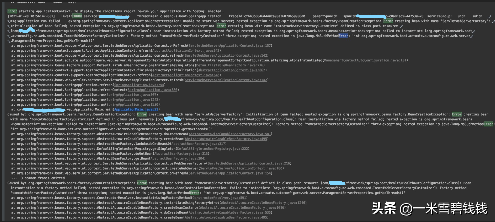
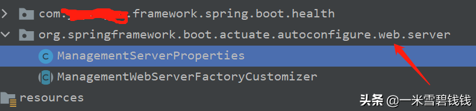
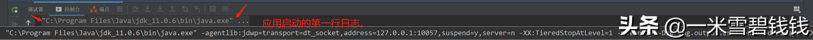
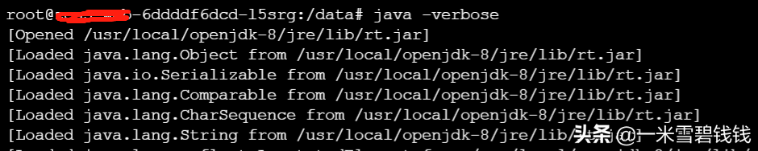
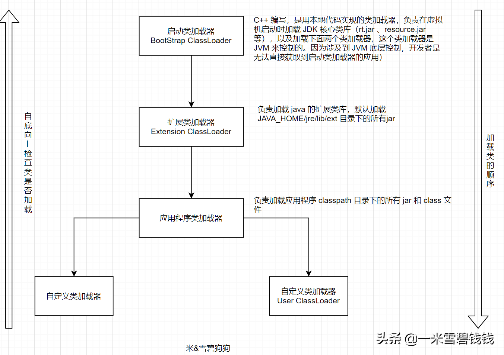

## **背景**

某天，业务线的一个妹子过来找我，说升级到 framework-bom 1.9.3，发布时，应用启动不了，但本地启动是ok的。报错信息如下：

## **起因**

我们中间件团队也对各种starter做了二次封装。比如健康检测模块。

但是，在上图中，箭头指向的package跟 SpringBoot 框架是一致的。而Spring 框架里面没有 getMaxThreads方法。

仔细看看上面的两个截图的箭头指向的位置，会发现 ManagementServerProperties 类的全路径一致。

## **讨论**

- 有人建议业务的妹子，把两者的 jar 的MAVEN 坐标在 POM文件中调换一下。我当时想着，这项目都部署完毕了，
已经没有 maven 事情了，肯定是类加载机制的问题。
- 我当时请教一下别人，别人说，可能是 SpringBoot 框架记住了jar 的顺序了。咦，纳闷了，
SpringBoot 还能干这个事情？如果不使用SpringBoot的话，肯定也有类似的类加载的问题，肯定是不是框架层次的问题了。

## **初步结论**

- 类加载冲突，导致出现问题。删除中间件团队封装的类即可。但是，冲突的原则或者策略是啥？让我们继续往下看！

## **Maven 的依赖规则**

- 短路优先（就近原则）
- 先声明先优先使用。

## **如何排除某些jar 呢？**

- idea 安装 maven helper 插件。如何使用，在这里就写了。

Maven Helper 插件
- maven help 命令来查看。

## **如何查看 java 应用加载 jar 的顺序呢？**

- 查看 idea 启动的时候，查看加载 jar 的顺序（这个跟类加载是两回事哈）

idea 启动时，可以看到 JAR 包加载顺序

- 部署应用的机器查看，使用 java -verbose 命令

Java -verbose 命令执行效果

## **类如何被JVM 加载的**

Java ClassLoader 加载顺序

## **最终原因是啥呢**

> JDK 官方文档：https://docs.oracle.com/javase/7/docs/technotes/tools/solaris/classpath.html The order in which the JAR files in a directory are enumerated in the expanded class path is not specified and may vary from platform to platform and even from moment to moment on the same machine. A well-constructed application should not depend upon any particular order. If a specific order is required then the JAR files can be enumerated explicitly in the class path. 
>
>翻译： 相同目录下，JAR文件在JVM 中加载的顺序是无法保证，并且可能因平台而异，甚至在同一台计算机上也可能因时间而异。构造良好的应用程序不应依赖于任何特定的顺序。
>如果需要特定的顺序，那么可以在类路径中显式指定加载JAR文件的顺序。
>
> 

至此，问题基本明了了，基本底层也搞清楚了。

## **后续步骤**

- 在应用检测层次，需要检测出来 类冲突，需要使用maven-enforcer-plugin插件，正好我也负责代码检测项目（jar 冲突，版本禁用，SQL 审批等），已经罗列到议程中。

