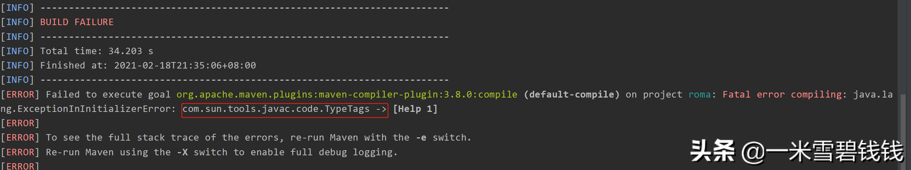

## **背景**

前段时间。在Java项目中，执行 maven 命令编译。出现了一个诡异的异常信息。具体异常如下：




项目依赖信息：

```xml
<lombok.version>1.16.16</lombok.version>
```

## **操作步骤**

1. 执行 <font color='green'>mvn clean compile -X</font> 看看具体的 debug 信息


1. Google 一下:找到一篇关于 Lombok 的issue: https://github.com/rzwitserloot/lombok/issues/1651


摘抄上面链接的重要信息。

1. 升级 Lombok 版本号即可。里面提及到 Lombok 版本太低；正好我电脑的 <font color='green'>JDK 版本是11</font>，将Lombok 升级即可。

```xml
<dependency>
    <groupId>org.projectlombok</groupId>
    <artifactId>lombok</artifactId>
    <version>1.18.4</version>
</dependency>

```

## **总结**

Lombok 在实际开发中，确实是遇到一些奇葩的问题，比如，高低版本不兼容。有问题，直接 Github 里面就搜索知道答案了。
