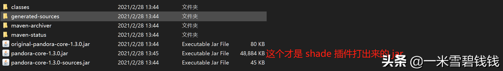
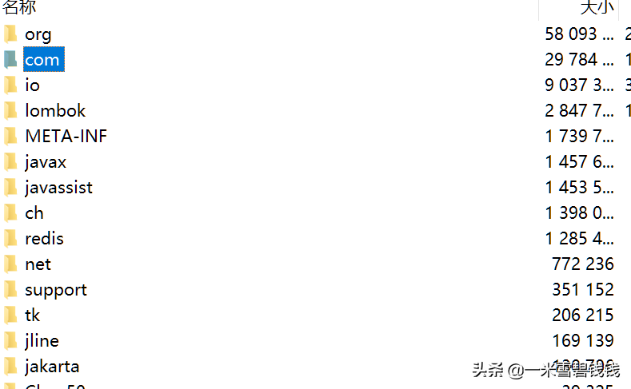
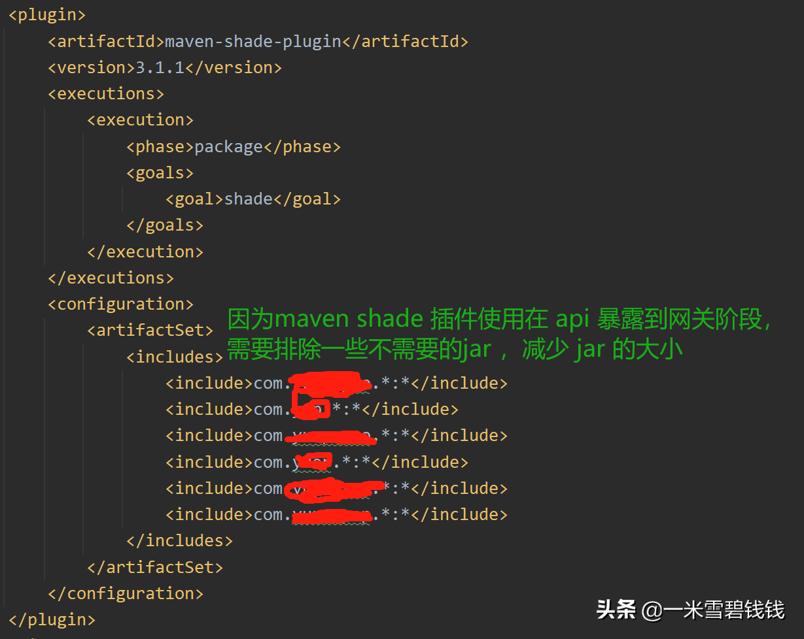

# **背景**

maven shade 插件，基本在开发过程中很少使用过。但是，在之前公司负责过 ES 网关和数据同步系统、API 网关的时候，正好使用过。在现在的公司，负责网关元数据开发(之前也开发网关)，也是用了这个shade 插件。

# **此 shade 插件有何用处**

> maven 插件列表：http://maven.apache.org/plugins/index.html
> 
> 
> shade 插件使用：http://maven.apache.org/plugins/maven-shade-plugin/ 将当前项目所有的依赖都打包成一个巨大的 jar，此jar 和 spring boot 打出来的 jar 略有不同。

# **命令行如何使用**

```bash
 在 maven 3.2.4 版本之后，可以使用此命令来执行 shade 操作。  
 mvn clean -Dmaven.test.skip=true  -Dspring-boot.repackage.skip=true package source:jar shade:shade

```

# **效果**


执行 shade 命令后，所有的依赖，都打到一个 JAR 里面。


执行 shade 命令后，打包后的 JAR ，解压缩的如上图。

---

> 命令行虽好，但是不够灵活。比如，有一些公共的 JAR 是可以排除掉的。那么，命令行不叫麻烦了。接下来，让我们看看通过代码的方式如何实现吧。
> 

---

# **添加依赖**

```xml
<dependency>   
	<groupId>org.apache.maven</groupId>    
	<artifactId>maven-model-builder</artifactId>    
	<version>3.6.0</version> 
</dependency>
<dependency>   
	<groupId>org.apache.maven</groupId>    
	<artifactId>maven-model</artifactId>    
	<version>3.6.0</version> 
</dependency>

```


# **代码实现**

```java
   public void addPluginToPublishModulePom(String publishModulePomPath) {
        try {
            FileInputStream fis = new FileInputStream(new File(publishModulePomPath));
            MavenXpp3Reader reader = new MavenXpp3Reader();
            Model model = reader.read(fis);
            Build build = model.getBuild();
            if (build == null) {
                build = new Build();
                model.setBuild(build);
            }
            List<Plugin> pluginList = model.getBuild().getPlugins();
            boolean existsMavenSourcePlugin = false;
            boolean existsMavenShadePlugin = false;
            if (CollectionUtils.isNotEmpty(pluginList)) {
                for (Plugin plugin : pluginList) {
                    if (StringUtils.equalsIgnoreCase("maven-source-plugin", plugin.getArtifactId())) {
                        existsMavenSourcePlugin = true;
                    }
                    if (StringUtils.equalsIgnoreCase("maven-shade-plugin", plugin.getArtifactId())) {
                        existsMavenShadePlugin = true;
                    }
                }
            }
            if (!existsMavenShadePlugin) {
                addMavenShadePlugin(model);
            }
            if (!existsMavenSourcePlugin) {
                addMavenSourcePlugin(model);
            }
            File outputPomPath = new File(publishModulePomPath);
            DefaultModelWriter defaultModelWriter = new DefaultModelWriter();
            defaultModelWriter.write(outputPomPath, new HashMap<>(), model);
        } catch (Exception e) {
            log.error("addPluginToPublishModulePom exception ,publishModulePomPath:{} ,e:{}", publishModulePomPath, e);
        }
    }

    private void addMavenSourcePlugin(Model model) {
        PluginExecution pluginExecution = new PluginExecution();
        pluginExecution.setGoals(Lists.newArrayList("jar-no-fork"));
        pluginExecution.setId("attach-sources");
        pluginExecution.setPhase("verify");
        Plugin mavenSourcePlugin = new Plugin();
        mavenSourcePlugin.setArtifactId("maven-source-plugin");
        mavenSourcePlugin.setVersion("3.0.1");
        mavenSourcePlugin.setExecutions(Lists.newArrayList(pluginExecution));
        model.getBuild().getPlugins().add(mavenSourcePlugin);
    }

    private void addMavenShadePlugin(Model model) {
        PluginExecution pluginExecution = new PluginExecution();
        pluginExecution.setGoals(Lists.newArrayList("shade"));
        pluginExecution.setPhase("package");
        Plugin mavenShadePlugin = new Plugin();
        mavenShadePlugin.setArtifactId("maven-shade-plugin");
        mavenShadePlugin.setGroupId("org.apache.maven.plugins");
        mavenShadePlugin.setVersion("3.1.1");
        mavenShadePlugin.setExecutions(Lists.newArrayList(pluginExecution));
        final Xpp3Dom mavenPluginConfiguration = new Xpp3Dom("configuration");
        final Xpp3Dom artifactSet = new Xpp3Dom("artifactSet");
        mavenPluginConfiguration.addChild(artifactSet);
        final Xpp3Dom includes = new Xpp3Dom("includes");
        artifactSet.addChild(includes);
        String packagePrefixString = ConfigService.getAppConfig().getProperty("maven.shade.plugin", "[]");
        List<String> packagePrefixList = JSON.parseArray(packagePrefixString, String.class);        // 做一些过滤，减少包的大小         if (CollectionUtils.isNotEmpty(packagePrefixList)) {             packagePrefixList.stream().forEach(packagePrefix -> {                 final Xpp3Dom packagePrefixDom = new Xpp3Dom("include");                 packagePrefixDom.setValue(packagePrefix + ".*:*");                 includes.addChild(packagePrefixDom);             });         }         mavenShadePlugin.setConfiguration(mavenPluginConfiguration);         model.getBuild().getPlugins().add(mavenShadePlugin);     }

    }
```


# **最终效果**



通过代码，最终生产的 POM.xml 文件如上图所示