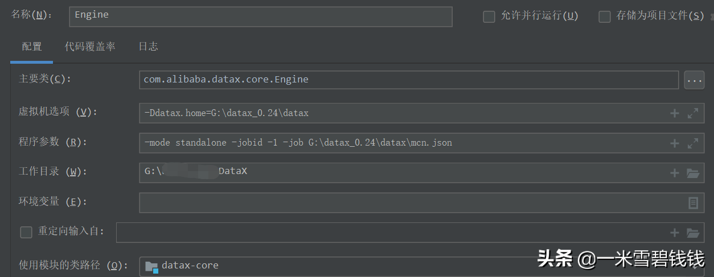
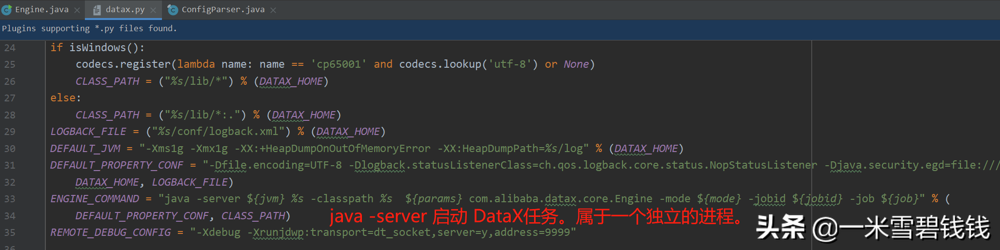
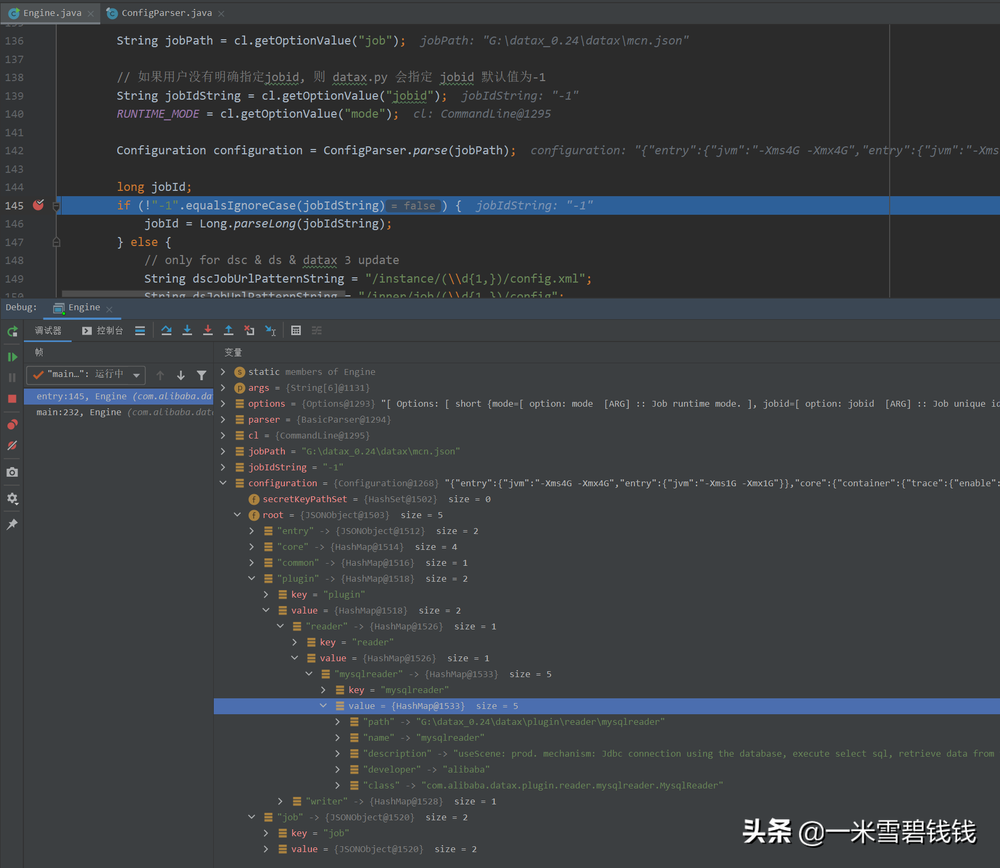

> 为了阅读DataX源码更加方便，要在本地开发工具，比如 IDEA 中进行 debug调试。
>但是，本人推荐 尽量少用Debug 来阅读代码。如果没有Debug模式阅读代码，那么，
>在阅读过程中，就有很多不同的疑问踊跃出来，助你快速成长！接下来，我们看看如何本地启动吧！
> 

## **环境搭建**

> 环境搭建，其实就是把源码导入进来，有自己的 任务配置。比如，我接下来即将使用到的 mcn.json 这个任务配置
> 

[DataX源码分析之一如何使用.md](DataX源码分析之一如何使用.md) 

## **启动参数配置**

1. 配置好虚拟机选项参数：Ddatax.home=G:\datax_0.24\datax主要是系统环境变量配置。
2. 配置好 Java Main 函数启动的 args 参数mode standalone -jobid -1 -job G:\datax_0.24\datax\mcn.json主要是DataX 任务启动参数配置。
启动 mode 和 jobid 都保持这个参数吧，因为DataX开源版本是单机版的。
3. 最终配置效果如下图

IDEA 里面展示的最终配置如上图所示

## **还想配置更多参数**

DataX 任务启动入口，通过 python 脚本创建独立进程，拉起 DataX 导数任务

## **启动**

最终启动效果如上图所示。上面是 mcn.json 转换效果

> Configuration 其实就是 DataX 启动导数任务的整个配置。若是本地启动的话，一定要细看配置是否正确喔
> 

## **总结**

1. DataX 通过 IDEA 启动任务，进行调试。无须过多的配置即可完成。