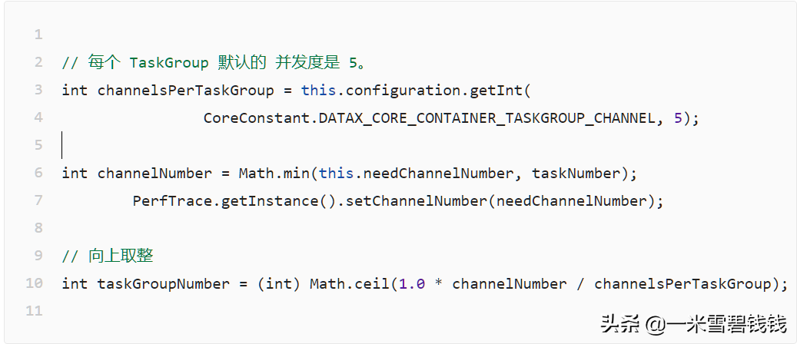
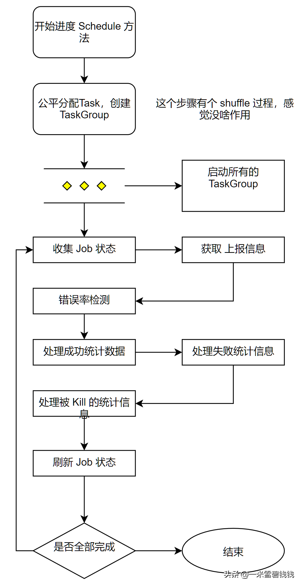

> 在上一章中，我们分析了在 JobContainer 里面 如何计算 最佳的channel的数量及 Task 数量。本章节，我们将分析Task 直接如何分配和Task及TaskGroup 之间的关系。
> 

继上一章节提到的JobContainer:继上篇文章：[DataX源码分析五之JobContainer详解.md](DataX源码分析五之JobContainer详解.md) 
# **代码入口**

```css
com.alibaba.datax.core.job.JobContainer#schedule
```

# **预知识点**

- 默认每个 TaskGroup 的并发度是 5。

# **计算公式**


DataX TaskGroup 计算规则

```java
        // 每个 TaskGroup 默认的 并发度是 5。
        int channelsPerTaskGroup = this.configuration.getInt(CoreConstant.DATAX_CORE_CONTAINER_TASKGROUP_CHANNEL, 5);
        int channelNumber = Math.min(this.needChannelNumber, taskNumber);
        PerfTrace.getInstance().setChannelNumber(needChannelNumber);
        // 向上取整int 
        taskGroupNumber = (int) Math.ceil(1.0 * channelNumber / channelsPerTaskGroup);
```

# **TaskGroup 调度过程**


JobContainer 中的 schedule 方法

# **重点的代码**

```java
    // 优化 TaskGroup 里面的 Channel 并发度
    private static void adjustChannelNumPerTaskGroup(List<Configuration> taskGroupConfig, int channelNumber) {
        int taskGroupNumber = taskGroupConfig.size();
        int avgChannelsPerTaskGroup = channelNumber / taskGroupNumber;
        int remainderChannelCount = channelNumber % taskGroupNumber;
        // 表示有 remainderChannelCount 个 taskGroup,其对应 Channel 个数应该为：avgChannelsPerTaskGroup + 1；     
        //（taskGroupNumber - remainderChannelCount）个 taskGroup,其对应 Channel 个数应该为：avgChannelsPerTaskGroup
        //这个情况属于不均匀，优先是前面的 TaskGroup 加大并发度，后面的平均数。
        int i = 0;
        for (; i < remainderChannelCount; i++) {
            taskGroupConfig.get(i).set(CoreConstant.DATAX_CORE_CONTAINER_TASKGROUP_CHANNEL, avgChannelsPerTaskGroup + 1);
        }
        // 从 I 开始，都是平均数        
        for (int j = 0; j < taskGroupNumber - remainderChannelCount; j++) {
            taskGroupConfig.get(i + j).set(CoreConstant.DATAX_CORE_CONTAINER_TASKGROUP_CHANNEL, avgChannelsPerTaskGroup);
        }
    }

```

# **总结**

- TaskGroup 创建过程，重点体现在 防止出现长尾效应。里面用了 load 资源表示符号和 shuffle 功能。