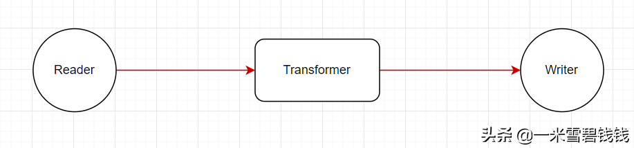
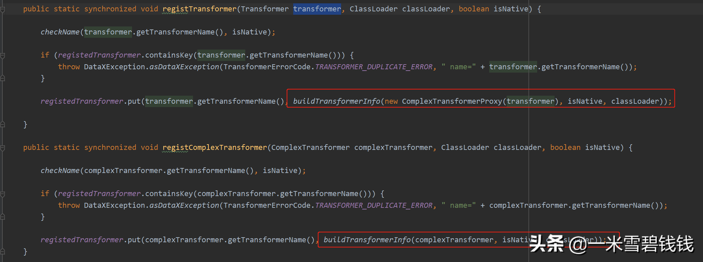

> 在 DataX中，还有一个比较核心的组件，就是 Transformer。本章我们将着重分析 Transformer。
> 

继上一篇文章：

[DataX源码分享八之TaskGroupContainer.md](DataX源码分享八之TaskGroupContainer.md) 


## **为啥需要Transformer**


简单的 ETL 模型视图

- 在上一节中。我们说到 Transformer 在 ETL 链路里面，就是 数据转换的角色。比如，我们常见的账号、密码脱敏等等。
- 比如，我们需要对 ext 字段的内容解析，然后，才决定是否需要此条Record。

## **代码初次入口**

> 在这段代码中，完成了自定义 Transformer 的加载、初始化等等。代码入口：
><font color='green'>com.alibaba.datax.core.taskgroup.TaskGroupContainer.TaskExecutor#TaskExecutor</font>。
>
> 

```java
// 加载定义的&内置的
TransformerTransformerUtil.buildTransformerInfo(taskConfig);
```

## **DataX 内置 Transformer**

> 在 DataX 中，transformer 有两处来源，一个是内置的。一个是 自己实现的。如果是自己实现的话，
>套路还是类似插件的那种，通过 transformer.json 来加载的；具体请看下一小节。那么内置的有哪些呢？
>代码入口：<font color='green'>com/alibaba/datax/core/transport/transformer/TransformerRegistry</font>
> 

```java
    // 下面的 transformer，看具体业务使用的场景而决定。
    static {
        registTransformer(new SubstrTransformer());
        registTransformer(new PadTransformer());
        registTransformer(new ReplaceTransformer());
        registTransformer(new FilterTransformer());
        registTransformer(new GroovyTransformer());
    }
```

## **DataX Transformer 分类**

- Simple类型的 Transformer

```java
public abstract class Transformer {
    /**
     * @param record 行记录，UDF进行record的处理后，更新相应的record
     * @param paras  transformer函数参数
     */
    abstract public Record evaluate(Record record, Object... paras);
}
```

- Proxy类型的Transformer

```java
// 这个其实就是一个 Proxy，
public abstract class ComplexTransformer {
    /**
     * @param record   行记录，UDF进行record的处理后，更新相应的record
     * @param tContext transformer运行的配置项
     * @param paras    transformer函数参数
     */
    abstract public Record evaluate(Record record, Map<String, Object> tContext, Object... paras);
}
```

> 通过代码分析，两者都没有啥大的区别。ComplexTransformer 通过 <font color='green'>ComplexTransformerProxy</font> 最终实现 transformer 调用。
>复杂的Transformer 中的 tContext 是为了多传一些参数罢了。
> 

## **DataX 自定义Transformer 加载&初始化**

```java
        // 第一步：// JOB_TRANSFORMER = "transformer"
        List<Configuration> tfConfigs = taskConfig.getListConfiguration(CoreConstant.JOB_TRANSFORMER);
        // 第二步：校验 dx_groovy 是否只调用了一次
        functionName.equals("dx_groovy") && functionNames.contains("dx_groovy")
        // 第三步：获取到每个 transformer 的组件的名称
        TransformerRegistry.loadTransformerFromLocalStorage(functionNames);
        // 第四步：读取指定 transformer 的路径// CoreConstant.DATAX_STORAGE_TRANSFORMER_HOME="G:\\datax_0.24\\datax\\local_storage\\transformer"
        String transformerPath = CoreConstant.DATAX_STORAGE_TRANSFORMER_HOME + File.separator + each;
        // 第五步：读取指定的 transformer 的配置
        Configuration.from(new File(transformerPath + File.separator + "transformer.json"));
        // 第六步：通过 transformer.json 读取 ClassName
        String className = transformerConfiguration.getString("class");
        // 第七步：通过反射初始化
        transformerClass<?> transformerClass = jarLoader.loadClass(className);
        // 第八步：注册 transformer。
        registedTransformer.put
```

# **Transformer 转换**

```java
    // 将反射生成的 Transformer 再次打包。方便调用
    private static TransformerInfo buildTransformerInfo(ComplexTransformer complexTransformer, boolean isNative, ClassLoader classLoader) {
        TransformerInfo transformerInfo = new TransformerInfo();
        transformerInfo.setClassLoader(classLoader);
        transformerInfo.setIsNative(isNative);
        transformerInfo.setTransformer(complexTransformer);
        return transformerInfo;
    }
```


Transformer 封装，统一转换为 Complex 类型的 Transformer

- 大家有没有发现，即使你是 Simple 类型的 Transformer，也会给你转换成 Proxy 类型的 Transformer。有点意思

# **Transformer 参数信息保存**

```java
        Integer columnIndex = configuration.getInt(CoreConstant.TRANSFORMER_PARAMETER_COLUMNINDEX);
        transformerExecutionParas.setColumnIndex(columnIndex);
        List<String> paras = configuration.getList(CoreConstant.TRANSFORMER_PARAMETER_PARAS, String.class);
        if (paras != null && paras.size() > 0) {
            transformerExecutionParas.setParas(paras.toArray(new String[0]));
        }
```

- 其实这块没必要搞这么复杂。比如，我这边的宽表系统，按照约定，直接丢一个 Record 到业务方的代码里面。业务方喜欢怎么解析都可以。

# **总结**

1. 通过分析自定义 Transformer 的加载过程中。我们又一次认识到了 <font color='green'>transformer.json</font> 类似这种文件的作用了。
如果你自己开发一套插件系统的话，你可以把 xx.json 放在 Resource 目录下。这种，整体的结构会更加简单。
2. Transformer 的定制化开发，你可以按照 自己的开发插件。如通过 DataX 内部来加载插件方式
或者直接在里面改动 DataX 代码来集成。但是，我不推荐直接改代码的方式。还是得要解耦。