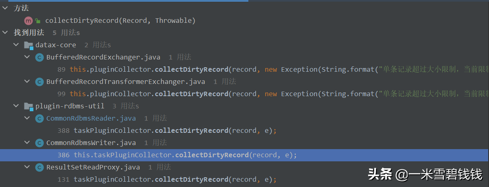

> 来吧！我们进入到最核心！最激动的模块了！分析 DataX 如何读取数据及如何限流。
> 

# **代码入口**

```java
// 代码入口com.alibaba.datax.core.taskgroup.runner.ReaderRunner#run
//启动 ReaderRunner
taskReader.startRead(recordSender);
```

# **Reader 读取数据**

> 代码入口：<font color='green'>com.alibaba.datax.plugin.rdbms.reader.CommonRdbmsReader.Task#startRead</font>
> 

```java
// 获取 SQL,拼接好的SQL。
        String querySql = readerSliceConfig.getString(Key.QUERY_SQL);
// 获取表
        String table = readerSliceConfig.getString(Key.TABLE);
        // 创建链接
        Connection conn = DBUtil.getConnection(this.dataBaseType, jdbcUrl, username, password);
        // 查询数据
        rs = DBUtil.query(conn, querySql, fetchSize);
        // transformer 数据
        this.transportOneRecord(recordSender, rs, metaData, columnNumber, mandatoryEncoding, taskPluginCollector);
        // 1、数据状态。比如你可以在 Record 对象上面添加以下属性。
        //2、将转换好的数据，推送到 Writer
        protected Record transportOneRecord (RecordSender recordSender, ResultSet rs, ResultSetMetaData metaData,
        int columnNumber, String mandatoryEncoding, TaskPluginCollector taskPluginCollector)
        {
            // 转换数据    
            Record record = buildRecord(recordSender, rs, metaData, columnNumber, mandatoryEncoding, taskPluginCollector);
            // Job 任务是否配置了 transformer。recordSender 具体的实例，请看接下来的一小节【Transformer 初始化】   
            recordSender.sendToWriter(record);
            return record;
        }

```

# **Transformer 初始化**

> 回到我们之前的一章，提到了在初始化 Runner 的时候，里面有 Transfromer 的初始化。 比如下面的代码片段：
> 

```java
        if (transformerInfoExecs != null && transformerInfoExecs.size() > 0) {
            recordSender = new BufferedRecordTransformerExchanger(taskGroupId, this.taskId, this.channel, this.taskCommunication, pluginCollector, transformerInfoExecs);
        } else {
            // 没有 Transformer 的话，用这个  
            recordSender = new BufferedRecordExchanger(this.channel, pluginCollector);
        }
```

# **Transformer 使用的地方**

> 下面的这段代码片段是在：com.alibaba.datax.core.transport.exchanger.BufferedRecordTransformerExchanger#sendToWriter 下面这段代码，调用了：<font color='green'>doTransformer</font> ，使用相应的 Transformer 来转换数据
> 

```java
    @Override
    public void sendToWriter(Record record) {
        if (shutdown) {
            throw DataXException.asDataXException(CommonErrorCode.SHUT_DOWN_TASK, "");
        }
        Validate.notNull(record, "record不能为空.");
        // 调用 Transformer     
        record = doTransformer(record);
        if (record == null) {
            return;
        }
        // 判断熔炼     
        if (record.getMemorySize() > this.byteCapacity) {
            this.pluginCollector.collectDirtyRecord(record, new Exception(String.format("单条记录超过大小限制，当前限制为:%s", this.byteCapacity)));
            return;
        }
        // 判断是否满了。    
        boolean isFull = (this.bufferIndex >= this.bufferSize || this.memoryBytes.get() + record.getMemorySize() > this.byteCapacity);
        if (isFull) {
            // 先把 buffer 里面的数据 刷掉，推送到 channel 里面        
            flush();
        }
        // 将数据存放起来。    
        this.buffer.add(record);
        this.bufferIndex++;
        memoryBytes.addAndGet(record.getMemorySize());
    }
```

1. 如果 buffer 还有空间的话，直接将数据缓存起来。
2. 如果 buffer 没有空间了，直接将数据推送到 channel 里面，然后，Writer 通过 channel 来读取数据。

# **推送数据至 Writer**

```java
    @Override
    public void flush() {
        if (shutdown) {
            throw DataXException.asDataXException(CommonErrorCode.SHUT_DOWN_TASK, "");
        }// 启动限流模，及将数据推送到
        Writer this.channel.pushAll(this.buffer);
        this.buffer.clear();
        this.bufferIndex = 0;
        this.memoryBytes.set(0);
    }
```

# **Channel 限流模块**

> 代码入口：<font color='green'>com.alibaba.datax.core.transport.channel.Channel#pushAll</font>下面摘抄核心代码：
> 

```java
        // 方法入口。com.alibaba.datax.core.transport.channel.Channel#statPush(long recordSize, long byteSize)
        当前字节流的速率long currentByteSpeed = (CommunicationTool.getTotalReadBytes(currentCommunication) - CommunicationTool.getTotalReadBytes(lastCommunication)) * 1000 / interval;
        // 如果超过了
        byteLimitSleepTime = currentByteSpeed * interval / this.byteSpeed - interval;
        // 当前 Record 条数的记录
        long currentRecordSpeed = (CommunicationTool.getTotalReadRecords(currentCommunication) - CommunicationTool.getTotalReadRecords(lastCommunication)) * 1000 / interval;
        // 如果超过了。计算根据recordLimit得到的休眠时间
        recordLimitSleepTime = currentRecordSpeed * interval / this.recordSpeed - interval;
        // 睡眠，通过这种方式，来达到限流的效果
        Thread.sleep(sleepTime);
        // 记录此次关键信息。方便下一次的限流数据比较。
        lastCommunication.setLongCounter(CommunicationTool.READ_SUCCEED_BYTES, currentCommunication.getLongCounter(CommunicationTool.READ_SUCCEED_BYTES));
        lastCommunication.setLongCounter(CommunicationTool.READ_FAILED_BYTES, currentCommunication.getLongCounter(CommunicationTool.READ_FAILED_BYTES));
        lastCommunication.setLongCounter(CommunicationTool.READ_SUCCEED_RECORDS, currentCommunication.getLongCounter(CommunicationTool.READ_SUCCEED_RECORDS));
        lastCommunication.setLongCounter(CommunicationTool.READ_FAILED_RECORDS, currentCommunication.getLongCounter(CommunicationTool.READ_FAILED_RECORDS));
        lastCommunication.setTimestamp(nowTimestamp);
```

- DataX 的模型，把 Job 任务，拆分为最细粒度的 Task。Task 获取记录来限流，而这限流指的是 Task 级别的限流。不是 Task 之间的。

## **脏数据采集**

> 在 DataX 中，脏数据定义有很多种，如下图，就是脏数据应用的地方。
> 



DataX 收集脏数据的方法入口

## **总结**

1. DataX 的限流，是 Task 维度的。
2. DataX 的限流，是基于此次&上一次的比较。而不是窗口的维度。
3. Exchanger 就是一个缓冲区，可以单条写入的，而 Channel 是批量模型。
4. 因为采用JDBC读取数据至缓冲区，如果限流过于频繁的话，会导致OOM。使用的时候，需要配置限流关系。