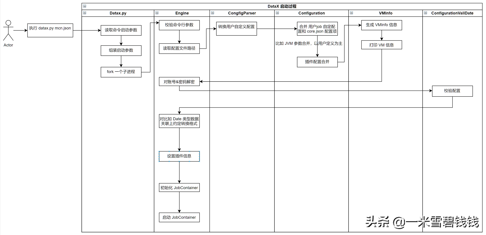
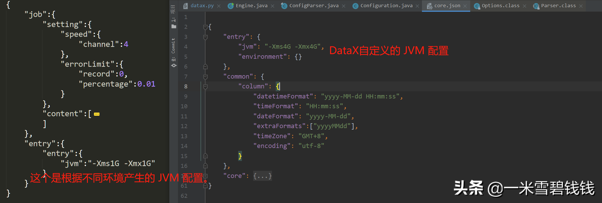
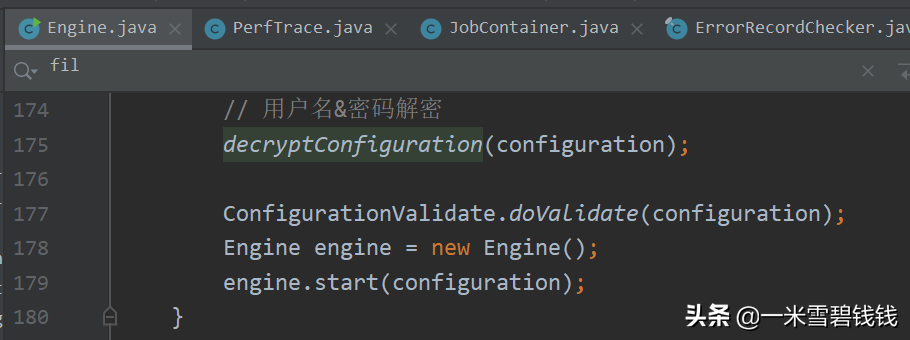

> 在上一篇文章中，我们大致分析了一下 DataX 主干流程后。接下来及后续，我们将详细讲解每个模块的源码。
> 

继上一篇：[DataX源码之三主干源码逻辑分析](https://www.toutiao.com/article/7115716599541367336/)

## **启动**

```shell script
// 比如，我在我电脑上，执行如下命令，即可开启 DataX 导数任务
PS G:\\datax_0.24\\datax> python bin/datax.py mcn.json
```

## **代码入口之 datax.py**

```shell script
if __name__ == "__main__":
    printCopyright()
    parser = getOptionParser()
    options, args = parser.parse_args(sys.argv[1:])
    if options.reader is not None and options.writer is not None:
        generateJobConfigTemplate(options.reader,options.writer)
        sys.exit(RET_STATE['OK'])
    if len(args) != 1:
        parser.print_help()
        sys.exit(RET_STATE['FAIL'])

    # 获取启动命令的各种参数，注意命令参数的顺序，其中第 0 各参数为 job 配置路径
    startCommand = buildStartCommand(options, args)
    # print startCommand

    # 开启子进程，拉起 DataX 任务;对应 Java 类是：com.alibaba.datax.core.Engine
    child_process = subprocess.Popen(startCommand, shell=True)
    register_signal()
    (stdout, stderr) = child_process.communicate()

    sys.exit(child_process.returncode)
```

## **进入 Engine 类分析**

> DataX 的 Java 入口就是 <font color='green'>Engine</font> 类，在这里可做的事情很多。比如 <font color='green'>mcn.json 任务</font>中的账号、密码是加密后的，我们需要在这里进行解密。Engine类主要的时序图如下：
> 


DataX 之 Engine 启动主流程分析；如上图所示



DataX 出现配置项冲突的时候，优先使用 job 定义的。如上图红字所示


比如，我们可以在上图所示位置，进行<font color='green'>MySQL 账号&密码转换</font>。如图上所示

# **QA:**

1. 为什么我们不把 DataX 改成多线程版？
 - 因为 DataX 多线程版会出现数据竞争。而且，DataX 的最大负担在于<font color='green'>内存的损耗</font>，只能摊机器来处理。

2. DataX 部署的机器适合开启多个任务吗？
 - 我们通过上面的源码分析可以看出。开源版的DataX通过拉起 子进程 来执行 DataX 任务。如果子进程 很多，会涉及到进程间的上下文切换；而且，出现OOM 的话，DataX 的某个导数任务会可能被 kill。而我这边的的控制，一般控制在两个任务执行，排查任务也方便。
3. DataX 出现的 VMInfo 有何目的呢？
 - 感觉这个不是主流程的。DataX 是一款中间件产品。我个人的思想是：提供的中间件及其运行过程中的数据，要<font color='green'>第一时间触达用户</font>。无需用户过多操作。

# **结论**

1. 在这章节中，最重要是的DataX 会将配置合并，并<font color='green'>以用户的配置为主</font>。
2. 在这章节中，我们学习到中间件的一个重要思想：<font color='green'>所见即所得，第一时间触达用户</font>。