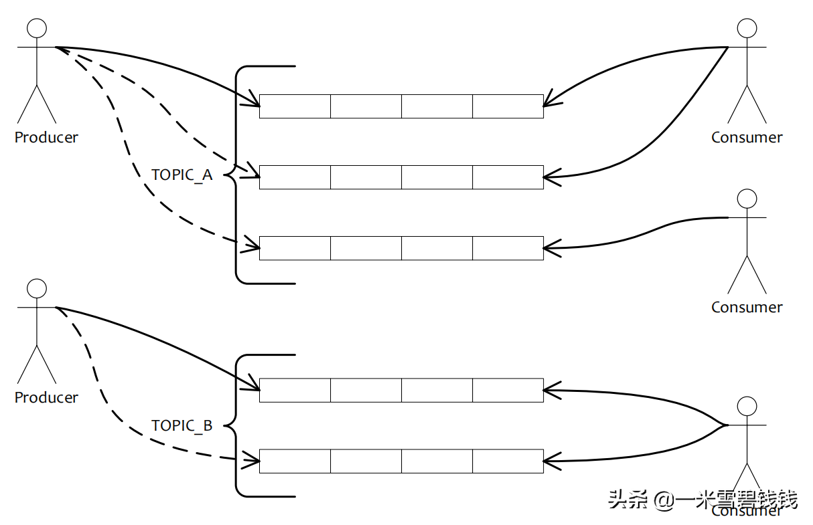
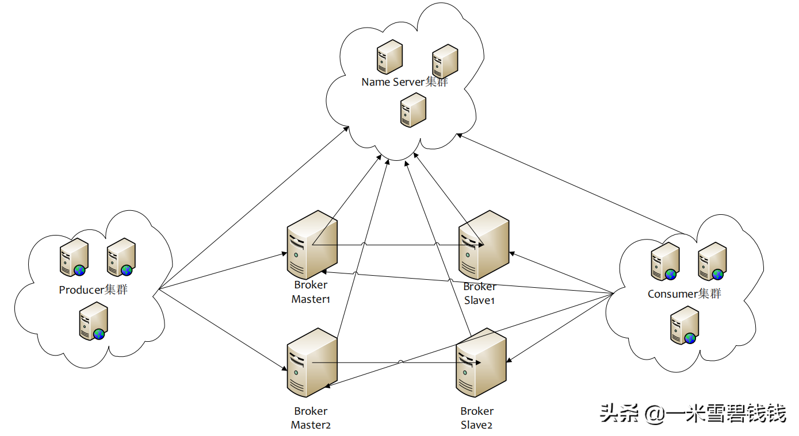
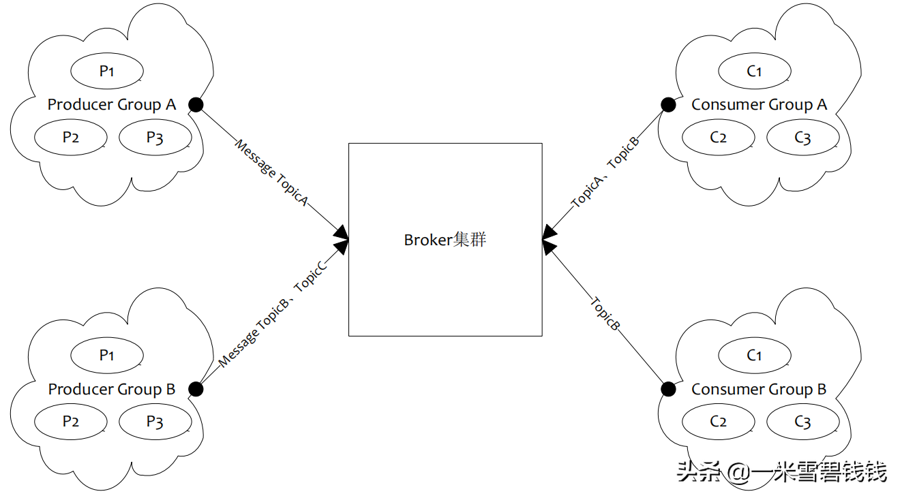
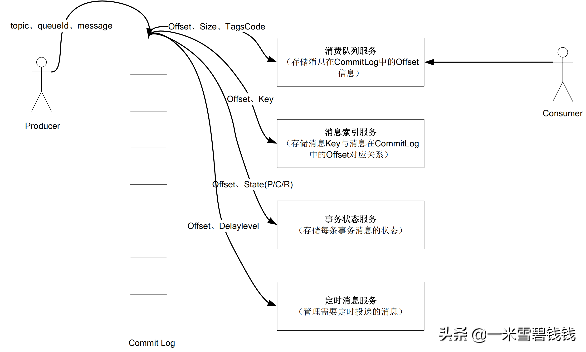

> 我依然记得，我当时负责RocketMQ的时候，很多小伙伴都没搞懂RokcetMQ的一些概念，总是搞错了！本文我们将整理一下 RocketMQ的基本概念。这个也是后续 RokcetMQ源码分享的基础文章。
> 

# **专业术语**

- **Producer**：消息生产者，负责产生消息，一般由业务系统负责产生消息。
- **Consumer**：消息消费者，负责消费消息，一般是后台系统负责异步消费。
- **Push Consumer**：Consumer 的一种，应用通常向 Consumer 对象注册一个 Listener 接口，一旦收到消息，
Consumer 对象立 刻回调 Listener 接口方法。
- **Pull Consumer**：Consumer 的一种，应用通常主动调用 Consumer 的拉消息方法从 Broker 拉消息，主动权由应用控制。
- **Producer Group**：一类 Producer 的集合名称，这类 Producer 通常发送一类消息，且发送逻辑一致。
事务消息是根据 Producer Group 来确认本地是否提交了。
- **Consumer Group**：一类 Consumer 的集合名称，这类 Consumer 通常消费一类消息，且消费逻辑一致。
重试消息也是按照Consumer Group 维度来处理的。
- **Broker**：消息中转角色，负责存储消息，转发消息，一般也称为Broker Server。
- **广播消费**：一条消息被多个 Consumer 消费，即使这些 Consumer 属于同一个 Consumer Group，消息也会
被 Consumer Group 中的每个 Consumer 都消费一次，广播消费中的 Consumer Group 概念可以认为在消息划分方面无意义。
- **集群消费**：一个 Consumer Group 中的 Consumer 实例平均分摊消费消息。
例如某个 Topic 有 9 条消息，且每个 queue 各有一条消息。其中一个 Consumer Group 有 3 个实例（可能是 3 个进程，或者 3 台机器），那就每个实例只消费其中的 3 条消息。
- **局部顺序消息**：消费消息的顺序要同发送消息的顺序一致，在 RocketMQ 中，主要指的是局部顺序，
即一类消息为满足顺 序性，必须 Producer 单线程顺序发送，且发送到同一个队列，这样 Consumer 就可以按照 Producer 
发送 的顺序去消费消息。
- **全局顺序消息**：顺序消息的一种，无论正常、异常情况都能保证顺序，但是牺牲了分布式 Failover 特性，
即 Broker 集群中只 要有一台机器不可用，则整个集群都不可用，服务可用性大大降低。 如果服务器部署为同步双
写模式，此缺陷可通过备机自动切换为主避免，不过仍然会存在几分钟的服务不 可用。（依赖同步双写，主备主动切换，
自动切换功能还没有实现）
- **Message Queue**：在 RocketMQ 中，所有消息队列都是持久化，长度无限的数据结构，所谓长度无限是指队
列中的每个存储 单元都是定长，访问其中的存储单元使用 Offset 来访问，offset 为 java long 类型，64 位，
理论上在 100 年内不会溢出，所以认为是长度无限，另外队列中只保存最近几天的数据，之前的数据会按照过期时间来删除。
也可以认为 Message Queue 是一个长度无限的数组，offset 就是下标。
- **Topic**：是生产者在发送消息和消费者在拉取消息的类别。Topic与生产者和消费者之间的关系很是松散。具体来讲，
一个Topic可能有0个，一个或多个生产者向它发送消息；相反，一个生产者能够发送不一样类型Topic的消息。相似的，
消费者组能够订阅一个或多个主题，只要该组的实例保持其订阅一致便可。
- **Tag**：标签，换句话的意思就是子主题，为用户提供了额外的灵活性。有了 TAG，来自同一业务模块的具备不一样
目的的消息能够具备相同的主题和不一样的标记。TAG有助于保持代码的清晰和连贯，同时标签也方便RocketMQ提供的查询功能。
tag 可以更细粒度的。比如 Topic是 pay_order。tag 可以是 channel_apple、channel_weixin。
- **queue**：即 message queue。创建 Topic 的时候，可以指定 queue 的数量。queue 的存在
是为了解决高可用、高并发等等。

# **RocketMQ 是什么**

Rocketmq 逻辑视图

- 是一个队列模型的消息中间件，具有高性能、高可靠、高实时、分布式的特点。
- Producer、Consumer、队列都可以分布式。
- Producer 向一些队列轮流发送消息，队列集合称为 Topic，Consumer 如果做广播消费，则一个 consumer 实例消费这个 Topic 对应的所有队列（queue）。如果做集群消费，则多个 Consumer 实例平均消费这个 topic 对应的队列（queue）集合。
- 能够保证严格的消息顺序。
- 提供丰富的消息拉取模式。
- 高效的订阅者水平扩展能力。
- 实时的消息订阅机制。
- 亿级消息堆积能力。
- 较少的依赖。

# **RocketMQ 物理部署结构**

RocketMQ 物理部署结构

- Name Server是一个几乎无状态节点，可集群部署，节点之间无任何信息同步。比 ZK 更加简单。
- Broker部署相对复杂，Broker 分为 Master 与 Slave，一个 Master 可以对应多个 Slave，
但是一个 Slave 只能 对应一个 Master，Master 与 Slave 的对应关系通过指定相同的 BrokerName，
不同的 BrokerId 来定义，BrokerId为 0 表示 Master，非 0 表示 Slave。Master 也可以部署多个。
每个 Broker 与 Name Server 集群中的所有节点建立长连接，定时注册 Topic 信息到所有 Name Server。
- Producer与 Name Server 集群中的其中一个节点（随机选择）建立长连接，定期从 Name Server 取 Topic 路由信息，
并向提供 Topic 服务的 Master 建立长连接，且定时向 Master 发送心跳。Producer 完全无状态，可集群部署。
- Consumer与 Name Server 集群中的其中一个节点（随机选择）建立长连接，定期从 Name Server 取 Topic 路由信息，
并向提供 Topic 服务的 Master、Slave 建立长连接，且定时向 Master、Slave 发送心跳。Consumer既可以从 Master 
订阅消息，也可以从 Slave 订阅消息，订阅规则由 Broker 配置决定。

# **RocketMQ 逻辑部署结构**

RocketMQ 逻辑部署结构

- Producer Group用来表示一个发送消息应用，一个 Producer Group 下包含多个 Producer 实例，可以是多台机器
，也可以是一台机器的多个迕程，或者一个进程的多个 Producer 对象。一个 Producer Group 可以发送多个 Topic消息，Producer Group 作用如下：
    - 1.标识一类 Producer。
    - 2.可以通过运维工具查询返此发送消息应用下有多个 Producer 实例。
    - 3.发送分布式事务消息时，如果 Producer 中途意外宕机，Broker 会主动回调 Producer Group 内的任意 一台机器来确认事务状态。
    - 4.Consumer Group 用来表示一个消费消息应用，一个 Consumer Group 下包含多个 Consumer 实例，可以是多台机器，也可以是多个进程，或者是一个进程的多个 Consumer 对象。一个 Consumer Group 下的多个 Consumer 以均摊方式消费消息，如果设置为广播方式，那这个 Consumer Group 下的每个实例都消费全量数据。

# **RocketMQ 存储结构**

RocketMQ 存储结构

# **总结**

- 上面都是 RocketMQ 的基本知识点，为我们后续分析源码做好铺垫！大家记得好好看！