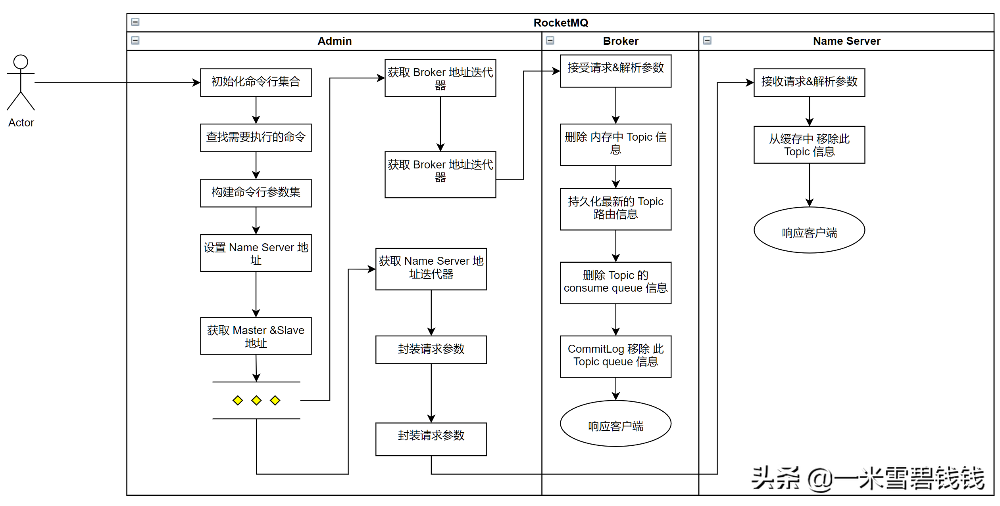

> 上一章中。我们分析了 RocketMQ 创建 Topic 的命令过程。本章，我们开始分析 删除 Topic 的过程。

# 命令参数

> 用法：sh mqadmin deleteTopic -n 192.168.1.100:9876
>
> 指令：deleteTopic
>
> 代码入口：
> org.apache.rocketmq.tools.command.topic.DeleteTopicSubCommand

| 参数 | 是否必填 | 说明                                                         |
| ---- | -------- | ------------------------------------------------------------ |
| -c   | 是       | cluster 名称，表示topic 建在该集群（集群可通过clusterList 查询） |
| -h   | 否       | 打印帮助                                                     |
| -n   | 是       | nameserve 服务地址列表，格式ip:port;ip:port;…                |
| -t   | 是       | Topic 名字                                                   |

# 解析命令行参数入口

``` java
        // RocketMQ 配置了 命令行的执行 shell 脚本入口。就是下面的 mqadmin.sh 这个文件mqadmin.sh
        //解析命令行入口org.apache.rocketmq.tools.command.MQAdminStartup#main0
        //设置 namesrvAddr 为全局变量。
        if (commandLine.hasOption('n')) {
            String namesrvAddr = commandLine.getOptionValue('n');
            System.setProperty(MixAll.NAMESRV_ADDR_PROPERTY, namesrvAddr);
        }
```

# 整体流程


RocketMQ 删除 Topic 大概流程

# Broker 删除无用Topic代码片段

``` java
    @Override
    public int cleanUnusedTopic(Set<String> topics) {
        Iterator<Entry<String, ConcurrentMap<Integer, ConsumeQueue>>> it = this.consumeQueueTable.entrySet().iterator();
        while (it.hasNext()) {
            Entry<String, ConcurrentMap<Integer, ConsumeQueue>> next = it.next();
            String topic = next.getKey();
            // Topic可以删除            
            if (!topics.contains(topic) && !topic.equals(ScheduleMessageService.SCHEDULE_TOPIC)) {
                ConcurrentMap<Integer, ConsumeQueue> queueTable = next.getValue();
                for (ConsumeQueue cq : queueTable.values()) {
                    // 消费者队列销毁，mapped 文件删除                  
                    cq.destroy();
                    log.info("cleanUnusedTopic: {} {} ConsumeQueue cleaned", cq.getTopic(), cq.getQueueId());
                    this.commitLog.removeQueueFromTopicQueueTable(cq.getTopic(), cq.getQueueId());
                }
                it.remove();
                log.info("cleanUnusedTopic: {},topic destroyed", topic);
            }
        }
        return 0;
    }
```

# Consume Queue 关闭&删除

> 在 RocketMQ 的基础概念的一章中提到。Topic 是有 N 个queue，而且，每个 Consume queue 都是独立的一个 MappFile 文件。Consumer queue 就相当于 消息在 commitLog 的二级索引。

``` java
    public void destroy() {
        this.maxPhysicOffset = -1;
        this.minLogicOffset = 0;
        this.mappedFileQueue.destroy();
        if (isExtReadEnable()) {
            this.consumeQueueExt.destroy();
        }
    }

    public void destroy() {
        for (MappedFile mf : this.mappedFiles) {
            mf.destroy(1000 * 3);
        }        // 移除所有的元素，让垃圾回收器回收垃圾      
        this.mappedFiles.clear();
        this.flushedWhere = 0;
        // delete parent directory        
        File file = new File(storePath);
        if (file.isDirectory()) {
            file.delete();
        }
    }
```

# 总结

- RocketMQ 删除 Topic 的时候，先删除 Broker ，在删除 Name Server 的 Topic 路由信息。
- RocketMQ 中的 Topic 是一个逻辑概念，但是 queue 是一个实打实的。具体体现在Consum queue。
- 在生产环境中，做好监控，切完别胡乱删除Topic。一般删除 Topic 先禁止写权限，在禁止读权限，观察一段时间后，再删除。