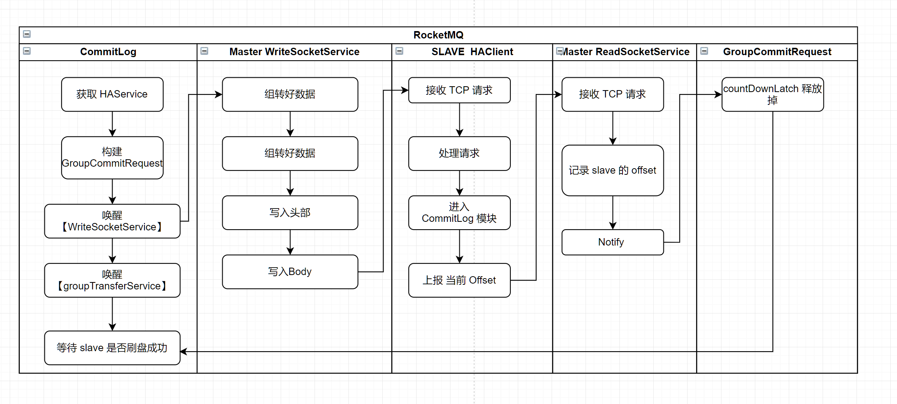

# RocketMQ源码分析至二三主从同步机制

> 本章节，我们将分析 RocketMQ 中的 Broker 主从同步机制
> 

### 概述

我们知道 RocketMQ 的 Broker 是分为 master 和 slave 。Master 主要用于处理 Producer、Consumer 的请求和存储数据。而Slave 更像是备份，
从 Master 同步数据保存至本地。为啥需要一个 slave 角色存在呢？下面我们展开来说：

- **Broker 服务服务高可用**。在分布式系统环境中，我们追求高可用、备份。假设在生产环境中，master 挂掉了或者服务 Hang 住了，那么，
我们可以通过 slave 来读取数据，减少 master 的压力，同时也能让 master 快速的恢复，不至于处于高压状态。
- **提高Broker 吞吐量**。如果 Consumer 从 Broker 拉取消息，Broker 端计算发现 与 commitLog 相差很大，则让其下一次直接请求到
 slave 拉取消息。这种也是类时 <font color='green'>82 原则</font>，master 处理热点数据（尽量保证数据在内存中），slave 处理冷却数据。

### Broker 同步模式

- 同步复制：生产者发送消息到 master 后，由 master notify slave ，等待 slave 写入后，再响应 Producer 是否写入成功。写入 RT 略有下降，常见于支付等场景。
    - 配置：<font color='green'>brokerRole = SYNC_MASTER</font>
    - 性能：这种性能略低，但是可靠性很强；可通过部署多台机器满足性能，或者使用  SSD，适用于金融，支付交易等场景。
- 异步复制：生产者发送消息到 master 后，就可以响应 client 了。后续由 slave 主动来复制同步最新消息。常见于写入 RT敏感或者吞吐量较大的系统。
    - 配置：<font color='green'>brokerRole = ASYNC_MASTER </font>
    - 性能：适用于大部分场景。

### RocketMQ 主从同步关系图谱

> RocketMQ 主从复制的代码结构不太好，有点绕，在这里，我先按照表格的方式整理出来。
> 

| 服务名 | 职责 |
| --- | --- |
| SlaveSynchronize | 从 Master 同步配置，同步 Topic、offset 、delayOffset、订阅关系。都是从 Broker 端同步数据的。 |
| HAService | HA服务，负责同步双写，异步复制功能 |
| HAService.GroupTransferService | 主从复制通知服务。这里是一个线程哦。 |
| HAService.HAClient | 读取 master 传过来的值，master & slave 沟通的桥梁，接受 master 推送过来的数据，并向 master 汇报消费进度 |
| HAService.AcceptSocketService | 接收新的Socket连接。HAConnection 将拥有 读 slave 上传的数据、往 slave 写入数据的能力。 |
| HAConnection | HA服务，Master用来向Slave <font color='green'>Push数据</font>，并接收Slave应答 |
| HAConnection.ReadSocketService | 读取Slave请求，一般为push ack.master 所拥有。得到 slave 的消费进度 |
| HAConnection.WriteSocketService | 向Slave写入数据,Slave 得到的 传输数据协议 <Phy Offset> <Body Size> <Body Data><br> |

### 同步配置入口（`SlaveSynchronize`）

> 启动入口：org.apache.rocketmq.broker.BrokerController#handleSlaveSynchronize
通过定时任务，同步的配置有：
>
>1、topic 信息 ；
>
>2、同步consumerOffset；
>
>3、同步 delayOffset；
>
>4、同步 subConfig 信息
>
> 

```java
private void handleSlaveSynchronize(BrokerRole role) {
        if (role == BrokerRole.SLAVE) {
            if (null != slaveSyncFuture) {
                slaveSyncFuture.cancel(false);
            }
            this.slaveSynchronize.setMasterAddr(null);
            slaveSyncFuture = this.scheduledExecutorService.scheduleAtFixedRate(new Runnable() {
                @Override
                public void run() {
                    try {
                        BrokerController.this.slaveSynchronize.syncAll();
                    }
                    catch (Throwable e) {
                        log.error("ScheduledTask SlaveSynchronize syncAll error.", e);
                    }
                }
            }, 1000 * 3, 1000 * 10, TimeUnit.MILLISECONDS);
        } else {
            //handle the slave synchronise
            if (null != slaveSyncFuture) {
                slaveSyncFuture.cancel(false);
            }
            this.slaveSynchronize.setMasterAddr(null);
        }
    }

/**
     * 在 broker initialize() 这个方法中，有启动。每隔 1 分钟，去 master 那边拉取数据
     */
    public void syncAll() {
        // 同步 Topic 信息
        this.syncTopicConfig();

        // 同步消费组的 offset
        this.syncConsumerOffset();

        // 同步延迟队列的 offset
        this.syncDelayOffset();

        // 同步订阅关系
        this.syncSubscriptionGroupConfig();
    }

```

### RequestCode

```java
// Broker 获取所有Topic的配置（Slave和Namesrv都会向Master请求此配置）
public static final int GET_ALL_TOPIC_CONFIG = 21;

// Broker 获取所有Consumer Offset
public static final int GET_ALL_CONSUMER_OFFSET = 43;

// Broker 获取所有延迟进度
public static final int GET_ALL_DELAY_OFFSET = 45;

// 获取所有的订阅关系
public static final int GET_ALL_SUBSCRIPTIONGROUP_CONFIG = 201;
```

### HA 服务启动入口

> org.apache.rocketmq.store.DefaultMessageStore#DefaultMessageStore
> 

```java

// 启动 HA 服务
this.haService = new HAService(this);

		/**
     * 这里构造函数中，几个变量。将在  HAService 中的 start() 中，进行 start()
     * @param defaultMessageStore
     * @throws IOException
     */
    public HAService(final DefaultMessageStore defaultMessageStore) throws IOException {
        this.defaultMessageStore = defaultMessageStore;

        // 接收新的Socket连接。HAConnection 将拥有 读 slave 上传的数据、往 slave 写入数据的能力
        this.acceptSocketService =
            new AcceptSocketService(defaultMessageStore.getMessageStoreConfig().getHaListenPort());

        this.groupTransferService = new GroupTransferService();

        // 这个才是重点，master & slave 沟通的桥梁.接受 master 推送过来的数据，并向 master 汇报消费进度
        this.haClient = new HAClient();
    }

```

### 同步双写 CommitLog

> 处理入口：org.apache.rocketmq.store.CommitLog#handleHA
> 

```java
// HA同步复制， 当msg写入master的commitlog文件后，
    // 判断maser的角色如果是同步双写SYNC_MASTER， 等待master同步到slave在返回结果
    // Synchronous write double 同步多写。也会写 slave 的。会等待 slave 的结果写入了
    public void handleHA(AppendMessageResult result, PutMessageResult putMessageResult, MessageExt messageExt) {
        // 同步双写
        if (BrokerRole.SYNC_MASTER == this.defaultMessageStore.getMessageStoreConfig().getBrokerRole()) {

            HAService service = this.defaultMessageStore.getHaService();

            // 默认是 true
            if (messageExt.isWaitStoreMsgOK()) {
                // Determine whether to wait
                if (service.isSlaveOK(result.getWroteOffset() + result.getWroteBytes())) {
                    GroupCommitRequest request = new GroupCommitRequest(result.getWroteOffset() + result.getWroteBytes());
                    service.putRequest(request);

                    // 那个线程启动呢？groupTransferService 这个将被唤醒
                    service.getWaitNotifyObject().wakeupAll();

                    //wakeupCustomer 这个方法，将计算器的值 - 1 .同步刷盘超时时间 5s
                    boolean flushOK =
                        request.waitForFlush(this.defaultMessageStore.getMessageStoreConfig().getSyncFlushTimeout());

                    if (!flushOK) {
                        log.error("do sync transfer other node, wait return, but failed, topic: " + messageExt.getTopic() + " tags: "
                            + messageExt.getTags() + " client address: " + messageExt.getBornHostNameString());
                        putMessageResult.setPutMessageStatus(PutMessageStatus.FLUSH_SLAVE_TIMEOUT);
                    }
                }
                // Slave problem
                else {
                    // Tell the producer, slave not available
                    putMessageResult.setPutMessageStatus(PutMessageStatus.SLAVE_NOT_AVAILABLE);
                }
            }
        }

    }
```

### 同步双写流程图

> 这里是同步双写的简单示意图，主要目的是想把 HA 这个模块中。为了方便理解，下面的图，我简化成了 同步的方式。
> 


### 异步双写流程

> RocketMQ 异步同步数据，是 slave 定时汇报 offset，WriteSocketService 根据上一次的 offset 继续获取是否拿到 数据。异步的逻辑算是比较简单的。由 Master 的 WriteSocketService 循环去获取数据。
代码入口：org.apache.rocketmq.store.ha.HAService.HAClient#run
> 

```java
// 传输数据,
// selectResult会赋值给this.selectMapedBufferResult，出现异常也会清理掉
SelectMappedBufferResult selectResult =
HAConnection.this.haService.getDefaultMessageStore().getCommitLogData(this.nextTransferFromWhere);
```

### 总结

- RocketMQ 复制的逻辑源码，确实是有点绕，但是我们需要记住几个类的关系。

### 附录
```java
/*
 * Licensed to the Apache Software Foundation (ASF) under one or more
 * contributor license agreements.  See the NOTICE file distributed with
 * this work for additional information regarding copyright ownership.
 * The ASF licenses this file to You under the Apache License, Version 2.0
 * (the "License"); you may not use this file except in compliance with
 * the License.  You may obtain a copy of the License at
 *
 *     http://www.apache.org/licenses/LICENSE-2.0
 *
 * Unless required by applicable law or agreed to in writing, software
 * distributed under the License is distributed on an "AS IS" BASIS,
 * WITHOUT WARRANTIES OR CONDITIONS OF ANY KIND, either express or implied.
 * See the License for the specific language governing permissions and
 * limitations under the License.
 */
package org.apache.rocketmq.store.ha;

import java.io.IOException;
import java.net.InetSocketAddress;
import java.net.SocketAddress;
import java.nio.ByteBuffer;
import java.nio.channels.ClosedChannelException;
import java.nio.channels.SelectionKey;
import java.nio.channels.Selector;
import java.nio.channels.ServerSocketChannel;
import java.nio.channels.SocketChannel;
import java.util.ArrayList;
import java.util.LinkedList;
import java.util.List;
import java.util.Set;
import java.util.concurrent.atomic.AtomicInteger;
import java.util.concurrent.atomic.AtomicLong;
import java.util.concurrent.atomic.AtomicReference;
import org.apache.rocketmq.common.ServiceThread;
import org.apache.rocketmq.common.constant.LoggerName;
import org.apache.rocketmq.logging.InternalLogger;
import org.apache.rocketmq.logging.InternalLoggerFactory;
import org.apache.rocketmq.remoting.common.RemotingUtil;
import org.apache.rocketmq.store.CommitLog;
import org.apache.rocketmq.store.DefaultMessageStore;


/**
 * @author shijia.wxr
 *
 * HA服务，负责同步双写，异步复制功能
 *
 * @author shijia.wxr<vintage.wang@gmail.com>
 * @since 2013-7-21
 * INFO:在哪里调用啦？DefaultMessageStore 里面的 start 方法调用到，DefaultMessageStore 在 broker 启动的时候，进行初始化
 *      在 DefaultMessageStore 这个的构造函数中进行初始化
 *
 *      记住啦！HA 服务是面向 存储层的。保证高可用。
 *      生产者及消费者会从 NameSrv 里面获取 broker 活跃的信息。因为 broker 不活跃的话，将会被剔除
 */
public class HAService {
    private static final InternalLogger log = InternalLoggerFactory.getLogger(LoggerName.STORE_LOGGER_NAME);

    // 客户端连接计数
    private final AtomicInteger connectionCount = new AtomicInteger(0);

    // 存储客户端连接
    private final List<HAConnection> connectionList = new LinkedList<>();

    // 接收新的Socket连接
    private final AcceptSocketService acceptSocketService;

    // 顶层存储对象
    private final DefaultMessageStore defaultMessageStore;

    // 异步通知
    private final WaitNotifyObject waitNotifyObject = new WaitNotifyObject();
    // 写入到Slave的最大Offset
    private final AtomicLong push2SlaveMaxOffset = new AtomicLong(0);

    // 主从复制通知服务，主要用于flush 到 slave 。得到相应结果
    private final GroupTransferService groupTransferService;

    // Slave订阅对象；master & slave 沟通的桥梁.接受 master 推送过来的数据，并向 master 汇报消费进度
    private final HAClient haClient;

    /**
     * 这里构造函数中，几个变量。将在  HAService 中的 start() 中，进行 start()
     * @param defaultMessageStore
     * @throws IOException
     */
    public HAService(final DefaultMessageStore defaultMessageStore) throws IOException {
        this.defaultMessageStore = defaultMessageStore;

        // 接收新的Socket连接。HAConnection 将拥有 读 slave 上传的数据、往 slave 写入数据的能力
        this.acceptSocketService =
            new AcceptSocketService(defaultMessageStore.getMessageStoreConfig().getHaListenPort());

        this.groupTransferService = new GroupTransferService();

        // 这个才是重点，master & slave 沟通的桥梁.接受 master 推送过来的数据，并向 master 汇报消费进度
        this.haClient = new HAClient();
    }

    public void updateMasterAddress(final String newAddr) {
        if (this.haClient != null) {
            this.haClient.updateMasterAddress(newAddr);
        }
    }

    /**
     * 放置 Request
     * @param request
     */
    public void putRequest(final CommitLog.GroupCommitRequest request) {
        this.groupTransferService.putRequest(request);
    }

    /**
     * 判断主从之间数据传输是否正常
     * 1、至少有客户端连接
     * 2、不能超过 haSlaveFallbehindMax = 1024 * 1024 * 256 这个阀值，相当于不能落后 256k
     *
     * @return
     */
    public boolean isSlaveOK(final long masterPutWhere) {
        boolean result = this.connectionCount.get() > 0;
        result =
            result
                && ((masterPutWhere - this.push2SlaveMaxOffset.get()) < this.defaultMessageStore
                .getMessageStoreConfig().getHaSlaveFallbehindMax());
        return result;
    }

    /**
     * 通知复制部分数据
     */
    public void notifyTransferSome(final long offset) {
        for (long value = this.push2SlaveMaxOffset.get(); offset > value; ) {
            boolean ok = this.push2SlaveMaxOffset.compareAndSet(value, offset);
            if (ok) {
                this.groupTransferService.notifyTransferSome();
                break;
            } else {
                value = this.push2SlaveMaxOffset.get();
            }
        }
    }

    public AtomicInteger getConnectionCount() {
        return connectionCount;
    }

    // public void notifyTransferSome() {
    // this.groupTransferService.notifyTransferSome();
    // }

    /**
     * 开启 主从 服务
     * Master通过AcceptSocketService监听slave的连接，每个master-slave连接都会构建一个HAConnection对象搭建他们之间的桥梁，
     * 对于一个master多slave部署结构的会有多个HAConnection实例，
     */
    public void start() throws Exception {
        // 配置通信的 socket 配置
        this.acceptSocketService.beginAccept();
        // HAConnection 将启动链接。数据的传输与接收工作
        this.acceptSocketService.start();
        // 主从复制通知服务
        this.groupTransferService.start();
        // master & slave 沟通的桥梁.
        // 接受 master 推送过来的数据，并向 master 汇报消费进度
        this.haClient.start();
    }

    public void addConnection(final HAConnection conn) {
        synchronized (this.connectionList) {
            this.connectionList.add(conn);
        }
    }

    public void removeConnection(final HAConnection conn) {
        synchronized (this.connectionList) {
            this.connectionList.remove(conn);
        }
    }

    /**
     * HA 服务关闭
     */
    public void shutdown() {
        this.haClient.shutdown();
        this.acceptSocketService.shutdown(true);

        // 销毁链接
        this.destroyConnections();
        this.groupTransferService.shutdown();
    }

    /**
     * 销毁所有的链接
     */
    public void destroyConnections() {
        synchronized (this.connectionList) {
            for (HAConnection c : this.connectionList) {
                c.shutdown();
            }

            this.connectionList.clear();
        }
    }

    public DefaultMessageStore getDefaultMessageStore() {
        return defaultMessageStore;
    }

    public WaitNotifyObject getWaitNotifyObject() {
        return waitNotifyObject;
    }

    public AtomicLong getPush2SlaveMaxOffset() {
        return push2SlaveMaxOffset;
    }

    /**
     * Listens to slave connections to create {@link HAConnection}.
     */
    /**
     * 接收新的Socket连接。HAConnection 将拥有 读 slave 上传的数据、往 slave 写入数据的能力
     *
     */
    class AcceptSocketService extends ServiceThread {
        private final SocketAddress socketAddressListen;
        private ServerSocketChannel serverSocketChannel;
        private Selector selector;

        public AcceptSocketService(final int port) {
            this.socketAddressListen = new InetSocketAddress(port);
        }

        /**
         * Starts listening to slave connections.
         *
         * @throws Exception If fails.
         */
        /**
         * 设置在接受新的连接前。的一些必要的参数
         */
        public void beginAccept() throws Exception {
            this.serverSocketChannel = ServerSocketChannel.open();
            this.selector = RemotingUtil.openSelector();
            // 表示在连接还在timewait状态时，就可复用其端口，这个对于大量连接且经常有timewait时适用
            this.serverSocketChannel.socket().setReuseAddress(true);
            this.serverSocketChannel.socket().bind(this.socketAddressListen);
            // 非阻塞
            this.serverSocketChannel.configureBlocking(false);
            this.serverSocketChannel.register(this.selector, SelectionKey.OP_ACCEPT);
        }

        /**
         * {@inheritDoc}
         */
        @Override
        public void shutdown(final boolean interrupt) {
            super.shutdown(interrupt);
            try {
                this.serverSocketChannel.close();
                this.selector.close();
            } catch (IOException e) {
                log.error("AcceptSocketService shutdown exception", e);
            }
        }

        /**
         * {@inheritDoc}
         */
        @Override
        public void run() {
            log.info(this.getServiceName() + " service started");

            while (!this.isStopped()) {
                try {
                    this.selector.select(1000);
                    Set<SelectionKey> selected = this.selector.selectedKeys();

                    if (selected != null) {
                        for (SelectionKey k : selected) {
                            if ((k.readyOps() & SelectionKey.OP_ACCEPT) != 0) {
                                SocketChannel sc = ((ServerSocketChannel) k.channel()).accept();

                                if (sc != null) {
                                    HAService.log.info("HAService receive new connection, "
                                        + sc.socket().getRemoteSocketAddress());

                                    try {
                                        // Slave 与 Master 通信的桥梁
                                        HAConnection conn = new HAConnection(HAService.this, sc);
                                        conn.start();
                                        HAService.this.addConnection(conn);
                                    } catch (Exception e) {
                                        log.error("new HAConnection exception", e);
                                        sc.close();
                                    }
                                }
                            } else {
                                log.warn("Unexpected ops in select " + k.readyOps());
                            }
                        }

                        selected.clear();
                    }
                } catch (Exception e) {
                    log.error(this.getServiceName() + " service has exception.", e);
                }
            }

            log.info(this.getServiceName() + " service end");
        }

        /**
         * {@inheritDoc}
         */
        @Override
        public String getServiceName() {
            return AcceptSocketService.class.getSimpleName();
        }
    }

    /**
     * GroupTransferService Service
     * 主从复制通知服务。这里是一个线程哦
     */
    class GroupTransferService extends ServiceThread {

        // 异步通知，用来通知是否 flush ok?
        private final WaitNotifyObject notifyTransferObject = new WaitNotifyObject();
        private volatile List<CommitLog.GroupCommitRequest> requestsWrite = new ArrayList<>();
        private volatile List<CommitLog.GroupCommitRequest> requestsRead = new ArrayList<>();

        // 放置请求
        public synchronized void putRequest(final CommitLog.GroupCommitRequest request) {
            synchronized (this.requestsWrite) {
                this.requestsWrite.add(request);
            }
            if (hasNotified.compareAndSet(false, true)) {
                waitPoint.countDown(); // notify

                // TODO 这里要Notify两个线程 1、GroupTransferService
                // 2、WriteSocketService
                // 在调用putRequest后，已经Notify了WriteSocketService
            }
        }

        /**
         * 通知 slave 已经复制了一部分数据。在 SYNC_MASTER 中。
         * doWaitTransfer() 这个方法 this.notifyTransferObject.waitForRunning(1000); 这个方法等待 slave 同步的数据
         * 返回的结果。
         */
        public void notifyTransferSome() {
            this.notifyTransferObject.wakeup();
        }

        private void swapRequests() {
            List<CommitLog.GroupCommitRequest> tmp = this.requestsWrite;
            this.requestsWrite = this.requestsRead;
            this.requestsRead = tmp;
        }

        /**
         * 等待 flush slave 的消息
         */
        private void doWaitTransfer() {
            synchronized (this.requestsRead) {
                if (!this.requestsRead.isEmpty()) {
                    for (CommitLog.GroupCommitRequest req : this.requestsRead) {
                        boolean transferOK = HAService.this.push2SlaveMaxOffset.get() >= req.getNextOffset();

                        // 同步刷盘到 slave 中，超时是 5s 。如果 超时了。那么，默认是失败了
                        long waitUntilWhen = HAService.this.defaultMessageStore.getSystemClock().now()
                            + HAService.this.defaultMessageStore.getMessageStoreConfig().getSyncFlushTimeout();
                        while (!transferOK && HAService.this.defaultMessageStore.getSystemClock().now() < waitUntilWhen) {
                            // 将会被 notifyTransferSome() 这个方法唤醒
                            this.notifyTransferObject.waitForRunning(1000);

                            transferOK = HAService.this.push2SlaveMaxOffset.get() >= req.getNextOffset();
                        }

                        if (!transferOK) {
                            log.warn("transfer messsage to slave timeout, " + req.getNextOffset());
                        }

                        //赋予是否执行成功
                        req.wakeupCustomer(transferOK);
                    }

                    this.requestsRead.clear();
                }
            }
        }

        // 这个方法在 HAService.class 中的 start() 已经启动啦
        public void run() {
            log.info(this.getServiceName() + " service started");

            while (!this.isStopped()) {
                try {
                    this.waitForRunning(10);
                    this.doWaitTransfer();
                } catch (Exception e) {
                    log.warn(this.getServiceName() + " service has exception. ", e);
                }
            }

            log.info(this.getServiceName() + " service end");
        }

        @Override
        protected void onWaitEnd() {
            this.swapRequests();
        }

        @Override
        public String getServiceName() {
            return GroupTransferService.class.getSimpleName();
        }
    }

    /**
     * 读取 master 传过来的值
     * master & slave 沟通的桥梁.接受 master 推送过来的数据，并向 master 汇报消费进度
     * 1、SLAVE 的客户端
     */
    class HAClient extends ServiceThread {
        private static final int READ_MAX_BUFFER_SIZE = 1024 * 1024 * 4;
        // 主节点IP:PORT
        private final AtomicReference<String> masterAddress = new AtomicReference<>();
        // 向Master汇报Slave最大Offset
        private final ByteBuffer reportOffset = ByteBuffer.allocate(8);
        private SocketChannel socketChannel;
        private Selector selector;
        private long lastWriteTimestamp = System.currentTimeMillis();

        // Slave向Master汇报Offset，汇报到哪里，是上一次处理完数据的进度
        private long currentReportedOffset = 0;
        private int dispatchPosition = 0;
        private ByteBuffer byteBufferRead = ByteBuffer.allocate(READ_MAX_BUFFER_SIZE);
        private ByteBuffer byteBufferBackup = ByteBuffer.allocate(READ_MAX_BUFFER_SIZE);

        public HAClient() throws IOException {
            this.selector = RemotingUtil.openSelector();
        }

        public void updateMasterAddress(final String newAddr) {
            String currentAddr = this.masterAddress.get();
            if (currentAddr == null || !currentAddr.equals(newAddr)) {
                this.masterAddress.set(newAddr);
                log.info("update master address, OLD: " + currentAddr + " NEW: " + newAddr);
            }
        }

        /**
         * 是否到时间 汇报消费进度啦
         * @return
         */
        private boolean isTimeToReportOffset() {
            long interval =
                HAService.this.defaultMessageStore.getSystemClock().now() - this.lastWriteTimestamp;
            boolean needHeart = interval > HAService.this.defaultMessageStore.getMessageStoreConfig()
                .getHaSendHeartbeatInterval();

            return needHeart;
        }

        /**
         * 告知 master 最大 offset
         * @param maxOffset
         * @return
         * buffer 中，put 操作，将使得 position 的值+1
         * 如果需要 get 的。那么，请把 position 的值 -1 或者 置为 0
         */
        private boolean reportSlaveMaxOffset(final long maxOffset) {
            this.reportOffset.position(0);
            // commitLog 的物理位置存储的宽度是 8
            this.reportOffset.limit(8);
            this.reportOffset.putLong(maxOffset);
            this.reportOffset.position(0);
            // position =0 ；limit =8
            this.reportOffset.limit(8);

            // 这里表示  重试 3 次。当读取完第 8 个值的时候，position == 8 啦！
            for (int i = 0; i < 3 && this.reportOffset.hasRemaining(); i++) {
                try {
                    this.socketChannel.write(this.reportOffset);
                } catch (IOException e) {
                    log.error(this.getServiceName()
                        + "reportSlaveMaxOffset this.socketChannel.write exception", e);
                    return false;
                }
            }

            lastWriteTimestamp = HAService.this.defaultMessageStore.getSystemClock().now();
            return !this.reportOffset.hasRemaining();
        }

        /**
         * Buffer满了以后，重新整理一次
         */
        private void reallocateByteBuffer() {
            int remain = READ_MAX_BUFFER_SIZE - this.dispatchPosition;
            if (remain > 0) {
                this.byteBufferRead.position(this.dispatchPosition);

                this.byteBufferBackup.position(0);
                this.byteBufferBackup.limit(READ_MAX_BUFFER_SIZE);
                this.byteBufferBackup.put(this.byteBufferRead);
            }

            this.swapByteBuffer();

            this.byteBufferRead.position(remain);
            this.byteBufferRead.limit(READ_MAX_BUFFER_SIZE);
            this.dispatchPosition = 0;
        }

        private void swapByteBuffer() {
            ByteBuffer tmp = this.byteBufferRead;
            this.byteBufferRead = this.byteBufferBackup;
            this.byteBufferBackup = tmp;
        }

        /**
         * 处理 master 推送过来的
         * @return
         */
        private boolean processReadEvent() {
            int readSizeZeroTimes = 0;
            while (this.byteBufferRead.hasRemaining()) {
                try {
                    int readSize = this.socketChannel.read(this.byteBufferRead);
                    if (readSize > 0) {
                        readSizeZeroTimes = 0;
                        // 构建 consumequeue、 index、appendmessage
                        boolean result = this.dispatchReadRequest();
                        if (!result) {
                            log.error("HAClient, dispatchReadRequest error");
                            return false;
                        }
                    } else if (readSize == 0) {
                        if (++readSizeZeroTimes >= 3) {
                            break;
                        }
                    } else {
                        log.info("HAClient, processReadEvent read socket < 0");
                        return false;
                    }
                } catch (IOException e) {
                    log.info("HAClient, processReadEvent read socket exception", e);
                    return false;
                }
            }

            return true;
        }

        /**
         * 接收 master 传过来的数据。并将进行 存储、构建 consumequeue、index 索引服务
         * @return
         */
        private boolean dispatchReadRequest() {
            final int msgHeaderSize = 8 + 4; // phyoffset + size
            int readSocketPos = this.byteBufferRead.position();

            while (true) {
                int diff = this.byteBufferRead.position() - this.dispatchPosition;
                if (diff >= msgHeaderSize) {
                    long masterPhyOffset = this.byteBufferRead.getLong(this.dispatchPosition);
                    int bodySize = this.byteBufferRead.getInt(this.dispatchPosition + 8);


                    long slavePhyOffset = HAService.this.defaultMessageStore.getMaxPhyOffset();

                    // 发生重大错误
                    if (slavePhyOffset != 0) {
                        if (slavePhyOffset != masterPhyOffset) {
                            log.error("master pushed offset not equal the max phy offset in slave, SLAVE: "
                                + slavePhyOffset + " MASTER: " + masterPhyOffset);
                            return false;
                        }
                    }

                    // 可以凑够一个请求
                    if (diff >= (msgHeaderSize + bodySize)) {
                        byte[] bodyData = new byte[bodySize];
                        this.byteBufferRead.position(this.dispatchPosition + msgHeaderSize);
                        this.byteBufferRead.get(bodyData);

                        // TODO 结果是否需要处理，暂时不处理。将在这里构建 consumequeue、index 索引服务
                        HAService.this.defaultMessageStore.appendToCommitLog(masterPhyOffset, bodyData);

                        // 这里的 position 需要回复原位。因为 get 的时候，导致 postion 发生变化.否则，将导致不能判断是否还有剩余的元素
                        this.byteBufferRead.position(readSocketPos);
                        this.dispatchPosition += msgHeaderSize + bodySize;

                        // 是否需要再次上传同步进度。如果能够使得 slave 的物理队列变大，则上传
                        if (!reportSlaveMaxOffsetPlus()) {
                            return false;
                        }

                        continue;
                    }
                }

                // 如果已经达到上限了，将返回 false ,表示缓冲区已经能满了
                if (!this.byteBufferRead.hasRemaining()) {
                    this.reallocateByteBuffer();
                }

                break;
            }

            return true;
        }

        /**
         * 是否再次需要汇报 slave 的消费进度
         * @return
         */
        private boolean reportSlaveMaxOffsetPlus() {
            boolean result = true;
            // 只要本地有更新，就汇报最大物理Offset
            long currentPhyOffset = HAService.this.defaultMessageStore.getMaxPhyOffset();

            if (currentPhyOffset > this.currentReportedOffset) {
                this.currentReportedOffset = currentPhyOffset;
                result = this.reportSlaveMaxOffset(this.currentReportedOffset);
                if (!result) {
                    this.closeMaster();
                    log.error("HAClient, reportSlaveMaxOffset error, " + this.currentReportedOffset);
                }
            }

            return result;
        }

        /**
         * 判断是否连上了 master
         * @return
         * @throws ClosedChannelException
         */
        private boolean connectMaster() throws ClosedChannelException {
            // 第一次
            if (null == socketChannel) {
                String addr = this.masterAddress.get();
                if (addr != null) {

                    SocketAddress socketAddress = RemotingUtil.string2SocketAddress(addr);
                    if (socketAddress != null) {
                        this.socketChannel = RemotingUtil.connect(socketAddress);
                        if (this.socketChannel != null) {
                            this.socketChannel.register(this.selector, SelectionKey.OP_READ);
                        }
                    }
                }

                // 每次连接时，要重新拿到最大的Offset
                this.currentReportedOffset = HAService.this.defaultMessageStore.getMaxPhyOffset();

                this.lastWriteTimestamp = System.currentTimeMillis();
            }

            return this.socketChannel != null;
        }

        /**
         * 关闭与 master 之间的 socket 链接
         * 比如，不能向 master 汇报消费进度
         */
        private void closeMaster() {
            if (null != this.socketChannel) {
                try {

                    SelectionKey sk = this.socketChannel.keyFor(this.selector);
                    if (sk != null) {
                        sk.cancel();
                    }

                    this.socketChannel.close();

                    this.socketChannel = null;
                } catch (IOException e) {
                    log.warn("closeMaster exception. ", e);
                }

                this.lastWriteTimestamp = 0;
                this.dispatchPosition = 0;

                this.byteBufferBackup.position(0);
                this.byteBufferBackup.limit(READ_MAX_BUFFER_SIZE);

                this.byteBufferRead.position(0);
                this.byteBufferRead.limit(READ_MAX_BUFFER_SIZE);
            }
        }

        /**
         * master & slave 沟通的桥梁.接受 master 推送过来的数据，并向 master 汇报消费进度
         * HAClient.run()
         */
        @Override
        public void run() {
            log.info(this.getServiceName() + " service started");

            while (!this.isStopped()) {
                try {
                    if (this.connectMaster()) {

                        // 先汇报最大物理Offset || 定时心跳方式汇报
                        if (this.isTimeToReportOffset()) {
                            boolean result = this.reportSlaveMaxOffset(this.currentReportedOffset);
                            if (!result) {
                                this.closeMaster();
                            }
                        }

                        // 等待应答
                        this.selector.select(1000);

                        // 接收数据。接受 master 推送过来的消息
                        boolean ok = this.processReadEvent();
                        if (!ok) {
                            this.closeMaster();
                        }

                        // 只要本地有更新，就汇报最大物理Offset
                        if (!reportSlaveMaxOffsetPlus()) {
                            continue;
                        }

                        // 检查Master的反向心跳
                        long interval =
                            HAService.this.getDefaultMessageStore().getSystemClock().now()
                                - this.lastWriteTimestamp;
                        if (interval > HAService.this.getDefaultMessageStore().getMessageStoreConfig()
                            .getHaHousekeepingInterval()) {
                            log.warn("HAClient, housekeeping, found this connection[" + this.masterAddress
                                + "] expired, " + interval);
                            this.closeMaster();
                            log.warn("HAClient, master not response some time, so close connection");
                        }
                    } else {
                        this.waitForRunning(1000 * 5);
                    }
                } catch (Exception e) {
                    log.warn(this.getServiceName() + " service has exception. ", e);
                    this.waitForRunning(1000 * 5);
                }
            }

            log.info(this.getServiceName() + " service end");
        }
        // private void disableWriteFlag() {
        // if (this.socketChannel != null) {
        // SelectionKey sk = this.socketChannel.keyFor(this.selector);
        // if (sk != null) {
        // int ops = sk.interestOps();
        // ops &= ~SelectionKey.OP_WRITE;
        // sk.interestOps(ops);
        // }
        // }
        // }
        // private void enableWriteFlag() {
        // if (this.socketChannel != null) {
        // SelectionKey sk = this.socketChannel.keyFor(this.selector);
        // if (sk != null) {
        // int ops = sk.interestOps();
        // ops |= SelectionKey.OP_WRITE;
        // sk.interestOps(ops);
        // }
        // }
        // }

        @Override
        public String getServiceName() {
            return HAClient.class.getSimpleName();
        }
    }
}


```

```java
/*
 * Licensed to the Apache Software Foundation (ASF) under one or more
 * contributor license agreements.  See the NOTICE file distributed with
 * this work for additional information regarding copyright ownership.
 * The ASF licenses this file to You under the Apache License, Version 2.0
 * (the "License"); you may not use this file except in compliance with
 * the License.  You may obtain a copy of the License at
 *
 *     http://www.apache.org/licenses/LICENSE-2.0
 *
 * Unless required by applicable law or agreed to in writing, software
 * distributed under the License is distributed on an "AS IS" BASIS,
 * WITHOUT WARRANTIES OR CONDITIONS OF ANY KIND, either express or implied.
 * See the License for the specific language governing permissions and
 * limitations under the License.
 */
package org.apache.rocketmq.store.ha;

import java.io.IOException;
import java.nio.ByteBuffer;
import java.nio.channels.SelectionKey;
import java.nio.channels.Selector;
import java.nio.channels.SocketChannel;
import org.apache.rocketmq.common.ServiceThread;
import org.apache.rocketmq.common.constant.LoggerName;
import org.apache.rocketmq.logging.InternalLogger;
import org.apache.rocketmq.logging.InternalLoggerFactory;
import org.apache.rocketmq.remoting.common.RemotingUtil;
import org.apache.rocketmq.store.SelectMappedBufferResult;

import java.io.IOException;
import java.nio.ByteBuffer;
import java.nio.channels.SelectionKey;
import java.nio.channels.Selector;
import java.nio.channels.SocketChannel;

/**
 * HA服务，Master用来向Slave Push数据，并接收Slave应答
 */
public class HAConnection {
    private static final InternalLogger log = InternalLoggerFactory.getLogger(LoggerName.STORE_LOGGER_NAME);
    private final HAService haService;
    private final SocketChannel socketChannel;
    private final String clientAddr;
    // 写入消息到 channel
    private WriteSocketService writeSocketService;
    // 读取Slave请求，一般为push ack.master 所拥有
    private ReadSocketService readSocketService;

    private volatile long slaveRequestOffset = -1;
    private volatile long slaveAckOffset = -1;

    /**
     * Slave 与 Master 通信的桥梁
     * @param haService
     * @param socketChannel
     * @throws IOException
     */
    public HAConnection(final HAService haService, final SocketChannel socketChannel) throws IOException {
        this.haService = haService;
        this.socketChannel = socketChannel;
        this.clientAddr = this.socketChannel.socket().getRemoteSocketAddress().toString();
        // 配置 HA 桥梁
        this.socketChannel.configureBlocking(false);
        this.socketChannel.socket().setSoLinger(false, -1);
        this.socketChannel.socket().setTcpNoDelay(true);
        this.socketChannel.socket().setReceiveBufferSize(1024 * 64);
        this.socketChannel.socket().setSendBufferSize(1024 * 64);
        // 写消息数据到 slave
        this.writeSocketService = new WriteSocketService(this.socketChannel);
        // 读去 slave 上传的 phy offset
        this.readSocketService = new ReadSocketService(this.socketChannel);
        this.haService.getConnectionCount().incrementAndGet();
    }

    /**
     * 向Slave传输数据协议 <Phy Offset> <Body Size> <Body Data><br>
     * 从Slave接收数据协议 <Phy Offset>
     */
    public void start() {
        // 读取Slave请求，一般为push ack.master 所拥有
        this.readSocketService.start();
        // 写入消息到 slave
        this.writeSocketService.start();
    }

    public void shutdown() {
        this.writeSocketService.shutdown(true);
        this.readSocketService.shutdown(true);
        this.close();
    }

    public void close() {
        if (this.socketChannel != null) {
            try {
                this.socketChannel.close();
            } catch (IOException e) {
                HAConnection.log.error("", e);
            }
        }
    }

    public SocketChannel getSocketChannel() {
        return socketChannel;
    }

    /**
     * 读取Slave请求，一般为push ack.master 所拥有。得到 slave 的消费进度
     *
     * @author shijia.wxr<vintage.wang@gmail.com>
     */
    class ReadSocketService extends ServiceThread {
        private static final int READ_MAX_BUFFER_SIZE = 1024 * 1024;
        private final Selector selector;
        private final SocketChannel socketChannel;
        private final ByteBuffer byteBufferRead = ByteBuffer.allocate(READ_MAX_BUFFER_SIZE);
        private int processPosition = 0;
        private volatile long lastReadTimestamp = System.currentTimeMillis();

        public ReadSocketService(final SocketChannel socketChannel) throws IOException {
            this.selector = RemotingUtil.openSelector();
            this.socketChannel = socketChannel;
            this.socketChannel.register(this.selector, SelectionKey.OP_READ);
            // 线程自动回收，不需要被其他线程join，设置为后台线程
            this.setDaemon(true);
        }

        @Override
        public void run() {
            HAConnection.log.info(this.getServiceName() + " service started");

            while (!this.isStopped()) {
                try {
                    this.selector.select(1000);
                    // 处理 slave 上传的进度
                    boolean ok = this.processReadEvent();
                    if (!ok) {
                        HAConnection.log.error("processReadEvent error");
                        break;
                    }

                    // 检测心跳间隔时间，超过则强制断开
                    long interval = HAConnection.this.haService.getDefaultMessageStore().getSystemClock().now() - this.lastReadTimestamp;
                    if (interval > HAConnection.this.haService.getDefaultMessageStore().getMessageStoreConfig().getHaHousekeepingInterval()) {
                        log.warn("ha housekeeping, found this connection[" + HAConnection.this.clientAddr + "] expired, " + interval);
                        break;
                    }
                } catch (Exception e) {
                    HAConnection.log.error(this.getServiceName() + " service has exception.", e);
                    break;
                }
            }

            this.makeStop();

            writeSocketService.makeStop();

            // 避免内存泄露
            haService.removeConnection(HAConnection.this);

            // 只有读线程需要执行
            HAConnection.this.haService.getConnectionCount().decrementAndGet();

            SelectionKey sk = this.socketChannel.keyFor(this.selector);
            if (sk != null) {
                sk.cancel();
            }

            try {
                this.selector.close();
                this.socketChannel.close();
            } catch (IOException e) {
                HAConnection.log.error("", e);
            }

            HAConnection.log.info(this.getServiceName() + " service end");
        }

        @Override
        public String getServiceName() {
            return ReadSocketService.class.getSimpleName();
        }

        // 处理读取事件
        private boolean processReadEvent() {
            int readSizeZeroTimes = 0;

            // 看看是否还有剩余的空间 // 是否已经达到缓冲区的上限啦
            if (!this.byteBufferRead.hasRemaining()) {
                // limit = position;position==0 ;
                this.byteBufferRead.flip();
                this.processPosition = 0;
            }

            while (this.byteBufferRead.hasRemaining()) {
                try {
                    int readSize = this.socketChannel.read(this.byteBufferRead);

                    if (readSize > 0) {
                        readSizeZeroTimes = 0;
                        this.lastReadTimestamp = HAConnection.this.haService.getDefaultMessageStore().getSystemClock().now();
                        // 这里的 8 表示：消息在 commitLog 中的物理起始位置偏移量
                        if ((this.byteBufferRead.position() - this.processPosition) >= 8) {
                            int pos = this.byteBufferRead.position() - (this.byteBufferRead.position() % 8);
                            long readOffset = this.byteBufferRead.getLong(pos - 8);
                            this.processPosition = pos;

                            // 处理Slave的请求.保存 Slave 的 offset
                            HAConnection.this.slaveAckOffset = readOffset;
                            if (HAConnection.this.slaveRequestOffset < 0) {
                                HAConnection.this.slaveRequestOffset = readOffset;
                                log.info("slave[" + HAConnection.this.clientAddr + "] request offset " + readOffset);
                            }

                            // 通知前端线程。告知 slave 已经同步消息了，那么，flushOK=true;
                            HAConnection.this.haService.notifyTransferSome(HAConnection.this.slaveAckOffset);
                        }
                    } else if (readSize == 0) {
                        if (++readSizeZeroTimes >= 3) {
                            break;
                        }
                    } else {
                        log.error("read socket[" + HAConnection.this.clientAddr + "] < 0");
                        return false;
                    }
                } catch (IOException e) {
                    log.error("processReadEvent exception", e);
                    return false;
                }
            }

            return true;
        }
    }

    /**
     * 向Slave写入数据
     *
     * @author shijia.wxr<vintage.wang@gmail.com>
     * Slave 得到的 传输数据协议 <Phy Offset> <Body Size> <Body Data><br>
     *                              8          4
     */
    class WriteSocketService extends ServiceThread {
        // 选择器
        private final Selector selector;
        // 通道
        private final SocketChannel socketChannel;

        // 这里的 8 表示：消息在 commitLog 中的物理起始位置偏移量，4 表示消息的大小
        // Phy Offset + Body Size
        private final int headerSize = 8 + 4;
        private final ByteBuffer byteBufferHeader = ByteBuffer.allocate(headerSize);
        // 下一次从哪里 推送消息
        private long nextTransferFromWhere = -1;
        private SelectMappedBufferResult selectMappedBufferResult;
        // 最后一次推送数据到 HA 的情况
        private boolean lastWriteOver = true;
        private long lastWriteTimestamp = System.currentTimeMillis();

        public WriteSocketService(final SocketChannel socketChannel) throws IOException {
            this.selector = RemotingUtil.openSelector();
            this.socketChannel = socketChannel;
            // 只管写操作
            this.socketChannel.register(this.selector, SelectionKey.OP_WRITE);
            this.setDaemon(true);
        }

        /**
         * 向 slave 传输数据。谁来接收呢？
         * HAClient 这个类接收
         * 写会尝试着去 发送心跳信息
         */
        @Override
        public void run() {
            HAConnection.log.info(this.getServiceName() + " service started");

            while (!this.isStopped()) {
                try {
                    this.selector.select(1000);

                    // Slave请求从哪里开始拉数据。slaveRequestOffset == -1 ，表示 slave 还没有发起 同步数据的请求。
                    // 如果slave 发起拉取数据的请求，那么， slaveRequestOffset >= 0
                    if (-1 == HAConnection.this.slaveRequestOffset) {
                        Thread.sleep(10);
                        continue;
                    }

                    // 第一次传输，需要计算从哪里开始
                    // Slave如果本地没有数据，请求的Offset为0，那么master则从物理文件最后一个文件开始传送数据
                    if (-1 == this.nextTransferFromWhere) {
                        if (0 == HAConnection.this.slaveRequestOffset) {
                            long masterOffset = HAConnection.this.haService.getDefaultMessageStore().getCommitLog().getMaxOffset();
                            masterOffset =
                                masterOffset
                                    - (masterOffset % HAConnection.this.haService.getDefaultMessageStore().getMessageStoreConfig()
                                    .getMappedFileSizeCommitLog());

                            if (masterOffset < 0) {
                                masterOffset = 0;
                            }

                            this.nextTransferFromWhere = masterOffset;
                        } else {
                            this.nextTransferFromWhere = HAConnection.this.slaveRequestOffset;
                        }

                        log.info("master transfer data from " + this.nextTransferFromWhere + " to slave[" + HAConnection.this.clientAddr
                            + "], and slave request " + HAConnection.this.slaveRequestOffset);
                    }

                    if (this.lastWriteOver) {

                        // 如果长时间没有发消息则尝试发心跳
                        long interval =
                            HAConnection.this.haService.getDefaultMessageStore().getSystemClock().now() - this.lastWriteTimestamp;

                        if (interval > HAConnection.this.haService.getDefaultMessageStore().getMessageStoreConfig()
                            .getHaSendHeartbeatInterval()) {

                            // 向Slave发送心跳
                            // Build Header
                            this.byteBufferHeader.position(0);
                            this.byteBufferHeader.limit(headerSize);
                            // Slave请求从哪里开始拉数据
                            this.byteBufferHeader.putLong(this.nextTransferFromWhere);
                            this.byteBufferHeader.putInt(0);
                            //limit=position; position=0 ; 进行反转，清空数据
                            this.byteBufferHeader.flip();

                            // 写入数据
                            this.lastWriteOver = this.transferData();
                            if (!this.lastWriteOver)
                                continue;
                        }
                    } else {
                        // 写入数据
                        this.lastWriteOver = this.transferData();
                        if (!this.lastWriteOver)
                            continue;
                    }

                    // 传输数据,
                    // selectResult会赋值给this.selectMapedBufferResult，出现异常也会清理掉
                    SelectMappedBufferResult selectResult =
                        HAConnection.this.haService.getDefaultMessageStore().getCommitLogData(this.nextTransferFromWhere);

                    if (selectResult != null) {
                        int size = selectResult.getSize();
                        if (size > HAConnection.this.haService.getDefaultMessageStore().getMessageStoreConfig().getHaTransferBatchSize()) {
                            size = HAConnection.this.haService.getDefaultMessageStore().getMessageStoreConfig().getHaTransferBatchSize();
                        }

                        long thisOffset = this.nextTransferFromWhere;

                        // 供下一次，根据此 offset 来读取数据
                        this.nextTransferFromWhere += size;

                        // 这里设置的太巧妙了, 缓冲区中限制元素的数量
                        selectResult.getByteBuffer().limit(size);
                        this.selectMappedBufferResult = selectResult;

                        // Build Header
                        this.byteBufferHeader.position(0);
                        this.byteBufferHeader.limit(headerSize);
                        // 当前这批数据，是从哪里获取的。
                        this.byteBufferHeader.putLong(thisOffset);
                        this.byteBufferHeader.putInt(size);
                        // limit =position; positon =0;
                        this.byteBufferHeader.flip();

                        // 开始发送数据
                        this.lastWriteOver = this.transferData();
                    } else {

                        // 没有数据，等待通知
                        HAConnection.this.haService.getWaitNotifyObject().allWaitForRunning(100);
                    }
                } catch (Exception e) {

                    // 只要抛出异常，一般是网络发生错误，连接必须断开，并清理资源
                    HAConnection.log.error(this.getServiceName() + " service has exception.", e);
                    break;
                }
            }

            HAConnection.this.haService.getWaitNotifyObject().removeFromWaitingThreadTable();

            // 清理资源
            if (this.selectMappedBufferResult != null) {
                this.selectMappedBufferResult.release();
            }

            this.makeStop();

            readSocketService.makeStop();

            // 避免内存泄露
            haService.removeConnection(HAConnection.this);

            SelectionKey sk = this.socketChannel.keyFor(this.selector);
            if (sk != null) {
                sk.cancel();
            }

            try {
                this.selector.close();
                this.socketChannel.close();
            } catch (IOException e) {
                HAConnection.log.error("", e);
            }

            HAConnection.log.info(this.getServiceName() + " service end");
        }

        /**
         * 表示是否传输完成。写头部，写 boby 部分
         */
        private boolean transferData() throws Exception {
            int writeSizeZeroTimes = 0;
            // Write Header
            while (this.byteBufferHeader.hasRemaining()) {
                // 先写头部
                int writeSize = this.socketChannel.write(this.byteBufferHeader);
                if (writeSize > 0) {
                    writeSizeZeroTimes = 0;
                    this.lastWriteTimestamp = HAConnection.this.haService.getDefaultMessageStore().getSystemClock().now();
                } else if (writeSize == 0) {
                    if (++writeSizeZeroTimes >= 3) {
                        break;
                    }
                } else {
                    throw new Exception("ha master write header error < 0");
                }
            }

            if (null == this.selectMappedBufferResult) {
                return !this.byteBufferHeader.hasRemaining();
            }

            writeSizeZeroTimes = 0;

            // Write Body
            if (!this.byteBufferHeader.hasRemaining()) {
                while (this.selectMappedBufferResult.getByteBuffer().hasRemaining()) {
                    int writeSize = this.socketChannel.write(this.selectMappedBufferResult.getByteBuffer());
                    if (writeSize > 0) {
                        writeSizeZeroTimes = 0;
                        this.lastWriteTimestamp = HAConnection.this.haService.getDefaultMessageStore().getSystemClock().now();
                    } else if (writeSize == 0) {
                        if (++writeSizeZeroTimes >= 3) {
                            break;
                        }
                    } else {
                        throw new Exception("ha master write body error < 0");
                    }
                }
            }

            // hasRemaining() 会在释放缓冲区是告诉您是否已经达到缓冲区的上限
            // 如果下面的条件中，任意一个为 false .那说明传输数据不正确
            boolean result = !this.byteBufferHeader.hasRemaining() && !this.selectMappedBufferResult.getByteBuffer().hasRemaining();

            if (!this.selectMappedBufferResult.getByteBuffer().hasRemaining()) {
                this.selectMappedBufferResult.release();
                this.selectMappedBufferResult = null;
            }

            return result;
        }

        @Override
        public String getServiceName() {
            return WriteSocketService.class.getSimpleName();
        }

        @Override
        public void shutdown() {
            super.shutdown();
        }
    }
}

```