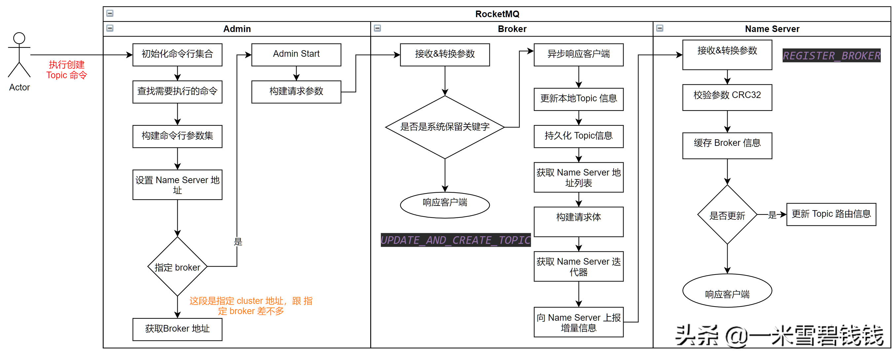

> 本章开始分析 RocketMQ 创建 Topic 命令的整体流程。

# 命令参数

> 用法：
> sh mqadmin updateTopic -n 192.168.1.100:9876
>
> 指令：
> updateTopic
>
> 代码入口：
> org.apache.rocketmq.tools.command.topic.UpdateTopicSubCommand

| 参数 | 是否必填           | 说明                                                         |
| ---- | ------------------ | ------------------------------------------------------------ |
| -b   | 如果-c为空，则必填 | broker 地址，表示topic 建在该broker                          |
| -c   | 如果-b为空，则必填 | cluster 名称，表示topic 建在该集群（集群可通过clusterList 查询） |
| -h   | 否                 | 打印帮助                                                     |
| -n   | 是                 | nameserve 服务地址列表，格式ip:port;ip:port;…                |
| -p   | 否                 | 指定新topic 的权限限制；2:[读]; 4:[写]; 6:[可读可写]         |
| -r   | 否                 | 可读队列数（默认为8）                                        |
| -w   | 否                 | 可写队列数（默认为8）                                        |
| -t   | 是                 | Topic 名称（名称只能使用字符 ^[a-zA-Z0-9_-]+$ ）             |
| -u   | 否                 |                                                              |
| -s   | 否                 |                                                              |
| -o   | 否                 | 默认是无序的。                                               |

# 解析命令行参数入口

``` java
        // RocketMQ 配置了 命令行的执行 shell 脚本入口。就是下面的 mqadmin.sh 这个文件mqadmin.sh
        //解析命令行入口org.apache.rocketmq.tools.command.MQAdminStartup#main0
        //设置 namesrvAddr 为全局变量。
        if (commandLine.hasOption('n')) {
            String namesrvAddr = commandLine.getOptionValue('n');
            System.setProperty(MixAll.NAMESRV_ADDR_PROPERTY, namesrvAddr);
        }
```

# 整体流程

> 流程列有缩减，为了整体理解更快。因为我们学习源码是为了学习整体流程、思想。


RocketMQ 创建 Topic 的整体流程

# QueueData

``` java
    // Topic 的 queue 信息
    public class QueueData implements Comparable<QueueData> {
        // broker 的名称   
        private String brokerName;
        // 可写队列
        private int readQueueNums;
        // 可写队列   
        private int writeQueueNums;
        // 权限    
        private int perm;
        // flag    
        private int topicSynFlag;
    }
```

# Topic 路由信息

```java
    public class RouteInfoManager {
        private static final InternalLogger log = InternalLoggerFactory.getLogger(LoggerName.NAMESRV_LOGGER_NAME);
        private final static long BROKER_CHANNEL_EXPIRED_TIME = 1000 * 60 * 2;
        private final ReadWriteLock lock = new ReentrantReadWriteLock();
        // Topic与 Queue 的信息    
        private final HashMap<String/* topic */, List<QueueData>> topicQueueTable;
        //说明 master 与 slave 是通过 brokerName 进行配对    
        private final HashMap<String/* brokerName */, BrokerData> brokerAddrTable;
        // 将 broker 按照 clusterName 分组    
        private final HashMap<String/* clusterName */, Set<String/* brokerName */>> clusterAddrTable;
        // 代表一个活的 broker 链接由最后更新时间，一个链接 channel，数据版本和 Ha 地址组成    
        //Broker 定时向 namesrv 注册并更新 BrokerLiveInfo 的时间戳    
        private final HashMap<String/* brokerAddr */, BrokerLiveInfo> brokerLiveTable;
        private final HashMap<String/* brokerAddr */, List<String>/* Filter Server */> filterServerTable;
    }
```

# 定时注册

```java
        // 定时将 broker 的信息注册到 namesrv 上面，broker 启动的时候，先将信息加载到 broker 中      
        this.scheduledExecutorService.scheduleAtFixedRate(new Runnable() {
            @Override
            public void run() {
                try {
                    BrokerController.this.registerBrokerAll(true, false, brokerConfig.isForceRegister());
                } catch (Throwable e) {
                    log.error("registerBrokerAll Exception", e);
                }
            }
        }, 1000 * 10, Math.max(10000, Math.min(brokerConfig.getRegisterNameServerPeriod(), 60000)), TimeUnit.MILLISECONDS);
```

# 总结

1. RocketMQ 创建 Topic 的时候，Broker 端保存一份，同时往所有 Name server 上面注册一份。
2. RocketMQ 的 Broker 端有一个定时、向 Name Server 上报信息的调度任务。即使此次 Broker 请求 Name Server 创建 Topic 不通，后续也会通过 心跳 方式推送到 Name Server。