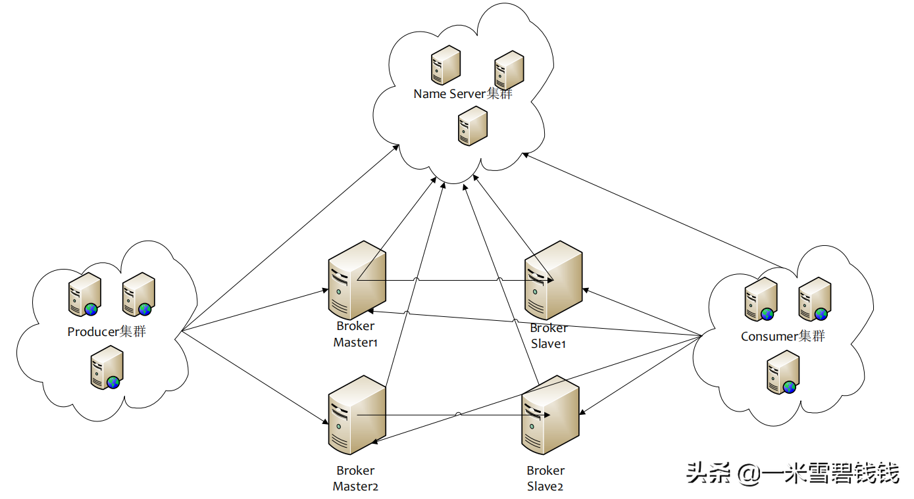
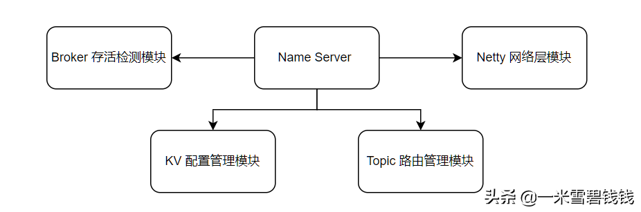

> 本章节，我们主要介绍 RocketMQ 一个核心组件，它的职责是提供了 <font color='green'>Topic 路由管理、Broker 服务注册与存活检测服务</font>。
>它就是 Name Sever。维护了整个集群的元数据。让我们一起学习一下 Name Server 启动过程吧！


# 什么是 Name Server

- 在 RocketMQ中，如果有 Producer、consumer 加入或者掉线了？RocketMQ 是如何保证 Producer、Consumer 平稳的呢？
还有比如 Broker 添加、掉线等等异常情况，RocketMQ 又是如何保证集群的平稳运行的？那么，RocketMQ 需要一个<font color='green'>协调者(NameServer)</font>来处理这这事情。
- RocketMQ 中的 Name Server 是一个 <font color='green'>内存型、轻量级</font>的协调者，多个 Name Server 之间组成一个 Name Server 集群，
但是 Name Server 集群中每个实例是<font color='green'>不会互相通信</font>的，数据的一致性是通过最终一致性来保证的。
- 在 RocketMQ中，Producer 第一次发送消息、Consumer 启动时，都会从 Name Server 获取 Topic 路由信息，在其内部缓存起来，
后续通过<font color='green'>定时任务</font>定时的从 Name Server 拉取Topic 路由信息。
- Name Server 就是 RocketMQ 集群大脑！


# 为啥仅需要 Name Server 即可

> 我个人搞中间件的原则：<font color='green'>简单粗暴</font>！

| 功能点       | Zookeeper | Name Server                          |
| ------------ | --------- | ------------------------------------ |
| 角色         | 协调者    | 元数据管理中心                       |
| 配置保存     | 磁盘      | 内存                                 |
| 是否支持选举 | 是        | 否                                   |
| 数据一致性   | 强一致性  | 最终一致性，通过 broker 定时上报心跳 |
| 是否高可用   | 是        | 是                                   |
| 协议设计     | ZAB       | 无                                   |
| 网络分区     | 存在      | 不存在                               |

> 更深层次的原因！

- 运维困难。我记得 MetaQ 不是采用 Name Server ，而是采用了 Zookeeper，但是 Zookeeper 还是比较重的，比如运维过程、还得需要专业的知识等等。
而 RocketMQ 选择了重新开发了一个 <font color='green'>内存型的 Name Server</font> 来代替 Zookeeper。
- 一次创建，几乎永久不变。RocketMQ Topic 上线，是先申请后创建的。后续可以通过获取 Name Server Topic 路由信息对比就
可以知道数据是不是有一致性的问题。而Zookeeper 偏向于运行过程中不断变换的数据。
- 数据一致性可以通过心跳来弥补。RocketMQ 创建 Topic，先在 Broker 端保存一份，后续通过 心跳方式来将其 本地的 Topic 信息
&Broker 信息上报给 Name Server。
- 极高的性能。RocketMQ 的 Broker 保存消息，是 <font color='green'>顺序写</font>的，能保证极高的吞吐量。各个 queue 之间不需要负载迁移等等。
- 网络分区问题。在分布式环境中，很容易出现<font color='green'>网络分区</font>的问题。这样会导致整体的 RocketMQ 架构异常复杂及复杂的运维工作量。

# RocketMQ 部署结构



RocketMQ 常见的部署架构

- Consumer 集群：<font color='green'>定时</font>从 Name Server 实例中同步 Topic 路由信息。
- Producer 集群：<font color='green'>定时</font>从 Name Server 实例中同步 Topic 路由信息&Broker 信息。
- Broker实例：<font color='green'>定时</font>向 Name Server 发送心跳，心跳内容包含了 Topic 路由信息。


# Name Server 核心模块架构



RocketMQ Name Server 几大模块

- Topic 路有管理模块：Topic 路由模块，维护了 <font color='green'>Topic 的queue</font> 的信息。通过 Broker 定时上报来维护 Topic 路由最新数据。供 Producer、Consumer 定时来获取。
- Netty 网络层模块：这个模块，是基于 Netty 来开发的。
- Broker 存活检测模块：这个的存活检测方向有<font color='green'>两种</font>。
  - 一种是定时去扫描。
  - 另一种是 Netty 层发现 TCP 链接断开了，然后回调业务层注册器，让业务层自己来处理，就是：org.apache.rocketmq.namesrv.routeinfo.BrokerHousekeepingService。
- KV 配置管理模块：这个应该是预留代码模块，感觉没啥作用。但是，可以通过上传自定义的 KV 配置，然后 Producer、Consumer 获取到后，做一些小动作‍。

# Name Server 核心数据结构

> Name Server 核心数据结构，因为 RocketMQ 的 Name Server 是<font color='green'>内存型服务</font>。基本不做持久化操作。

```java
    // Topic 路由信息
    public class RouteInfoManager {
        private static final InternalLogger log = InternalLoggerFactory.getLogger(LoggerName.NAMESRV_LOGGER_NAME);
        private final static long BROKER_CHANNEL_EXPIRED_TIME = 1000 * 60 * 2;
        private final ReadWriteLock lock = new ReentrantReadWriteLock();
        private final HashMap<String/* topic */, List<QueueData>> topicQueueTable;
        //说明 master 与 slave 是通过 brokerName 进行配对    
        private final HashMap<String/* brokerName */, BrokerData> brokerAddrTable;
        // 将 broker 按照 clusterName 分组    
        private final HashMap<String/* clusterName */, Set<String/* brokerName */>> clusterAddrTable;
        // 代表一个活的 broker 链接由最后更新时间，一个链接 channel，数据版本和 Ha 地址组成    
        //Broker 定时向 namesrv 注册并更新 BrokerLiveInfo 的时间戳    
        private final HashMap<String/* brokerAddr */, BrokerLiveInfo> brokerLiveTable;
        private final HashMap<String/* brokerAddr */, List<String>/* Filter Server */> filterServerTable;
    }

    // Topic queue  的数据结构
    public class QueueData implements Comparable<QueueData> {
        // broker 的名称    
        private String brokerName;
        // 可写队列    
        private int readQueueNums;
        // 可写队列    
        private int writeQueueNums;
        // 权限    
        private int perm;
        // flag    
        private int topicSynFlag;
    }

    // Broker 数据结构
    public class BrokerData implements Comparable<BrokerData> {
        private String cluster;
        // broker 名字    
        private String brokerName;
    }

    // Broker 存活数据结构
    class BrokerLiveInfo {
        private long lastUpdateTimestamp;
        private DataVersion dataVersion;
        private Channel channel;
        private String haServerAddr;
    }
```

# Name Server 启动流程之加载配置

> Name Server 启动类的入口：
>
> org.apache.rocketmq.namesrv.NamesrvStartup
>
> 下面是加载&转换配置核心代码片段

```java
        // 初始化配置文件
        final NamesrvConfig namesrvConfig = new NamesrvConfig();
        // NameSrv 中 netty 的配置
        final NettyServerConfig nettyServerConfig = new NettyServerConfig();
        // 监听的端口，默认是 9876 。这里是设置 Netty 监听的端口，可以设置任何值，只要保证不冲突就可以啦
        nettyServerConfig.setListenPort(9876);
        // 加载配置
        String file = commandLine.getOptionValue('c');
        InputStream in = new BufferedInputStream(new FileInputStream(file));
        properties = new Properties();
        properties.load(in);
        // 将配置转换为 namesrv 
        configMixAll.properties2Object(properties, namesrvConfig);
        // 将 配置转换为 netty server 
        configMixAll.properties2Object(properties, nettyServerConfig);
```

# Name Server 启动之初始化 NameSrvController

```java
    public NamesrvController(NamesrvConfig namesrvConfig, NettyServerConfig nettyServerConfig) {
        this.namesrvConfig = namesrvConfig;
        this.nettyServerConfig = nettyServerConfig;
        this.kvConfigManager = new KVConfigManager(this);
        // 运行过程中的路由信息，数据只在内存，宕机后数据消失，但是Broker会 定期 推送最新数据     
        this.routeInfoManager = new RouteInfoManager();
        // broker 长链接检测      
        this.brokerHousekeepingService = new BrokerHousekeepingService(this);
        this.configuration = new Configuration(log, this.namesrvConfig, this.nettyServerConfig);
        this.configuration.setStorePathFromConfig(this.namesrvConfig, "configStorePath");
    }
```

# Name Server 启动过程之初始化

> 代码入口：
>
> org.apache.rocketmq.namesrv.NamesrvController#initialize
>
> 非核心代码我都忽略掉了

```java
        // 注册 RequestCOde,RocketMQ 所有的请求，都先经过 Netty 层 decode 后，拿到具体的 RequestCode，再做具体的
        //请求转发
        this.registerProcessor();
        // 定时扫描不活跃的 Broker
        this.scheduledExecutorService.scheduleAtFixedRate(new Runnable() {
            @Override
            public void run() {
                NamesrvController.this.routeInfoManager.scanNotActiveBroker();
            }
        }, 5, 10, TimeUnit.SECONDS);
        // 其他的都不太重要了，我就不写出来了

```

# Name Server 启动过程之 Start

```java
        // 网络层启动，后续会单独几篇来说 RocketMQ 网络层
        this.remotingServer.start();
        // 这个是为了开启 SSL，具体的代码片段：org.apache.rocketmq.namesrv.NamesrvController#initialize
        if (this.fileWatchService != null) {
            this.fileWatchService.start();
        }
```

# Name Server 之 RequestCode

> RocketMQ 通过 RequestCode 来辨别需要调用的方法。

```java
// 保存 KV 配置
        RequestCode.PUT_KV_CONFIG
// 获取 KV 配置
        RequestCode.GET_KV_CONFIG
// 删除 KV 配置
        RequestCode.DELETE_KV_CONFIG
// 查询数据版本号。Broker 注册的是，带有 version
        RequestCode.QUERY_DATA_VERSION
// 注册 Borker
        RequestCode.REGISTER_BROKER
// 取消注册 broker
        RequestCode.UNREGISTER_BROKER
// 通过 Topic 查询路由信息
        RequestCode.GET_ROUTEINTO_BY_TOPIC
// 获取集群 Broker 信息
        RequestCode.GET_BROKER_CLUSTER_INFO
// 擦除 Broker 权限
        RequestCode.WIPE_WRITE_PERM_OF_BROKER
// 获取所有的 Topic
        RequestCode.GET_ALL_TOPIC_LIST_FROM_NAMESERVER
// 删除 Topic
        RequestCode.DELETE_TOPIC_IN_NAMESRV
// 获取 KV 列表
        RequestCode.GET_KVLIST_BY_NAMESPACE
// 获取集群Topic
        RequestCode.GET_TOPICS_BY_CLUSTER
// 获取系统保留的 Broker
        RequestCode.GET_SYSTEM_TOPIC_LIST_FROM_NS
        RequestCode.GET_UNIT_TOPIC_LIST
        RequestCode.GET_HAS_UNIT_SUB_TOPIC_LIST
        RequestCode.GET_HAS_UNIT_SUB_UNUNIT_TOPIC_LIST
// 更新 name srv的配置
        RequestCode.UPDATE_NAMESRV_CONFIG
// 获取 name server 配置
        RequestCode.GET_NAMESRV_CONFIG
```

# Broker 端之 Broker 心跳注册

> Broker 端定时注册心跳，并且，携带比如 Topic 等等信息。

```java
// 定时将 broker 的信息注册到 namesrv 上面，broker 启动的时候，先将信息加载到 broker 中      
        this.scheduledExecutorService.scheduleAtFixedRate(new Runnable() {
            @Override
            public void run() {
                try {
                    BrokerController.this.registerBrokerAll(true, false, brokerConfig.isForceRegister());
                } catch (Throwable e) {
                    log.error("registerBrokerAll Exception", e);
                }
            }
        }, 1000 * 10, Math.max(10000, Math.min(brokerConfig.getRegisterNameServerPeriod(), 60000)), TimeUnit.MILLISECONDS);
```

# Name Server 接收 Broker 心跳

> Name Servuer 端，处理 Broker 端上报的心跳数据。

```java
        case RequestCode.REGISTER_BROKER:
            Version brokerVersion = MQVersion.value2Version(request.getVersion());
            if (brokerVersion.ordinal() >= MQVersion.Version.V3_0_11.ordinal()) {
                return this.registerBrokerWithFilterServer(ctx, request);
            } else {
                return this.registerBroker(ctx, request);
            }

```

# Name Server 之 扫描Broker 存活

> Broker 注册心跳信息，是 <font color='green'>one way</font> 的方式，存在可能心跳数据丢失等等问题。
>所以 Name Server 端主动检测 Broker 存活问题。前面一节，我们提到过，RocketMQ Name Server 启动的时候，
>注册一个 定时任务，<font color='green'>定时扫描 Broker 端网络</font>。

```java
    // 扫描不活跃的 Broker 
    public void scanNotActiveBroker() {
        // Broker 定时上报        
        Iterator<Entry<String, BrokerLiveInfo>> it = this.brokerLiveTable.entrySet().iterator();
        while (it.hasNext()) {
            Entry<String, BrokerLiveInfo> next = it.next();
            long last = next.getValue().getLastUpdateTimestamp();// 120s         
            if ((last + BROKER_CHANNEL_EXPIRED_TIME) < System.currentTimeMillis()) {
                // channel 关闭                
                RemotingUtil.closeChannel(next.getValue().getChannel());
                it.remove();
                log.warn("The broker channel expired, {} {}ms", next.getKey(), BROKER_CHANNEL_EXPIRED_TIME);
                // channel 关闭，移除内存重的数据               
                this.onChannelDestroy(next.getKey(), next.getValue().getChannel());
            }
        }
    }

    public void onChannelDestroy(String remoteAddr, Channel channel) {
        // brokerLiveTable 数据移除
        this.brokerLiveTable.remove(brokerAddrFound);
        // 移除 Filter ，RocketMQ 的 Broker 也有可能是 Filter
        this.filterServerTable.remove(brokerAddrFound);
    }
```

# Name Server 网络层检测心跳

> 前面的 扫描 Broker 属于 主动发现的，是有一定的时间间隔的。而这个属于 Netty 层，主动发现。

``` java
    // 接收Broker连接事件,这个接口会监听网络层的请求，如果有close等关闭请求，直接从brokerLiveTable中移除该数据
    private BrokerHousekeepingService brokerHousekeepingService;

    public class BrokerHousekeepingService implements ChannelEventListener {
        private static final InternalLogger log = InternalLoggerFactory.getLogger(LoggerName.NAMESRV_LOGGER_NAME);
        private final NamesrvController namesrvController;

        public BrokerHousekeepingService(NamesrvController namesrvController) {
            this.namesrvController = namesrvController;
        }

        @Override
        public void onChannelConnect(String remoteAddr, Channel channel) {
        }

        @Override
        public void onChannelClose(String remoteAddr, Channel channel) {
            this.namesrvController.getRouteInfoManager().onChannelDestroy(remoteAddr, channel);
        }

        @Override
        public void onChannelException(String remoteAddr, Channel channel) {
            this.namesrvController.getRouteInfoManager().onChannelDestroy(remoteAddr, channel);
        }

        @Override
        public void onChannelIdle(String remoteAddr, Channel channel) {
            this.namesrvController.getRouteInfoManager().onChannelDestroy(remoteAddr, channel);
        }
    }
```

# 总结一下：

- Name Server 实例简单、实用。运维简单。
- Name Server 的 Topic 信息，通过 Broker 定时上报心跳，来达到数据最终的一致性。
- Name Server 各个实例之间是不会通信的。可能存在短暂的不一致。但是一般都是上线前申请，应用再上线，这种还是可以接受的。
- Name Server 最主要的是数据结构的设计。
- Name Server 在检测 Broker 存活的时候，一种是通过定时任务；一种是 TCP 层检测回调处理。