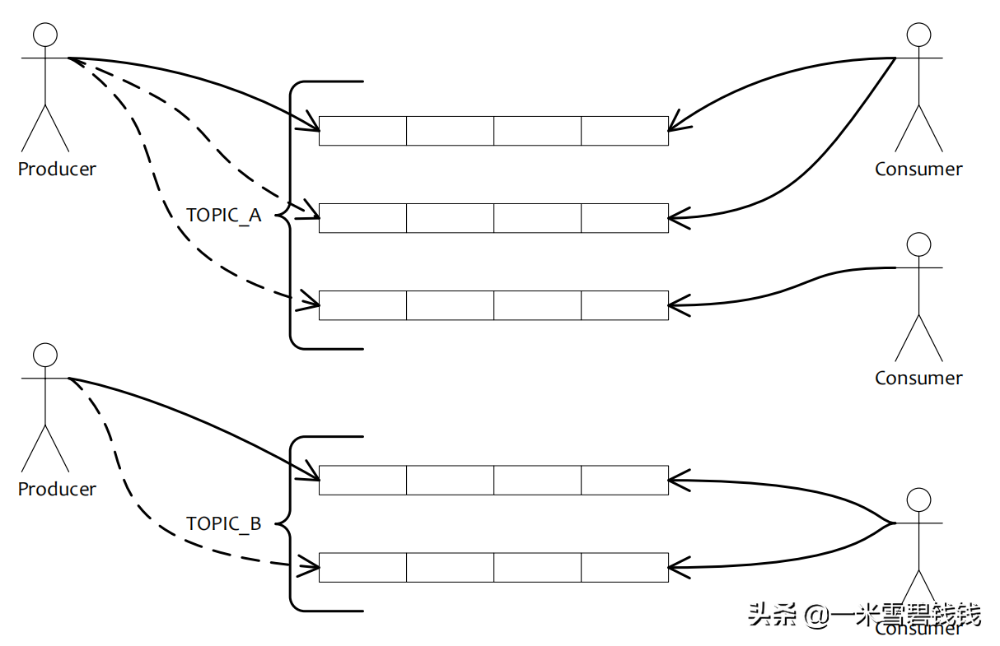
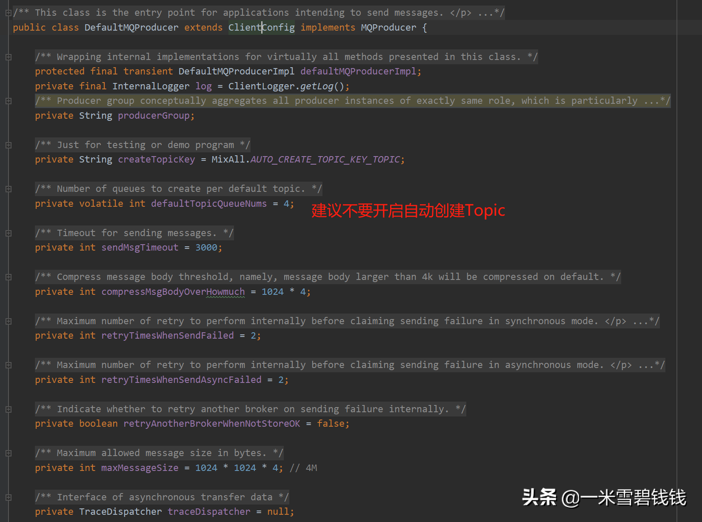
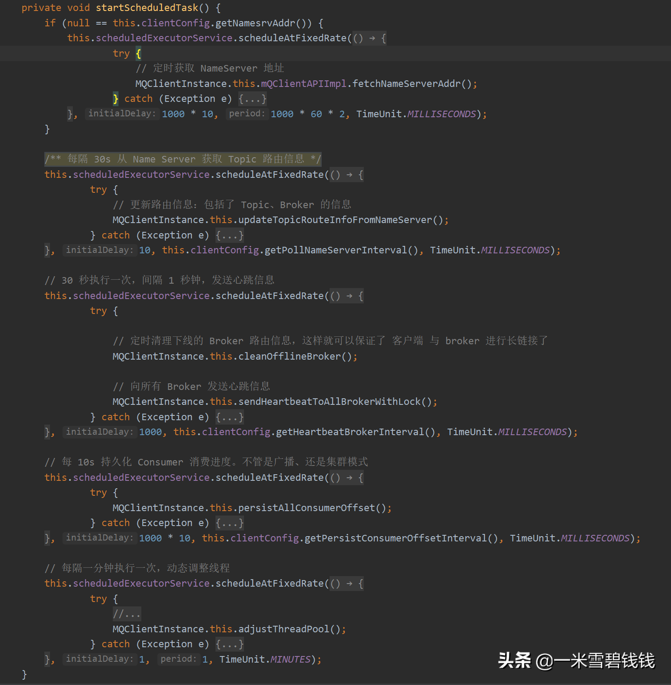

> 本章节，我们主要分析 RocketMQ Producer<font color='green'>发送普通消息的原理</font>（暂时不涉及到事务消息Producer），
>暂时不涉及到存储端是如何存储消息的。那接下来，让我们一块看看 RocketMQ Producer 发送普通消息其内部是如何实现的吧！


# 例子

> RocketMQ 发送消息超级简单！Name Server 地址别设置错了！

``` java
public class Producer {
    public static void main(String[] args) throws MQClientException, InterruptedException {
        // 设置业务上有意义的名称       
        DefaultMQProducer producer = new DefaultMQProducer("ProducerGroupName");
        producer.setNamesrvAddr("www.hebaodan.com");
        producer.start();
        try {
            Message msg = new Message("TopicTest", "TagA", "OrderID188", "Hello world".getBytes(RemotingHelper.DEFAULT_CHARSET));
            SendResult sendResult = producer.send(msg);
            System.out.printf("%s%n", sendResult);
        } catch (Exception e) {
            e.printStackTrace();
        }
        producer.shutdown();
    }
}
```

# RocketMQ 发送消息逻辑结构



RocketMQ 发送消息逻辑结构

- **Producer:**
  消息生产者，负责产生消息，一般由业务系统负责产生消息。
- **Message Queue:**
  在 RocketMQ 中，所有消息队列都是持久化，长度无限的数据结构，所谓长度无限是指队列中的每个存储 单元都是定长，
  访问其中的存储单元使用 Offset 来访问，offset 为 java long 类型，64 位，理论上在 100 年内不会溢出，所以认为是长度无限，
  另外队列中只保存最近几天的数据，之前的数据会按照过期时间来删除。也可以认为 Message Queue 是一个长度无限的数组，
  offset 就是下标。
- **Topic:**
  Topic是生产者在发送消息和消费者在拉取消息的类别。Topic与生产者和消费者之间的关系很是松散。具体来讲，
  一个Topic可能有0个，一个或多个生产者向它发送消息；相反，一个生产者能够发送不一样类型Topic的消息。
  相似的，消费者组能够订阅一个或多个主题，只要该组的实例保持其订阅一致便可。
- **Tag:**
  <font color='green'>二级 Topic</font>，为用户提供了额外的灵活性。有了 tag，来自同一业务模块的具备不一样目的的消息能够具备相同的 
  Topic和不一样的 tag。tag有助于保持代码的清晰和连贯，同时Tag 也方便RocketMQ提供的查询功能。

# 消息类型

- 普通消息：这种消息是我们最常见的。默认是<font color='green'>轮询队列</font>的方式发送。可靠性最好。
- 分区有序消息：这种消息，一般是可以自己<font color='green'>选择指定队列</font>的方式。比如，
根据 goodsId 发送到指定队列里面。可靠性还行。
- 全局有序消息：这种消息，永远只能发送到单个队列里面，如果此队列对应的Broker 不可用，那么，造成的业务影响最大。
- 延迟消息：RocketMQ <font color='green'>默认支持 18 种级别</font>的消息。具体每种级别的延迟时间可以
按照业务需求来配置。
- 事务消息：这种是 RocketMQ 高版本支持的，也是 <font color='green'>Producer 本地事务消息</font>。
比如，你既要保证修改订单成功，
也要告诉下游说有订单产生了。这种其实不算是严格意义上的分布式事务。消费端得成功与否再也和 Producer 没有关系拉。

# RocketMQ Producer 消息发送方式

- 同步：Producer 发送消息后，一直等待 Broker 端响应。适合正常的业务，返回具体的 messageId，
建议保存在日志里面，方便后续追溯问题。推荐这种方式。
- 异步：Prouder 发送消息后，通过 <font color='green'>callBack</font> 接口来继续执行后续的业务。
- one way：这种方式就不在乎消息是否能否发送到 broker 、或者能否在 broker 保存起来。适合日志。
比如 RocketMQ 内部的 trace 链路跟踪系统。

# RocketMQ 消息数据结构

> RocketMQ 除了 Topic、body 外，很多特有的属性，都是通过 <font color='green'>KV 这种方式存储</font>，也是方便了扩展。

``` java
public class Message implements Serializable {
    private static final long serialVersionUID = 8445773977080406428L;
    /**
     * 消息主题
     */
    private String topic;
    /**
     * 消息标志，系统不做干预，完全由应用决定如何使用
     */
    private int flag;
    /**
     * 消息属性，都是系统属性，禁止应用设置，扩展字段，这样的设计非常巧妙
     */
    private Map<String, String> properties;
    /**
     * 消息体
     */
    private byte[] body;
    private String transactionId;

    public Message(String topic, String tags, String keys, int flag, byte[] body, boolean waitStoreMsgOK) {
        this.topic = topic;
        this.flag = flag;
        this.body = body;
        if (tags != null && tags.length() > 0) this.setTags(tags);
        if (keys != null && keys.length() > 0)
            this.setKeys(keys);
        // 这种方式用于 可靠性要求极高的方案       
        this.setWaitStoreMsgOK(waitStoreMsgOK);
    }

    public void setTags(String tags) {
        this.putProperty(MessageConst.PROPERTY_TAGS, tags);
    }

    public void setKeys(Collection<String> keys) {
        StringBuffer sb = new StringBuffer();
        for (String k : keys) {
            sb.append(k);
            sb.append(MessageConst.KEY_SEPARATOR);
        }
        this.setKeys(sb.toString().trim());
    }

    /**
     * 消息延时投递时间级别，0表示不延时，大于0表示特定延时级别（具体级别在服务器端定义）
     * * 客户端不支持任意时间段的
     * * 最高延迟级别 等于 队列数
     * * @param level
     */
    public void setDelayTimeLevel(int level) {
        this.putProperty(MessageConst.PROPERTY_DELAY_TIME_LEVEL, String.valueOf(level));
    }

    /**
     * 是否等待服务器将消息存储完毕再返回（可能是等待刷盘完成或者等待同步复制到其他服务器）     
     * * 这个比较适合：可靠性要求极高的。     
     * * 这个属性，将消息刷到 slave 中的。这个效率更加高，只要这条消息刷盘成功了，就可以返回啦     
     * * @return
     */
    public boolean isWaitStoreMsgOK() {
        String result = this.getProperty(MessageConst.PROPERTY_WAIT_STORE_MSG_OK);
        if (null == result) return true;
        return Boolean.parseBoolean(result);
    }

    public void setWaitStoreMsgOK(boolean waitStoreMsgOK) {
        this.putProperty(MessageConst.PROPERTY_WAIT_STORE_MSG_OK, Boolean.toString(waitStoreMsgOK));
    }
}

```

# RocketMQ Producer 可配置参数




# Producer 启动流程

> RocketMQ 启动过程中不是很复杂的，下面我摘抄核心的地方出来。 第一次发送的时候，RocketMQ 需要到 RocketMQ 获取 Topic 路由信息。

``` java
// 检查配置
        this.checkConfig();
// 默认 Topic：TBW102 。后续 Producer 会 根据 topicPublishInfoTable 定时更新 Topic 路由信息
        this.topicPublishInfoTable.put(this.defaultMQProducer.getCreateTopicKey(), new TopicPublishInfo());
// 启动网络成
        this.mQClientAPIImpl.start();
// 启动各种定时任务【核心】
        this.startScheduledTask();
// 开始拉去消息，这是一个线程，必须要看起 run 方法，就知道如何拉取消息啦
        this.pullMessageService.start();
//负载均衡启动， 10s 做一次均衡负载。
        this.rebalanceService.start();
```

# Producer 各种定时任务

> 重点关注定时更新 Topic 和 剔除下线的 Broker 。 
>
>定时更新Topic：除了能获取 Topic 路由信息外，还可以起到发送心跳的作用。


Producer 启动的各种定时任务

- updateTopicRouteInfoFromNameServer： 这个方法会<font color='green'>定时</font>从 Name Server 上面更新 Topic 路由信息。
这段代码包含了 Consumer 和 Producer 更新 Topic 路由信息。

# Producer 如何保证发送消息链路可靠

> 在 RocketMQ 中，有两种方式保证发送消息链路的可靠性。
>
> 一种是靠重试，
>
> 一种是通过采集数据，简单判断队列是否可靠。
>
> 那我们接下来看看这两种：

``` java
// 第一种：同步 3 次、异步 1 次
        int timesTotal = communicationMode == CommunicationMode.SYNC ? 1 + this.defaultMQProducer.getRetryTimesWhenSendFailed() : 1

// 第二种：采集数据，也可以自己实现。
        this.updateFaultItem(mq.getBrokerName(), endTimestamp - beginTimestampPrev, false);


    /**
     * 更新 容错选项，是为了能够保证下一次更加高的成功率
     *
     * @param name
     * @param currentLatency
     * @param notAvailableDuration
     */
    @Override
    public void updateFaultItem(final String name, final long currentLatency, final long notAvailableDuration) {
        FaultItem old = this.faultItemTable.get(name);
        if (null == old) {
            final FaultItem faultItem = new FaultItem(name);
            faultItem.setCurrentLatency(currentLatency);
            faultItem.setStartTimestamp(System.currentTimeMillis() + notAvailableDuration);
            old = this.faultItemTable.putIfAbsent(name, faultItem);
            // 可能存在并发的情况            
            if (old != null) {
                old.setCurrentLatency(currentLatency);
                old.setStartTimestamp(System.currentTimeMillis() + notAvailableDuration);
            }
        } else {
            old.setCurrentLatency(currentLatency);
            old.setStartTimestamp(System.currentTimeMillis() + notAvailableDuration);
        }
    }
```


# RocketMQ的 Producer如何选择队列呢？

> 上一节中，我们提到了 RocketMQ 为了保证发送消息的链路可靠性，<font color='green'>默认提供了重试策略</font>。
>但是我们可以可以开启更加高级的容错策略。默认是不开启的。
> 具体代码入口：
> org.apache.rocketmq.client.latency.MQFaultStrategy#sendLatencyFaultEnable

``` java
    // 第一种：默认情况下，RocketMQ 都是 轮询方式选择队列
    public MessageQueue selectOneMessageQueue() {
        int index = this.sendWhichQueue.getAndIncrement();
        int pos = Math.abs(index) % this.messageQueueList.size();
        if (pos < 0) pos = 0;
        return this.messageQueueList.get(pos);
    }

    // 第二种：还是 选择轮询队列的方式，但是，这种方式还会继续判断，Broker 是否可用，如果命中的 broker 还是不可用，那么，就选择将要可用的 broker 
    //下面的 是核心代码片段
    int index = tpInfo.getSendWhichQueue().getAndIncrement();
    MessageQueue mq = tpInfo.getMessageQueueList().get(pos);latencyFaultTolerance.isAvailable(mq.getBrokerName())
    final String notBestBroker = latencyFaultTolerance.pickOneAtLeast();

    // --------------------------- 分割线 ----------------------// 
    //判断是否 可用
    @Override
    public boolean isAvailable(final String name) {
        final FaultItem faultItem = this.faultItemTable.get(name);
        if (faultItem != null) {
            return faultItem.isAvailable();
        }
        return true;
    }

    // 获取最近可用的 Broker 
    @Override
    public String pickOneAtLeast() {
        final Enumeration<FaultItem> elements = this.faultItemTable.elements();
        List<FaultItem> tmpList = new LinkedList<FaultItem>();
        while (elements.hasMoreElements()) {
            final FaultItem faultItem = elements.nextElement();
            tmpList.add(faultItem);
        }
        if (!tmpList.isEmpty()) {
            Collections.shuffle(tmpList);
            // 排序：可用-->延迟时间-->开始时间            
            Collections.sort(tmpList);
            final int half = tmpList.size() / 2;
            if (half <= 0) {
                return tmpList.get(0).getName();
            } else {
                // 选择 half+1 后面的                
                final int i = this.whichItemWorst.getAndIncrement() % half;
                return tmpList.get(i).getName();
            }
        }
        return null;
    }
```


# RocketMQ Producer 更新 Topic 路由信息

> 代码片段在：
>
> org.apache.rocketmq.client.impl.producer.DefaultMQProducerImpl#sendDefaultImpl
>
> 这里我只摘抄核心代码片段：

``` java
    // 第一种：第一次发送消息时候。如果找不到，那么，将抛出 此 Topic 不存在。这里的代码值得好好看一下。
    TopicPublishInfo topicPublishInfo = this.tryToFindTopicPublishInfo(msg.getTopic());
    // 第二种：定时任务更新
    org.apache.rocketmq.client.impl.factory.MQClientInstance#updateTopicRouteInfoFromNameServer()
```


# RocketMQ Producer 网络层

> RocketMQ Producer 发送消息的时候。有一个比较重要的参数， opaque。
>
> 后续再好好讨论一下。
>
> 网络层 代码入口：
>
> org.apache.rocketmq.remoting.netty.NettyRemotingAbstract#invokeSyncImpl

``` java
    // 先缓存起来。
    this.responseTable.put(opaque,responseFuture);
    // 定时扫描异常 Response 表。
    org.apache.rocketmq.remoting.netty.NettyRemotingAbstract#scanResponseTable
```


# Producer 发送心跳至Broker 端

``` java
    // 这里会更新 此 Name Server 下 Broker 集群的地址
    org.apache.rocketmq.client.impl.factory.MQClientInstance#updateTopicRouteInfoFromNameServer(java.lang.String, boolean, org.apache.rocketmq.client.producer.DefaultMQProducer)
    // 剔除下线的 Broker，主要是通过 topicRouteTable 来判断。因为有可能 Topic 已经迁移到其他 broker 上面了。
    org.apache.rocketmq.client.impl.factory.MQClientInstance#isBrokerAddrExistInTopicRouteTable
```


# 总结
- RocketMQ Producer 发送端的源码逻辑比较简单，需要注意的是<font color='green'>各种定时任务</font>。
- RocketMQ Producer 的 GroupName 最好是设置为有意义的那种。
- RocketMQ Producer 发送消息后，<font color='green'>建议保存 messageId 到日志里面</font>。方便追溯问题。
- RocketMQ Producer 根据 GroupName 来划分业务。