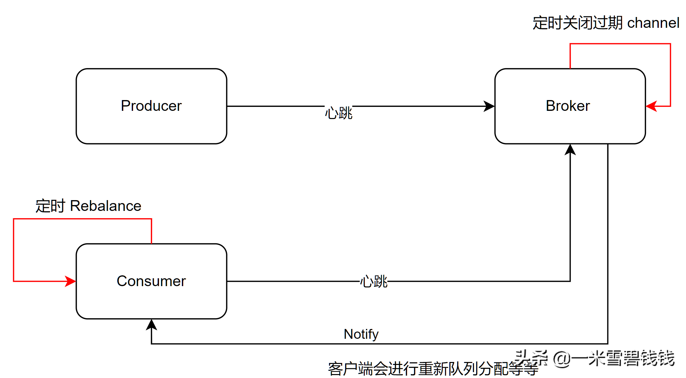

> 本章节，我们主要分析 RocketMQ Producer 心跳处理的原理！RocketMQ 心跳处理包括<font color='green'>Client主动上报、
>Broker 扫描不活跃的 channel</font>，达到节约网络端口，提升性能的效果。


# 整体逻辑示意图



# RocketMQ 心跳协议

> RocketMQ 心跳协议是 Producer、Consumer 公用的！

```java
    public class HeartbeatData extends RemotingSerializable {
        // 客户端ID
        private String clientID;
        // 生产者数据集
        private Set<ProducerData> producerDataSet = new HashSet<ProducerData>();
        // 消费者数据集
        private Set<ConsumerData> consumerDataSet = new HashSet<ConsumerData>();
    }

    // Producer 心跳数据
    public class ProducerData {
        // 组名
        private String groupName;
    }

    // consumer 心跳数据
    public class ConsumerData {
        // 组名
        private String groupName;
        // 消费消息类型：主动(pull)、被动（push）
        private ConsumeType consumeType;
        // 消息模式：集群（默认）、广播
        private MessageModel messageModel;
        // consumer 从哪里开始消费
        private ConsumeFromWhere consumeFromWhere;
        // 订阅的 topic 的基本
        private Set<SubscriptionData> subscriptionDataSet = new HashSet<SubscriptionData>();
        private boolean unitMode;
    }
```

# 准备心跳包

> ProducerTable 数据来源于：
>
> org.apache.rocketmq.client.impl.factory.MQClientInstance#registerProducer ConsumerTable
>
> 数据来源于：
>
> org.apache.rocketmq.client.impl.factory.MQClientInstance#registerConsumer
>
> <font color='green'>MQClientInstance</font> 这个类是 Consumer、Producer 统一的抽象底层类！很重要的！

``` java
    /**
     * 准备心跳数据包，这个方法是公用的
     *
     * @return
     */
    private HeartbeatData prepareHeartbeatData() {
        // 初始化心跳数据包     
        HeartbeatData heartbeatData = new HeartbeatData();
        // clientID       
        heartbeatData.setClientID(this.clientId);
        // Consumer 心跳数据包        
        for (Map.Entry<String, MQConsumerInner> entry : this.consumerTable.entrySet()) {
            MQConsumerInner impl = entry.getValue();
            if (impl != null) {
                ConsumerData consumerData = new ConsumerData();
                consumerData.setGroupName(impl.groupName());
                consumerData.setConsumeType(impl.consumeType());
                consumerData.setMessageModel(impl.messageModel());
                consumerData.setConsumeFromWhere(impl.consumeFromWhere());
                consumerData.getSubscriptionDataSet().addAll(impl.subscriptions());
                consumerData.setUnitMode(impl.isUnitMode());
                heartbeatData.getConsumerDataSet().add(consumerData);
            }
        }

        // Producer 心跳数据包        
        for (Map.Entry<String/* group */, MQProducerInner> entry : this.producerTable.entrySet()) {
            MQProducerInner impl = entry.getValue();
            if (impl != null) {
                ProducerData producerData = new ProducerData();
                producerData.setGroupName(entry.getKey());
                heartbeatData.getProducerDataSet().add(producerData);
            }
        }
        return heartbeatData;
    }
```

# 定时发送心跳数据至Broker 端

> 代码入口：
> org.apache.rocketmq.client.impl.factory.MQClientInstance#startScheduledTask

``` java
// 30 秒执行一次，间隔 1 秒钟，发送心跳信息
//向所有 Broker 发送心跳信息
MQClientInstance.this.sendHeartbeatToAllBrokerWithLock();
```

# 发送心跳代码入口

> RocketMQ Consumer 端和 Producer 端共用一套逻辑。
>
> 具体代码如下：
> org.apache.rocketmq.client.impl.factory.MQClientInstance#sendHeartbeatToAllBroker 。
>
> 下面只摘抄核心代码片段：

``` java
int version = this.mQClientAPIImpl.sendHearbeat(addr, heartbeatData, 3000);
```

# RequestCode

``` java
// Broker Client向Client发送心跳，并注册自身
public static final int HEART_BEAT = 34;
```

# Broker 端处理心跳逻辑入口

``` java
// broker 处理心跳，包含了 Consumer、Producer 
org.apache.rocketmq.broker.processor.ClientManageProcessor#heartBeat
```

# Broker 端处理之 Producer

> Producer 处理比较简单。

``` java
HashMap<Channel, ClientChannelInfo> channelTable = this.groupChannelTable.get(group);
```

# Broker 端处理之Consumer

> Consumer 端处理有点复杂：
>
> 1、看看是否是有新的 consumer instance 上线，如果有，则进行负载均衡处理操作。
>
> 2、查看订阅关系是否改变。RocketMQ 消息的过滤是<font color='green'>2次过滤方式</font>，
>一次是 broker 通过 hashcode 过滤，一次是在 Consumer client 通过 topic+tag 过滤。因为hashcode 存在冲突。

``` java
        // 注册 重试Topic 
        String newTopic = MixAll.getRetryTopic(data.getGroupName());
        // TODO 这里会将 broker 的配置重新推送到 name server 端
        this.brokerController.getTopicConfigManager().createTopicInSendMessageBackMethod(newTopic, subscriptionGroupConfig.getRetryQueueNums(), PermName.PERM_WRITE | PermName.PERM_READ, topicSysFlag);
        
        // 注册 consumer 
        public boolean registerConsumer ( final String group, final ClientChannelInfo clientChannelInfo, ConsumeType
        consumeType, MessageModel messageModel, ConsumeFromWhere consumeFromWhere,final Set<SubscriptionData> subList,
        boolean isNotifyConsumerIdsChangedEnable){
            ConsumerGroupInfo consumerGroupInfo = this.consumerTable.get(group);
            if (null == consumerGroupInfo) {
                ConsumerGroupInfo tmp = new ConsumerGroupInfo(group, consumeType, messageModel, consumeFromWhere);
                ConsumerGroupInfo prev = this.consumerTable.putIfAbsent(group, tmp);
                consumerGroupInfo = prev != null ? prev : tmp;
            }
            // 更新 channel      
            boolean r1 = consumerGroupInfo.updateChannel(clientChannelInfo, consumeType, messageModel, consumeFromWhere);
            // 更新订阅关系        
            boolean r2 = consumerGroupInfo.updateSubscription(subList);
            // 若 r1 ==true，则说明有消费者上线了        
            //若 r2 ==true，则说明订阅关系发生了变化    
            if (r1 || r2) {
                if (isNotifyConsumerIdsChangedEnable) {
                    this.consumerIdsChangeListener.handle(ConsumerGroupEvent.CHANGE, group, consumerGroupInfo.getAllChannel());
                }
            }
            this.consumerIdsChangeListener.handle(ConsumerGroupEvent.REGISTER, group, subList);
            return r1 || r2;
        }

```

# Channel 数据结构

``` java
    public class ClientChannelInfo {
        // 进行通信的 channel, Netty 中的 channel   
        private final Channel channel;
        //  客户端ID    
        private final String clientId;
        private final LanguageCode language;
        // 客户端版本号    
        private final int version;
        // 最后更新时间设定为当前时间,用于 channel 是否处于活跃来判断   
        private volatile long lastUpdateTimestamp = System.currentTimeMillis();
    }
```

# Broker 定时扫描不活跃 Channel

> 代码入口：
> org.apache.rocketmq.broker.client.ClientHousekeepingService#start

```java
    /**
     * 扫描非活跃的 channel  * 1、生产者  * 2、消费者  * 3、过滤服务器
     */
    private void scanExceptionChannel() {
        // 生产者
        this.brokerController.getProducerManager().scanNotActiveChannel();
        // 消费者
        this.brokerController.getConsumerManager().scanNotActiveChannel();
        // 专门的过滤服务器
        this.brokerController.getFilterServerManager().scanNotActiveChannel();
    }
    // channnel 超时过期的时间是 120s，client 是30s 发送一次。
    private static final long CHANNEL_EXPIRED_TIMEOUT = 1000 * 120;
    // 最终处理效果是，直接关闭 channel。
    RemotingUtil.closeChannel(clientChannelInfo.getChannel());
    // consumerTable remove 指定channel。
```

# Consumer 定时发起Rebalance

> Consumer 端定时 Rebalance，保证了消费的可靠性。
> 代码入口：
> org.apache.rocketmq.client.impl.consumer.RebalanceService。

```java
        private static long waitInterval = Long.parseLong(System.getProperty("rocketmq.client.rebalance.waitInterval", "20000"));
        @Override
        public void run () {
            log.info(this.getServiceName() + " service started");
            while (!this.isStopped()) {
                this.waitForRunning(waitInterval);
                this.mqClientFactory.doRebalance();
            }
            log.info(this.getServiceName() + " service end");
        }
```

- Broker 端关闭了channel 后，consumer 端最晚 <font color='green'>20s</font> 才进行重新 Rebalance。
这种最好在 Broker 做好监控埋点。同时客户端也要做好 <font color='green'>堆积量监控</font>的埋点。


# 总结

- 本文分析了 RocketMQ Heartbeat 涉及的方方面面，整体形成了一个完整的链路。
但是本文还是聚焦在 <font color='green'>Client → Broker</font> 端的链路上。
- RocketMQ channel 的更新，还是得要依靠 HearBeat 来。如果client 数量巨大，可能会照成更新延迟，
Broker 端心跳压力过大！最好<font color='green'>做好监控埋点</font>！也可以单独剥离出来！