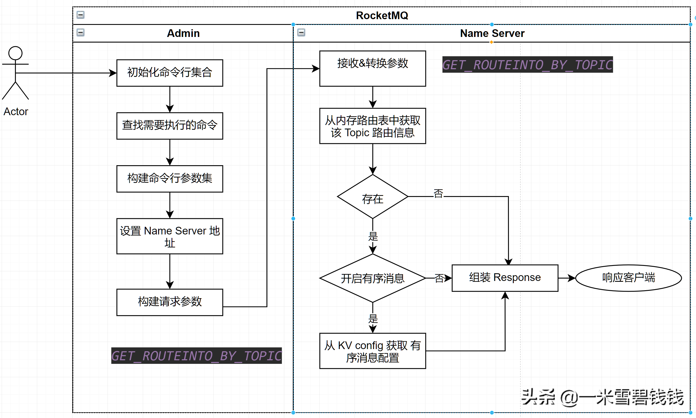

> 上一章中。我们分析了 RocketMQ 创建 Topic 的命令过程。本章，我们开始分析 获取 Topic 路由信息的源码过程。

继上一篇：
[RocketMQ源码分析三之删除Topic.md](RocketMQ源码分析之三删除Topic.md) 

# 命令参数

> 用法：sh mqadmin topicRoute -n 192.168.1.100:9876 -t shg
>
> 指令：topicRoute
>
> 代码入口：
> org.apache.rocketmq.tools.command.topic.TopicRouteSubCommand

| 参数 | 是否必填 | 说明                                          |
| ---- | -------- | --------------------------------------------- |
| -h   | 否       | 打印帮助                                      |
| -n   | 是       | nameserver 服务地址列表，格式ip:port;ip:port;… |
| -t   | 是       | Topic 名字                                    |

> 

# 解析命令行参数入口

```java
        // RocketMQ 配置了 命令行的执行 shell 脚本入口。就是下面的 mqadmin.sh 这个文件mqadmin.sh
        //解析命令行入口org.apache.rocketmq.tools.command.MQAdminStartup#main0
        //设置 namesrvAddr 为全局变量。
        if (commandLine.hasOption('n')) {
            String namesrvAddr = commandLine.getOptionValue('n');
            System.setProperty(MixAll.NAMESRV_ADDR_PROPERTY, namesrvAddr);
        }
```

# 整体流程 


RocketMQ 获取 Topic 的路由信息过程

# RequestCode

```java
// Namesrv 根据Topic获取Broker Name、队列数(包含读队列与写队列)
public static final int GET_ROUTEINTO_BY_TOPIC = 105;
```

# Name Server 路由管理表

> 这个是理解 RocketMQ 的一个关键地方了。我们先重点记住这个路由表。因为在 Producer和 Consumer 端向 Name Server 获取心跳的时候的，会返回 Topic 路由表。

``` java
    public class RouteInfoManager {
        private static final InternalLogger log = InternalLoggerFactory.getLogger(LoggerName.NAMESRV_LOGGER_NAME);
        private final static long BROKER_CHANNEL_EXPIRED_TIME = 1000 * 60 * 2;
        private final ReadWriteLock lock = new ReentrantReadWriteLock();
        // Topic 路由表    
        private final HashMap<String/* topic */, List<QueueData>> topicQueueTable;
        //说明 master 与 slave 是通过 brokerName 进行配对    
        private final HashMap<String/* brokerName */, BrokerData> brokerAddrTable;
        // 将 broker 按照 clusterName 分组    
        private final HashMap<String/* clusterName */, Set<String/* brokerName */>> clusterAddrTable;
        // 代表一个活的 broker 链接由最后更新时间，一个链接 channel，数据版本和 Ha 地址组成    
        //Broker 定时向 namesrv 注册并更新 BrokerLiveInfo 的时间戳    
        private final HashMap<String/* brokerAddr */, BrokerLiveInfo> brokerLiveTable;
        private final HashMap<String/* brokerAddr */, List<String>/* Filter Server */> filterServerTable;
    }
```

# Name Server Topic 路由表结构

``` java
    public class TopicRouteData extends RemotingSerializable {
        private String orderTopicConf;
        // 队列的数据    
        private List<QueueData> queueDatas;
        // broker 的数据    
        private List<BrokerData> brokerDatas;
        // Filter Server    
        private HashMap<String/* brokerAddr */, List<String>/* Filter Server */> filterServerTable;
    }
```

# QueueData 数据结构

> RocketMQ 的 Topic 是一个逻辑概念，而 queue 是实打实的，体现在 QueueData这里。具体的物理的结构就是 Consume queuer 中的 MappedFile 了

``` java
    public class QueueData implements Comparable<QueueData> {
        // broker 的名称    
        private String brokerName;
        // 可写队列    
        private int readQueueNums;
        // 可写队列    
        private int writeQueueNums;
        // 权限    
        private int perm;
        // flag    
        private int topicSynFlag;
    }
```

# Broker 的数据结构

``` java
    public class BrokerData implements Comparable<BrokerData> {
        private String cluster;
        // broker 名字    private String brokerName;   
        /**
         * brokerId 为 0,表示该 broker 为 master     * broker address 这里究竟是什么？是：mq1101.2dfire-inc.com:10911
         */
        private HashMap<Long/* brokerId */, String/* broker address */> brokerAddrs;
        private final Random random = new Random();
    }
```

# 总结

- RocketMQ 获取 Topic 的路由信息很简单。从 Name Server 的 RouteInfoManager 这个数据结构读取数据即可。
- 上面的文章内容，是我在阅读 RocketMQ 源码的做的笔记，这段时间把它整理出来。
- Name Server 中最主要的数据结构就是 RouteInfoManager。
- 阅读 RocketMQ源码，如果从 命令行 开始，基本都把 RocketMQ 的所有逻辑都吃了N遍，在回头看看消费端、生产端，那就更加容易了，而且，RocketMQ的运维端提供的命令行实在是太丰富了。