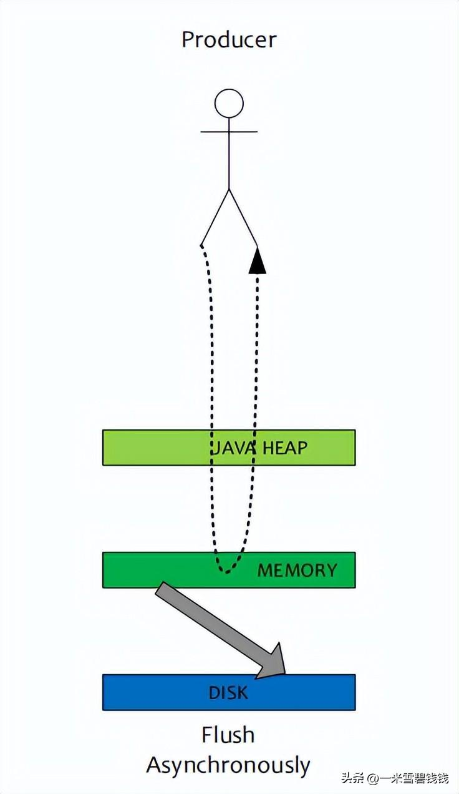
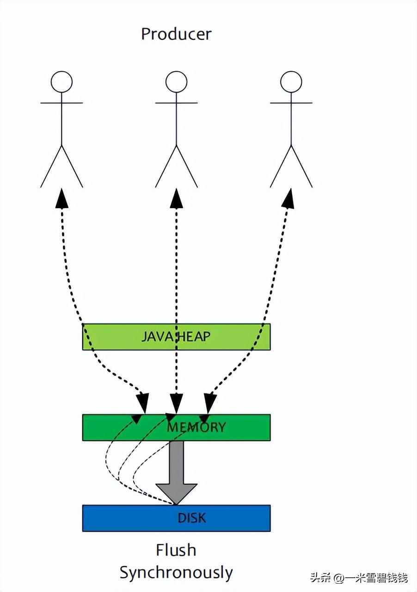
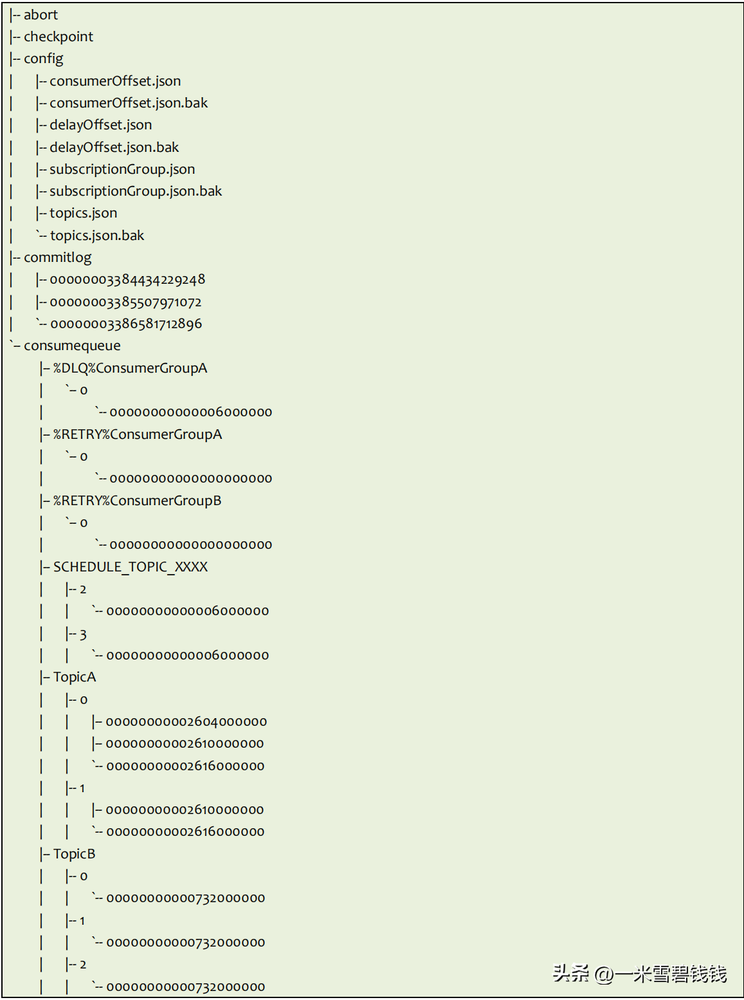
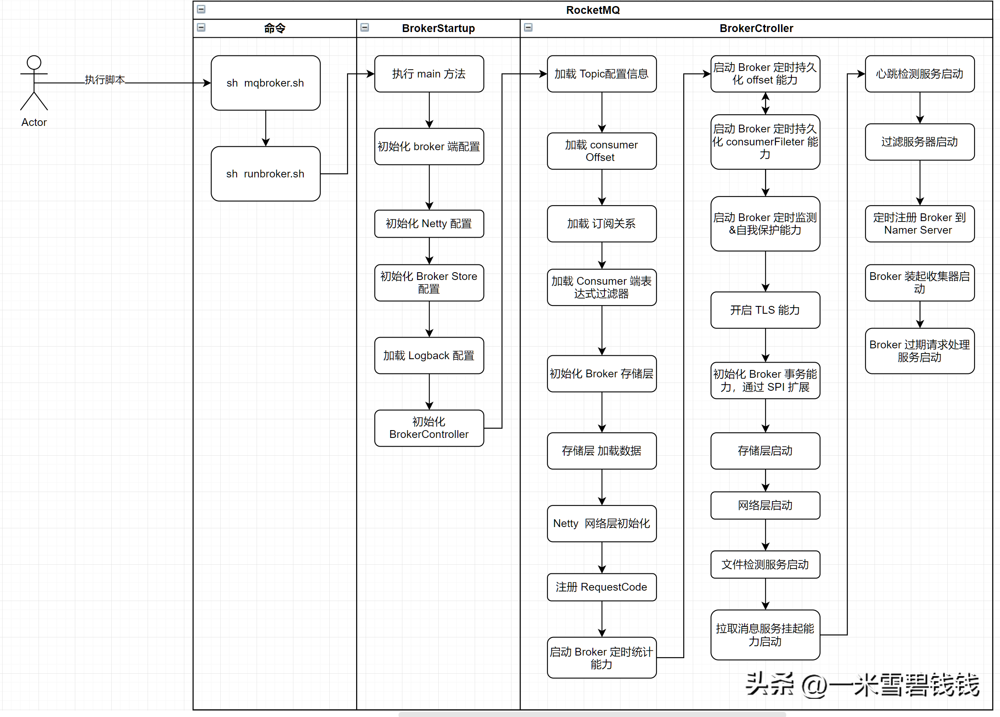

> 本章节，继续跟大家分析RocketMQ Broker 基础概念及启动过程。RocketMQ Broker 启动分为 
>master、slave 启动。本章节主要集中在 master 启动过程。

# 什么是 RocketMQ Broker

- RocketMQ Broker 是存、转发消息的地方。
- RocketMQ Broker 是分为 master、slave。两者是 broker Name 是一致的；
其中 master的 BrokerId 为 0 ，slave 为 非0。
- RocketMQ 复制是以 Broker 维度的。与 kafka 略有不同。

# 常见参数描述

> 下面便是 RocketMQ Broker 端部署常用的配置。

| 参数名                            | 默认值                   | 说明                                                         |
| --------------------------------- | ------------------------ | ------------------------------------------------------------ |
| listenPort                        | 10911                    | Broker 对外服务的监听端口                                    |
| namesrvAddr                       | null                     | Name Server 地址                                             |
| brokerIP1                         | 本机 IP                  | 本机 IP 地址，默认系统自动识别， RemotingUtil.getLocalAddress() |
| brokerIP2                         | 本机 IP                  | 本机 IP 地址，默认系统自动识别， RemotingUtil.getLocalAddress() |
| brokerName                        | 本机主机名               | Broker 名字                                                  |
| brokerClusterName                 | DefaultCluster           | Broker 所属哪个集群                                          |
| brokerId                          | 0                        | BrokerId，必须是大等于 0 的整数， 0 表示 Master， >0 表 示 Slave， 一个 Master 可以挂多个 Slave，Master 与 Slave 通过 **BrokerName** 来配对。 |
| defaultTopicQueueNums             | 0                        | 如果开启自动创建Topic的话，那么，队列数为 8。                |
| autoCreateTopicEnable             | true                     | 是否允许 Broker 自动创建Topic。建议都关闭，创建Topic走工单申请方式。 |
| autoCreateSubscriptionGroup       | true                     | 是否允许 Broker 自动创建订阅组。建议关闭，走工单申请方式，以后RocketMQ治理更方便。 |
| clusterTopicEnable                | true                     |                                                              |
| brokerTopicEnable                 | true                     |                                                              |
| messageStorePlugIn                |                          | 消息存储插件                                                 |
| msgTraceTopicName                 | RMQ_SYS_TRACE_TOPIC      | RocketMQ 消息端到端的链路监控 Topic。                        |
| traceTopicEnable                  | false                    |                                                              |
| longPollingEnable                 | true                     | 开启长轮训，如果暂时没有拉取到数据，则挂起                   |
| shortPollingTimeMills             | 1000                     | 一次轮询等待时间                                             |
| rejectTransactionMessage          | false                    | 是否拒绝事务消息接入。                                       |
| fetchNamesrvAddrByAddressServer   | false                    | 是否从web服务器获取Name Server 地址，针对大规模的Broker 集群建议使用这种方式 |
| maxDelayTime                      | 40                       | 延迟队列的时间，默认最大 40天                                |
| slaveReadEnable                   | false                    | 默认不开始从 slave 读取。                                    |
| storePathCommitLog                | $HOME/store/commitlog    | commitLog 存储路径                                           |
| storePathConsumeQueue             | $HOME/store/consumequeue | 消费队列存储路径                                             |
| storePathIndex                    | $HOME/store/index        | 消息索引存储路径                                             |
| storeCheckpoint                   | $HOME/store/checkpoint   | checkpoint 文件存储路径                                      |
| abortFile                         | $HOME/store/abort        | abort 文件存储路径                                           |
| deleteWhen                        | 04                       | 删除文件时间点，默认凌晨 4 点                                |
| diskMaxUsedSpaceRatio             | 75                       | 磁盘最大使用率                                               |
| fileReservedTime                  | 72                       | 文件保留时间，默认 72时                                   |
| flushCommitLogLeastPages          | 4                        | 至少刷 4 个 commitLog page 到磁盘                           |
| maxTransferBytesOnMessageInMemory | 262144                   | 单次 Pull 消息（内存）传输的最大字节数                       |
| maxTransferCountOnMessageInMemory | 32                       | 单次 Pull 消息（内存）传输的最大条数                         |
| maxTransferBytesOnMessageInDisk   | 65536                    | 单次 Pull 消息（磁盘）传输的最大字节数                       |
| maxTransferCountOnMessageInDisk   | 8                        | 单次 Pull 消息（磁盘）传输的最大条数                         |
| messageIndexEnable                | true                     | 是否开启消息索引功能                                         |
| messageIndexSafe                  | false                    | 是否提供安全的消息索引机制，索引保证不丢                     |
| haMasterAddress                   |                          | 在 Slave 上直接设置 Master地址，默认从 Name Server 上自动获取，也可以手工强制配置。 |
| brokerRole                        | ASYNC_MASTER             | Broker 的角色 ASYNC_MASTER： 异步复制Master SYNC_MASTER：同步双写Master- SLAVE |
| flushDiskType                     | ASYNC_FLUSH              | 刷盘方式 ASYNC_FLUSH：异步刷盘 SYNC_FLUSH：同步刷盘          |
| cleanFileForciblyEnable           | true                     | 磁盘满、且无过期文件情况下 true：表示强制删除文件，优先保证服务可用。 false：标记服务不可用，文件不删除。 |
| messageDelayLevel                 |                          | 定时消息的级别。可以根据自己的业务特性来配置。 默认的配置如下：1s 5s 10s 30s 1m 2m 3m 4m 5m 6m 7m 8m 9m 10m 20m 30m 1h 2h |
| flushDelayOffsetInterval          | 1000 * 10                | 磁盘空间超过90%警戒水位，自动开始删除文件                    |

# RocketMQ Broker 部署模式

- **单 Master**:

  这种部署模式风险极大，一旦此 Broker 重启或者宕机了，会导致整个服务不可用，影响到业务开发进度。不建议这种方式。
- **多 Master** 

  缺点是：直到此台 Broker 恢复了，保存在 此台 broker 的消息才能被消费。影响到了 读、写 功能。
- **多 Master 多 Slave 模式，异步复制**

  缺点：如果 master 宕机而且是磁盘损坏了，会有丢失少量消息。一般我们用 
  RAID5 或者云盘都可以避免这种意外情况出现。
- **多 Master 多 Slave 模式，同步双写**

  缺点：写入性能略低，RT 会略高，但是可靠性极高。写入的消息除了 master 写入外，还要保证数据同步到 slave 。

# 异步刷盘

> **异步刷盘**：数据直接写入到 pageCache 后，直接就返回了。性能很高。
>由RocketMQ定时刷盘或者Linux 脏页率控制。
>
> 劣势：如果突然断电或者宕机了，有可能内存里面的数据还没有来得及刷到磁盘中，
>会导致部分数据丢失。 
>
>场景：常见于普通的业务。

# 同步刷盘

> **同步刷盘**：写入 pageCache后，调用 flush 方法。等待刷盘成功后，
>再返回给 client。
>
> 劣势：性能略有影响。
>
> 场景：常见于支付等要求可靠性很高的。

# Master与Slave复制

- **同步复制**：生产者发送消息到 master 后，由 master notify slave ，
等待 slave 写入后，再响应 client 是否写入成功。写入 RT 略有下降，常见于 支付等场景。
- **异步复制**：生产者发送消息到 master 后，就可以响应 client 了。
后续由 slave 主动来复制同步最新消息。常见于写入 RT敏感或者吞吐量较大的系统。

# Broker 存储目录结构介绍

> 下面是 RocketMQ 在安装后，产生了若个的存储目录及文件。

- **commitlog**：目录，包含了若干的 commitlog 的文件。文件名是该文件保存消息的最大物理 
offset之在高位补0组成的。顺序写文件。通常每个文件是 1GB 大小，也可以自己设定。
参数见于：mappedFileSizeCommitLog。
- **consumequeue**：目录。包含了该 Broker 上所有的 Topic 对应的消息索引。
Consumer 端根据此文件来消费消息。
- **index**：目录。如果发送消息有 key 值，那么，RocketMQ 会根据这个来构建 索引。
一般 key 设置比如订单id，方便我们能快速查询消息。
- **config**：目录。保存了当前 Broker 中的全部 Topic 信息（topic.json），
订阅信息（subscriptionGroup.json）和消费进度（consumerOffset.json）、
延迟消息的进度（delayOffset.json）。Broker 端会定时持久内存的数据到磁盘。
- **abort**：判定 Broker 是否异常关闭的标志。正常关闭时i，该文件会被删除。
RocketMQ 重启时，会根据是否异常宕机决定是否需要重新构建 Index 索引等操作。
比如 ES 里面也有类似的文件。
- **checkpoint**：Broker 最近一次正常运行时的状态。比如最近一次刷盘时间、构建索引时间等等。
- **SCHEDULE_TOPIC_XXXX**：延时消息的Topic。
- **%DLQ%**：死信队列。重试 N 次后，还是消费不成功，消息就会进入到此队列中。
一般我们需要监控+告警+重投递策略来保证业务正常进行。

# RocketMQ 物理部署结构 

RocketMQ 物理部署结构

# Broker 启动流程

- RocketMQ 启动之前，有一个很重要的脚本 os.sh ，这里有针对 系统的参数优化的。建议在启动前，执行一下。
- BrokerStartup：主要负责为正真启动的过程做一下准备，主要是创建、初始化BrokerController 等工作。
- BrokerController：管理 Broker 各个模块，比如 messageStore、NettyServer、接收请求。

# Broker 启动的重要的模块

- **MessageStore**：RocketMQ 消息存储模块，比如 commitLog、consumequeue、IndexService 服务。
- **RemotingServer**：基于 Netty 开发的。处理 TCP 请求。
- **PullRequestHoldService**：拉取消息挂起服务。如果 consumer 没有消费到消息，就会被挂起等待一定时间。
- **ClientHousekeepingService**：清除不活跃的链接。
- **transactionalMessageService**：RocketMQ 事务管理服务。

# 总结

- RocketMQ Broker 端启动过程很复杂，这里只是做了一个概览！后续我们分析到每个模块的时候，
再回过头来，慢慢的分析。